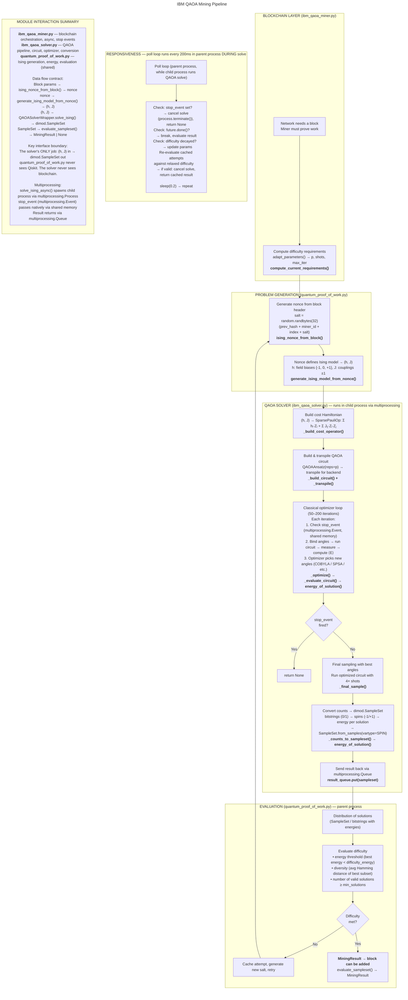

```mermaid
---
title: "IBM QAOA Mining Pipeline"
---
flowchart TD
    subgraph BLOCKCHAIN["BLOCKCHAIN LAYER (ibm_qaoa_miner.py)"]
        direction TB
        A["Network needs a block<br/>Miner must prove work"]
        A --> C["Compute difficulty requirements<br/>adapt_parameters() → p, shots, max_iter<br/><b>compute_current_requirements()</b>"]
    end

    C --> D

    subgraph GENERATE["PROBLEM GENERATION (quantum_proof_of_work.py)"]
        direction TB
        D["Generate nonce from block header<br/>salt = random.randbytes(32)<br/>(prev_hash + miner_id + index + salt)<br/><b>ising_nonce_from_block()</b>"]
        D --> E["Nonce defines Ising model → (h, J)<br/>h: field biases {-1, 0, +1}, J: couplings ±1<br/><b>generate_ising_model_from_nonce()</b>"]
    end

    E --> F

    subgraph SOLVER["QAOA SOLVER (ibm_qaoa_solver.py) — runs in child process via multiprocessing"]
        direction TB
        F["Build cost Hamiltonian<br/>(h, J) → SparsePauliOp: Σ hᵢ·Zᵢ + Σ Jᵢⱼ·Zᵢ·Zⱼ<br/><b>_build_cost_operator()</b>"]
        F --> G["Build & transpile QAOA circuit<br/>QAOAAnsatz(reps=p) → transpile for backend<br/><b>_build_circuit() + _transpile()</b>"]
        G --> H["Classical optimizer loop (50–200 iterations)<br/>Each iteration:<br/>1. Check stop_event (multiprocessing.Event, shared memory)<br/>2. Bind angles → run circuit → measure → compute ⟨E⟩<br/>3. Optimizer picks new angles (COBYLA / SPSA / etc.)<br/><b>_optimize() → _evaluate_circuit() → energy_of_solution()</b>"]
        H --> I{"stop_event<br/>fired?"}
        I -->|Yes| J["return None"]
        I -->|No| K["Final sampling with best angles<br/>Run optimized circuit with 4× shots<br/><b>_final_sample()</b>"]
        K --> L["Convert counts → dimod.SampleSet<br/>bitstrings (0/1) → spins (-1/+1) → energy per solution<br/>→ SampleSet.from_samples(vartype=SPIN)<br/><b>_counts_to_sampleset() → energy_of_solution()</b>"]
        L --> L2["Send result back via multiprocessing.Queue<br/><b>result_queue.put(sampleset)</b>"]
    end

    L2 --> M

    subgraph EVAL["EVALUATION (quantum_proof_of_work.py) — parent process"]
        direction TB
        M["Distribution of solutions<br/>(SampleSet / bitstrings with energies)"]
        M --> N["Evaluate difficulty<br/>• energy threshold (best energy < difficulty_energy)<br/>• diversity (avg Hamming distance of best subset)<br/>• number of valid solutions ≥ min_solutions"]
        N --> O{"Difficulty<br/>met?"}
        O -->|No| P["Cache attempt, generate new salt, retry"]
        O -->|Yes| Q["<b>MiningResult → block can be added</b><br/>evaluate_sampleset() → MiningResult"]
    end

    P --> D

    subgraph POLL["RESPONSIVENESS — poll loop runs every 200ms in parent process DURING solve"]
        direction TB
        R["Poll loop (parent process, while child process runs QAOA solve)"]
        R --> S["Check: stop_event set?       → cancel solve (process.terminate()), return None<br/>Check: future.done()?         → break, evaluate result<br/>Check: difficulty decayed?     → update params<br/>Re-evaluate cached attempts<br/>against relaxed difficulty     → if valid: cancel solve, return cached result<br/><br/>sleep(0.2) → repeat"]
    end

    subgraph SUMMARY["MODULE INTERACTION SUMMARY"]
        direction TB
        T["<b>ibm_qaoa_miner.py</b> — blockchain orchestration, async, stop events<br/><b>ibm_qaoa_solver.py</b> — QAOA pipeline, circuit, optimizer, conversion<br/><b>quantum_proof_of_work.py</b> — Ising generation, energy, evaluation (shared)<br/><br/>Data flow contract:<br/>Block params → ising_nonce_from_block() → nonce<br/>nonce → generate_ising_model_from_nonce() → (h, J)<br/>(h, J) → QAOASolverWrapper.solve_ising() → dimod.SampleSet<br/>SampleSet → evaluate_sampleset() → MiningResult | None<br/><br/>Key interface boundary:<br/>The solver's ONLY job: (h, J) in → dimod.SampleSet out<br/>quantum_proof_of_work.py never sees Qiskit. The solver never sees blockchain.<br/><br/>Multiprocessing:<br/>solve_ising_async() spawns child process via multiprocessing.Process<br/>stop_event (multiprocessing.Event) passes natively via shared memory<br/>Result returns via multiprocessing.Queue"]
    end
```
