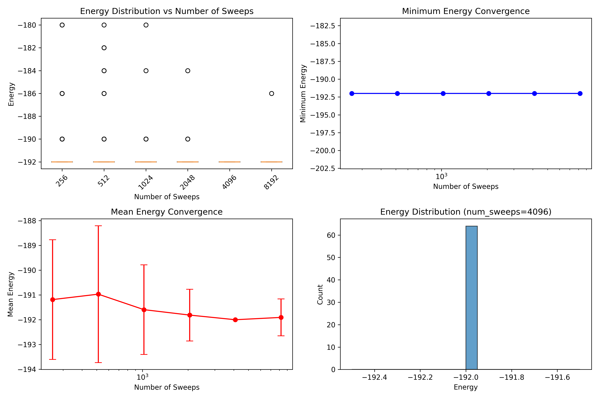
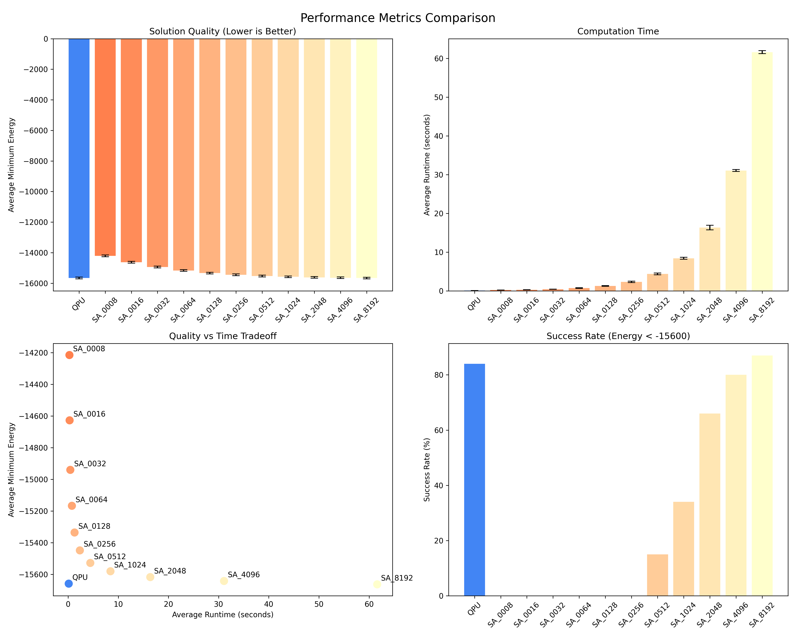
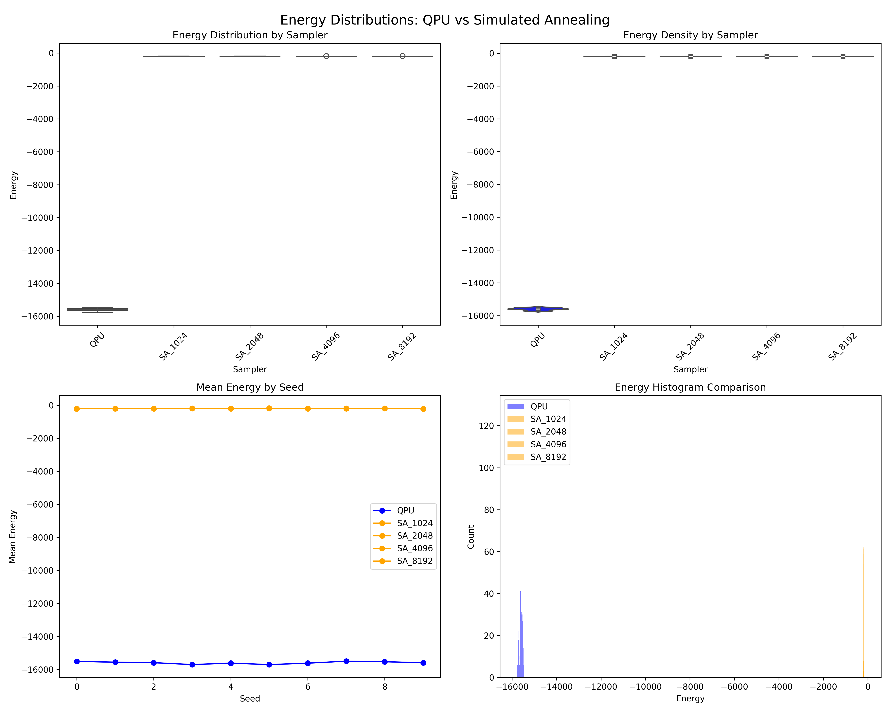
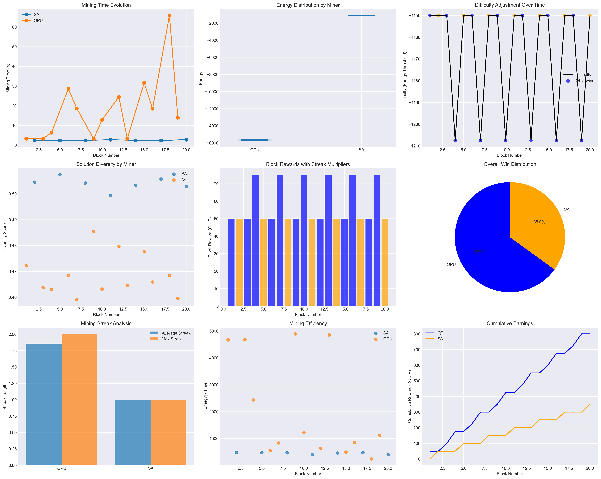
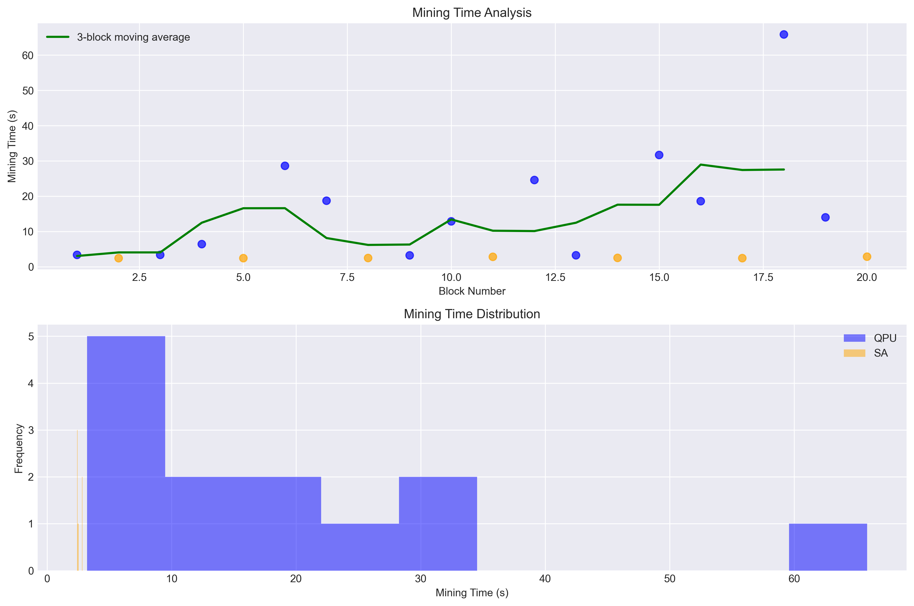

# Quantum Proof-of-Work Blockchain Implementation

This project implements a quantum blockchain using quantum annealing for proof-of-work consensus. It features competitive mining between quantum computers (QPU) and classical simulated annealing (SA) with a dynamic difficulty adjustment mechanism.

## Overview

The blockchain demonstrates:
- **Quantum Annealing PoW**: Using Ising model optimization as the mining puzzle
- **Competitive Mining**: Multiple miners (QPU and SA) compete to mine blocks
- **Multi-Miner Support**: Configure any number of QPU and SA miners
- **Dynamic Difficulty**: Inverted difficulty mechanism that prevents miner monopolization
- **Streak Rewards**: Consecutive wins increase block rewards
- **Solution Diversity**: Requires multiple diverse solutions to prevent trivial mining
- **Individual Miner Tracking**: Each miner has unique ID and performance stats

## Setup

1. Create and activate a virtual environment (Python 3.10+):
   ```bash
   python3 -m venv .quip
   source .quip/bin/activate  # Windows: .venv\Scripts\activate
   ```

2. Install the package in editable mode using the standardized requirements file:
   ```bash
   pip install -U pip setuptools wheel
   pip install -e .
   ```
   This will install all dependencies from requirements.txt and register console scripts.

3. Set up D-Wave API credentials (optional, for QPU access):
   ```bash
   echo "DWAVE_API_KEY=your_api_key_here" > .env
   ```

## Project Structure

```
quip-protocol/
├── quantum_blockchain.py       # Main blockchain implementation
├── blockchain_base.py          # Base classes for miners and nodes
├── quantum_blockchain_network.py  # P2P networking layer
├── quantum_blockchain_p2p.py   # P2P-enabled blockchain
├── CPU/                        # CPU-based miners
│   └── cpu_miner.py           # Simulated annealing miner
├── GPU/                        # GPU-accelerated miners
│   └── gpu_miner.py           # Modal Labs GPU miner
├── QPU/                        # Quantum processor miners
│   └── qpu_miner.py           # D-Wave QPU miner
├── launch_network.py           # Network launcher utility
├── reference/                  # Reference implementation tests
│   ├── test_quantum_pow.py    # Tests showing optimal SA parameters
│   └── reference_test_results.png
├── benchmarks/                 # Performance benchmarking suite
│   ├── benchmark_quantum_pow.py
│   ├── energy_distributions.png
│   ├── performance_metrics.png
│   ├── blockchain_benchmark_comprehensive.png
│   ├── blockchain_benchmark_timing.png
│   └── benchmark_results.json
└── venv/                      # Python virtual environment
```

## New Click-based CLIs

Two new commands provide a friendlier CLI using Click while keeping existing scripts intact.

### quip-network-node

Run a single P2P node of a specific type. Subcommands: cpu, gpu, qpu.

- Always enables competitive mode
- Implies a single miner of that type (num-sa/num-gpu/num-qpu = 1)
- Supports a top-level --config TOML that can choose a default subcommand
- Global settings provide host, port, peer, and auto_mine
- CPU supports --num-cpus to cap threads via OMP/MKL/BLAS env vars
- GPU supports multi-device via [gpu] in TOML (backend=local|modal); --device forces single device
- QPU supports D-Wave settings via CLI or TOML under [qpu]

Examples:

```bash
# CPU node (bootstrap), limit to 4 threads
quip-network-node cpu --port 8080 --num-cpus 4

# GPU node joining bootstrap with device 0
quip-network-node gpu --port 8082 --peer localhost:8080 --device 0

# Use TOML config to choose default subcommand and flags
quip-network-node --config ./QUIP-node.example.toml

# Modal backend example via TOML
# [gpu]
# backend = "modal"
# types = ["t4", "a10g"]
```

TOML structure:

```toml
[global]
default = "gpu"  # or "cpu"/"qpu"
# Global network options
host = "0.0.0.0"
port = 8082
peer = "localhost:8080"
auto_mine = 0

[cpu]
# Limit CPU worker threads; max is number of logical CPUs
num_cpus = 4

[gpu]
# Backend selection: "local" (default) uses local GPUs (CUDA/ROCm/MPS). "modal" uses Modal cloud GPUs.
backend = "local"
# For local backend: list devices to use (CUDA ordinals like "0", "1"). If omitted, runtime may auto-detect.
devices = ["0", "1"]
# For modal backend: list GPU types to use (e.g., ["t4", "a10g"]).
# types = ["t4", "a10g"]

[qpu]
# Provide any of these to configure D-Wave access; can also pass on CLI
# dwave_api_key = "..."
# dwave_api_solver = "Advantage_system6.4"
# dwave_region_url = "https://na-west-1.cloud.dwavesys.com/sapi/v2/"  # default
```

See a working example in QUIP-node.example.toml.

### quip-network-simulator

Mimics launch_network.py scenarios, but runs separate processes via quip-network-node and prints the exact commands:

```bash
# Mixed (approx. 3 CPU, 2 GPU, 1 QPU)
quip-network-simulator --scenario mixed

# CPU-only with 4 nodes
quip-network-simulator --scenario cpu

# GPU-only with overrides and base port (print only)
quip-network-simulator --scenario gpu --num-gpu 2 --base-port 9000 --print-only
```

## Systemd Service Installation

You can run quip-network-node as a systemd service for production deployment with automatic restarts and proper logging.

### Service Configuration

Create the systemd service file at `/etc/systemd/system/quip-network-node.service`:

```ini
[Unit]
Description=QUIP Network Node
After=network.target
Wants=network.target

[Service]
Type=simple
User=QUIP
Group=QUIP
Environment=PATH=/usr/local/bin:/usr/bin:/bin
Environment=PYTHONPATH=/usr/local/lib/python3.10/site-packages
ExecStart=/usr/local/bin/quip-network-node cpu --config /etc/QUIP.network/config.toml
Restart=always
RestartSec=5
StandardOutput=journal
StandardError=journal
SyslogIdentifier=quip-network-node

# Security settings
NoNewPrivileges=yes
PrivateTmp=yes
ProtectSystem=strict
ProtectHome=yes
ReadWritePaths=/var/log/QUIP-node /var/lib/QUIP-node
ProtectKernelTunables=yes
ProtectControlGroups=yes

# Resource limits
MemoryLimit=2G
CPUQuota=200%

[Install]
WantedBy=multi-user.target
```

### Installation Steps

1. **Create directories and user**:
   ```bash
   sudo mkdir -p /etc/QUIP.network
   sudo mkdir -p /var/log/QUIP-node
   sudo mkdir -p /var/lib/QUIP-node
   sudo useradd --system --shell /bin/false --home /var/lib/QUIP-node --create-home QUIP
   sudo chown -R QUIP:QUIP /var/log/QUIP-node /var/lib/QUIP-node
   ```

2. **Copy and configure**:
   ```bash
   sudo cp QUIP-node.example.toml /etc/QUIP.network/config.toml
   sudo chown QUIP:QUIP /etc/QUIP.network/config.toml
   # Edit /etc/QUIP.network/config.toml as needed - all configuration goes here
   ```

3. **Install and enable service**:
   ```bash
   sudo cp quip-network-node.service /etc/systemd/system/
   sudo systemctl daemon-reload
   sudo systemctl enable quip-network-node
   sudo systemctl start quip-network-node
   ```

4. **Monitor the service**:
   ```bash
   sudo systemctl status quip-network-node
   journalctl -u quip-network-node -f
   ```

### Configuration Options

The service can be customized by modifying the `ExecStart` line:

- **CPU mining**: `quip-network-node cpu --config /etc/QUIP.network/config.toml`
- **GPU mining**: `quip-network-node gpu --config /etc/QUIP.network/config.toml`
- **QPU mining**: `quip-network-node qpu --config /etc/QUIP.network/config.toml`

All miner-specific configuration (D-Wave credentials, GPU settings, CPU limits, etc.) should be set in `/etc/QUIP.network/config.toml`:

```toml
[global]
node_name = "Production Node"
listen = "0.0.0.0"
port = 20049
log_level = "INFO"
node_log = "/var/log/QUIP-node/node.log"
http_log = "/var/log/QUIP-node/http.log"

[cpu]
num_cpus = 4

[gpu]
backend = "local"
devices = ["0", "1"]

[qpu]
dwave_api_key = "your_key_here"
dwave_api_solver = "Advantage_system6.4"
```

### Service Management

```bash
# View logs
sudo journalctl -u quip-network-node -n 50

# Restart service
sudo systemctl restart quip-network-node

# Stop service
sudo systemctl stop quip-network-node

# Disable service
sudo systemctl disable quip-network-node
```

### Troubleshooting

- **Service fails to start**: Check permissions on `/etc/QUIP.network/config.toml`
- **Python import errors**: Verify PYTHONPATH and package installation
- **Permission denied**: Ensure the `QUIP` user has access to necessary directories
- **Network issues**: Check firewall settings for the configured port (default: 20049)

The systemd service provides production-ready deployment with automatic restarts, proper logging, and security hardening. All configuration is centralized in the TOML file for easier management.

## Usage

### Run the Quantum Blockchain Demo

```bash
# Basic competitive mining (1 QPU vs 1 SA miner)
python quantum_blockchain.py --competitive

# Multiple miners (2 QPU miners vs 4 SA miners)
python quantum_blockchain.py --competitive --num-qpu 2 --num-sa 4

# Custom number of blocks
python quantum_blockchain.py --competitive --num-qpu 2 --num-sa 3 --blocks 10

# Non-competitive mode (single miner)
python quantum_blockchain.py
```

Parameters:
- `--competitive`: Enable competitive mining mode
- `--num-qpu N`: Number of QPU miners (default: 1)
- `--num-sa N`: Number of SA miners (default: 1)
- `--blocks N`: Number of blocks to mine (default: 20)

### Run Reference Implementation Tests

```bash
python reference/test_quantum_pow.py
```

Tests the reference implementation with different `num_sweeps` values. Results show SA achieves optimal performance at `num_sweeps=4096`.



### Run Performance Benchmarks

```bash
python benchmarks/benchmark_quantum_pow.py
```

Generates comprehensive benchmarks comparing QPU vs SA performance:




## Quantum Proof-of-Work Mechanism

### Core Concepts

1. **Ising Model Generation**: Each block generates a unique Ising problem based on:
   - Block header hash
   - Mining nonce
   - Deterministic random seed

2. **Solution Requirements**:
   - **Energy Threshold**: Solutions must have energy < difficulty_energy
   - **Solution Diversity**: Multiple solutions with minimum Hamming distance
   - **Minimum Solutions**: At least N valid solutions required

3. **Mining Process**:
   - Miners iterate through nonces
   - For each nonce, sample the quantum annealer
   - Check if solutions meet all criteria
   - First miner to find valid solutions wins

### Dynamic Difficulty (Inverted Mechanism)

The blockchain implements an inverted difficulty adjustment:

```
Initial State: HARD (QPU-favored)
├── Energy: -1150
├── Diversity: 0.45
└── Solutions: 15

Consecutive Wins → EASIER
└── Reduces requirements progressively

New Winner → HARDER
└── Increases difficulty based on previous streak
```

This mechanism:
- Starts with QPU-favorable difficulty
- Makes mining easier for consecutive winners
- Immediately hardens when a new miner wins
- Prevents long-term monopolization

### Competitive Mining Results

The inverted difficulty mechanism produces balanced mining distribution:



Key outcomes:
- **QPU**: ~70% of blocks (leverages quantum advantage initially)
- **SA**: ~30% of blocks (catches up as difficulty eases)
- **Streak Rewards**: Up to 5x multiplier for consecutive wins
- **Dynamic Balance**: Self-adjusting difficulty maintains competition



## Technical Parameters

### Shared Mining Parameters
```python
base_difficulty_energy = -1150  # Energy threshold
min_diversity = 0.45           # Solution diversity requirement
min_solutions = 15             # Minimum valid solutions
```

### Miner-Specific Settings
- **QPU**: Uses D-Wave quantum processor (when available)
- **SA**: num_sweeps=4096 for optimal performance
- **Both**: 64 reads per mining attempt

### Difficulty Adjustment
```python
energy_adjustment_rate = 0.10  # 10% change per streak level
max_streak_multiplier = 5      # Maximum reward multiplier
```

## Key Features

1. **Decentralized Consensus**: All miners use identical difficulty parameters
2. **Quantum-Classical Competition**: Fair competition between QPU and SA
3. **Anti-Monopolization**: Dynamic difficulty prevents single miner dominance
4. **Performance Monitoring**: Comprehensive metrics and visualizations
5. **Solution Quality**: Enforces diversity to prevent trivial solutions

## GPU Mining Support

The blockchain supports GPU-accelerated mining using Modal Labs cloud infrastructure, providing a cost-effective middle ground between CPU-based SA miners and QPU miners.

### GPU Mining Setup

1. **Install Modal** (includes $30/month free credits):
   ```bash
   pip install modal
   modal token new  # Opens browser for authentication
   ```

2. **Run GPU Miners**:
   ```bash
   # Single GPU miner (T4)
   python quantum_blockchain.py --competitive --num-gpu 1 --blocks 10

   # Multiple GPU miners with different types
   python quantum_blockchain.py --competitive --num-gpu 3 --gpu-types t4 a10g a100 --blocks 20

   # Mix of QPU, SA, and GPU miners
   python quantum_blockchain.py --competitive --num-qpu 1 --num-sa 2 --num-gpu 2 --gpu-types t4 a10g
   ```

### GPU Types and Performance

| GPU Type | Cost/Hour | Performance vs SA | Best Use Case |
|----------|-----------|-------------------|---------------|
| T4       | ~$0.10    | 3x faster         | Cost-conscious mining |
| A10G     | ~$0.30    | 8x faster         | Balanced performance |
| A100     | ~$1.00    | 25x faster        | Maximum performance |

### GPU Mining Features

- **CUDA Acceleration**: Uses CuPy for GPU-optimized annealing
- **Automatic Fallback**: Falls back to SA if GPU unavailable
- **Individual Tracking**: Each GPU miner has unique ID (GPU-1, GPU-2, etc.)
- **Color Coding**: GPU miners shown in green shades in benchmark plots
- **Cost Optimization**: Start with T4, scale up as needed

### GPU Benchmarking

Run standalone GPU benchmarks:
```bash
modal run benchmarks/gpu_benchmark_modal.py
```

This compares different GPU types and provides cost/performance analysis.

## P2P Network Support

The blockchain now includes a peer-to-peer networking layer that enables nodes to discover each other, share blocks, and maintain network consensus.

### P2P Features

- **Automatic Node Discovery**: Nodes broadcast new peers to the entire network
- **Heartbeat Mechanism**: Nodes send regular heartbeats to track liveness (15s interval, 60s timeout)
- **Block Propagation**: New blocks are automatically broadcast to all connected nodes
- **Concurrent Mining**: Multiple nodes can mine simultaneously with different miner configurations
- **Resilient Networking**: Nodes automatically remove dead peers and handle network partitions

### P2P Quick Start

1. **Install P2P Dependencies**:
   ```bash
   pip install aiohttp
   ```

2. **Start Bootstrap Node**:
   ```bash
   python quantum_blockchain_p2p.py --port 8080 --competitive --num-sa 2
   ```

3. **Join Network**:
   ```bash
   # Connect to bootstrap node
   python quantum_blockchain_p2p.py --port 8081 --peer localhost:8080 --competitive --num-sa 2

   # Add GPU miners
   python quantum_blockchain_p2p.py --port 8082 --peer localhost:8080 --competitive --num-gpu 1 --num-sa 1
   ```

4. **Run Demo**:
   ```bash
   python p2p_demo.py --demo
   ```

### P2P Network Protocol

- **Join Request** (`/join`): New nodes announce themselves and receive node list
- **Heartbeat** (`/heartbeat`): Regular liveness checks between nodes
- **Block Broadcast** (`/block`): Propagates new blocks across network
- **Node Broadcast** (`/broadcast`): Generic message broadcasting

### Example P2P Network Setup

```bash
# Terminal 1: Bootstrap node
python quantum_blockchain_p2p.py --port 8080 --competitive

# Terminal 2: SA mining node
python quantum_blockchain_p2p.py --port 8081 --peer localhost:8080 --competitive --num-sa 3

# Terminal 3: GPU mining node
python quantum_blockchain_p2p.py --port 8082 --peer localhost:8080 --competitive --num-gpu 2 --gpu-types t4 a10g

# Terminal 4: Mixed mining node
python quantum_blockchain_p2p.py --port 8083 --peer localhost:8081 --competitive --num-sa 1 --num-gpu 1
```

This creates a 4-node network with diverse mining configurations, automatic block propagation, and fault tolerance.

## Modular Miner Architecture

The blockchain now supports modular miners that can independently join the P2P network. Each miner type implements the same protocol:

1. **Connects to P2P network** via peer discovery
2. **Gets latest block** from network peers
3. **Mines new blocks** using miner-specific algorithms
4. **Broadcasts wins** to all network nodes
5. **Stops mining** when receiving valid blocks from others

### CPU Miner

Pure Python implementation using simulated annealing:

```bash
# Start a CPU miner
python CPU/cpu_miner.py --id 1 --port 8080

# With custom parameters
python CPU/cpu_miner.py --id 2 --port 8081 --peer localhost:8080 --num-sweeps 8192
```

Options:
- `--num-sweeps N`: Annealing sweeps (default: 4096)

### GPU Miner

Cloud GPU acceleration using Modal Labs:

```bash
# Install Modal first
pip install modal
modal token new

# Start GPU miners
python GPU/gpu_miner.py --id 1 --port 8080 --gpu-type t4
python GPU/gpu_miner.py --id 2 --port 8081 --peer localhost:8080 --gpu-type a10g
```

Options:
- `--gpu-type TYPE`: GPU type - t4, a10g, a100 (default: t4)
- `--num-sweeps N`: Annealing sweeps (default: 512)

### QPU Miner

D-Wave quantum annealer integration:

```bash
# Set D-Wave credentials
export DWAVE_API_TOKEN=your_token_here

# Start QPU miner
python QPU/qpu_miner.py --id 1 --port 8080
```

Falls back to CPU if QPU unavailable.

### Network Launcher

Easy deployment of mixed networks:

```bash
# Launch mixed network (CPU + GPU + QPU)
python launch_network.py --scenario mixed

# Launch CPU-only network (4 nodes)
python launch_network.py --scenario cpu

# Launch GPU competition (different GPU types)
python launch_network.py --scenario gpu
```

### Example Heterogeneous Network

```bash
# Terminal 1: Bootstrap CPU node
python CPU/cpu_miner.py --id 1 --port 8080

# Terminal 2: Fast CPU node
python CPU/cpu_miner.py --id 2 --port 8081 --peer localhost:8080 --num-sweeps 8192

# Terminal 3: GPU node (T4)
python GPU/gpu_miner.py --id 1 --port 8082 --peer localhost:8080

# Terminal 4: GPU node (A10G)
python GPU/gpu_miner.py --id 2 --port 8083 --peer localhost:8080 --gpu-type a10g

# Terminal 5: QPU node
python QPU/qpu_miner.py --id 1 --port 8084 --peer localhost:8080
```

### Common Miner Options

All miners support:
- `--id N`: Node ID (default: 1)
- `--host HOST`: Bind address (default: 0.0.0.0)
- `--port PORT`: Listen port (default: 8080)
- `--peer HOST:PORT`: Bootstrap peer to connect to
- `--log-level LEVEL`: Logging level (DEBUG, INFO, WARNING, ERROR)

### Mining Parameters

All miners use the same difficulty parameters:
```python
difficulty_energy = -15500.0  # Energy threshold
min_diversity = 0.46         # Solution diversity
min_solutions = 25           # Required solutions
```

## TLS/HTTPS Support

The network nodes support TLS encryption for secure communication between peers. TLS is automatically enabled when certificate files are provided in the configuration.

### Quick Setup with Let's Encrypt (Certbot)

1. **Install Certbot** (for domain-based certificates):
   ```bash
   # Ubuntu/Debian
   sudo apt update && sudo apt install certbot
   
   # CentOS/RHEL
   sudo yum install certbot
   
   # macOS
   brew install certbot
   ```

2. **Obtain TLS Certificates**:
   ```bash
   # Replace with your actual domain
   sudo certbot certonly --standalone -d your-node.example.com
   
   # Certificates will be saved to:
   # Certificate: /etc/letsencrypt/live/your-node.example.com/fullchain.pem
   # Private Key: /etc/letsencrypt/live/your-node.example.com/privkey.pem
   ```

3. **Configure TLS in TOML**:
   ```toml
   [global]
   node_name = "Secure Node"
   listen = "0.0.0.0"
   port = 20049
   tls_cert_file = "/etc/letsencrypt/live/your-node.example.com/fullchain.pem"
   tls_key_file = "/etc/letsencrypt/live/your-node.example.com/privkey.pem"
   ```

4. **Run with TLS**:
   ```bash
   quip-network-node --config config.toml cpu
   ```

### Self-Signed Certificates (Development)

For testing or private networks, you can generate self-signed certificates:

```bash
# Generate private key and certificate
openssl req -x509 -newkey rsa:4096 -keyout key.pem -out cert.pem -days 365 -nodes \
  -subj "/C=US/ST=State/L=City/O=Organization/CN=localhost"

# Use in configuration
echo 'tls_cert_file = "cert.pem"' >> config.toml
echo 'tls_key_file = "key.pem"' >> config.toml
```

### TLS Configuration Options

Add these options to your configuration file:

```toml
[global]
# Required for TLS
tls_cert_file = "/path/to/certificate.pem"
tls_key_file = "/path/to/private_key.pem"

# When TLS is enabled, nodes will use https:// for peer communication
# Make sure peer URLs use https:// scheme when connecting to TLS-enabled nodes
peer = "https://secure-node.example.com:20049"
```

### Security Features

The TLS implementation uses modern security standards:
- **TLS 1.3 only**: Ensures forward secrecy and latest security features
- **Strong cipher suites**: ECDHE+AESGCM, ECDHE+CHACHA20, DHE+AESGCM, DHE+CHACHA20
- **Perfect Forward Secrecy**: Ephemeral key exchange protects past communications
- **No weak algorithms**: Explicitly excludes aNULL, MD5, and DSS

### Certificate Renewal

Set up automatic renewal for Let's Encrypt certificates:

```bash
# Add to crontab
sudo crontab -e

# Add this line for automatic renewal (checks twice daily)
0 12,0 * * * certbot renew --quiet --post-hook "systemctl reload quip-network-node"
```

### Troubleshooting TLS

- **Certificate errors**: Verify certificate paths and permissions
- **Connection refused**: Ensure firewall allows the configured port
- **Mixed HTTP/HTTPS**: All peers must use the same protocol (HTTP or HTTPS)
- **Self-signed warnings**: Use `--insecure` flag for development testing

## Future Enhancements

- Consensus mechanism for longest chain rule
- Block validation and quantum proof verification
- Persistent blockchain storage and peer list
- Transaction validation and smart contracts
- Multiple QPU support
- Advanced difficulty algorithms
- Real-time mining pool statistics
- Client certificate authentication for enhanced security

## License

MIT License - See LICENSE file for details