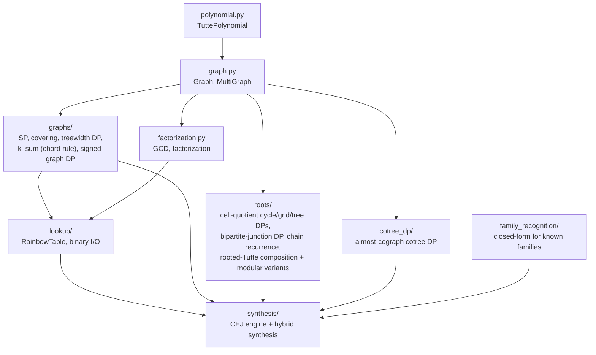
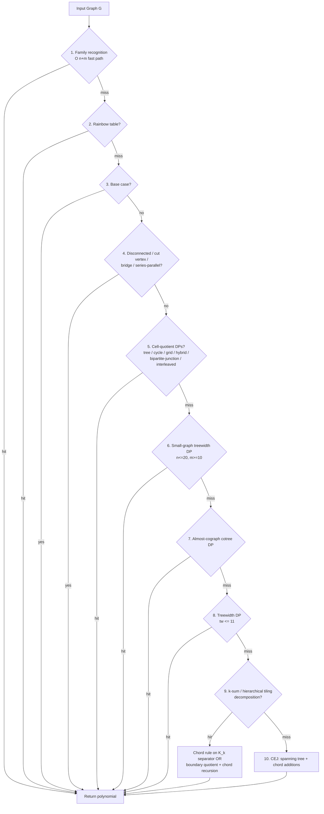

# Tutte Polynomial Synthesis Library

Tools for computing Tutte polynomials of graphs via structural
decomposition, algebraic identities, rooted-Tutte composition over
cell-quotient topologies, and approximate graph covers. These
polynomials are used to canonically determine the difficulty of a
collection of Ising Models in the Quip Protocol's initial quantum
proof of work. Future applications may include efficient construction
of embeddings for arbitrary input graphs onto specified processor
graphs.

## Package Structure



| Subpackage                                              | Description                                                                                                                                                                                                                                                                          |
| ------------------------------------------------------- | ------------------------------------------------------------------------------------------------------------------------------------------------------------------------------------------------------------------------------------------------------------------------------------ |
| [`graphs/`](graphs/README.md)                           | Series-parallel recognition, subgraph covering with hierarchical / heterogeneous partitioners, treewidth DP (C extension), k-sum chord rule (`k_sum.py`), signed-graph elimination DP, σ-equivariant DP                                                                              |
| [`roots/`](roots/README.md)                             | Rooted-Tutte composition for cell-decomposable graphs: cycle / grid / tree / bipartite-junction / interleaved DPs over cell-quotient topology, chain-recurrence framework, modular point-value variants for Cm-style targets, k-matching closed form                                |
| [`cotree_dp/`](cotree_dp/almost_cograph.py)             | Almost-cograph cotree DP (path-of-modules generalization of P_4-free graphs)                                                                                                                                                                                                         |
| [`family_recognition/`](family_recognition/__init__.py) | O(n+m) closed-form polynomials for known families: trees, cycles, wheels, fans, ladders, prisms, books, gears, Möbius ladders                                                                                                                                                        |
| [`lookup/`](lookup/README.md)                           | Rainbow table: O(1) polynomial lookup by canonical key, binary serialization                                                                                                                                                                                                         |
| [`synthesis/`](synthesis/README.md)                     | `SynthesisEngine` (cascade) + `HybridSynthesisEngine` (structural-first variant)                                                                                                                                                                                                     |
| [`data/`](data/README.md)                               | Pre-computed lookup tables and benchmark results                                                                                                                                                                                                                                     |
| [`tests/`](tests/README.md)                             | Parametrized test suite (Kirchhoff + NetworkX cross-validation)                                                                                                                                                                                                                      |
| [`benchmarks/`](benchmarks/README.md)                   | Standalone CEJ / Hybrid / NetworkX benchmark with empty-table cold-start measurements                                                                                                                                                                                                |
| [`docs/`](docs/README.md)                               | Per-technique documentation                                                                                                                                                                                                                                                          |
| [`research/`](research/)                                | Engine workflow primer, literature survey, and prototype scripts that feed production paths                                                                                                                                                                                          |

### Core Modules

| Module             | Description                                                                                              |
| ------------------ | -------------------------------------------------------------------------------------------------------- |
| `graph.py`         | `Graph` and `MultiGraph` classes, graph builders, WL-canonical hashing                                   |
| `polynomial.py`    | `TuttePolynomial` class with bitstring encoding, modular evaluation                                      |
| `factorization.py` | Polynomial GCD and factorization                                                                         |
| `validation.py`    | Kirchhoff spanning-tree verification, NetworkX cross-checks                                              |

## Synthesis Pipeline

Single primary engine (`SynthesisEngine`) tries techniques in order;
first success wins. The structural-first `HybridSynthesisEngine`
re-orders steps to prioritise treewidth DP on graphs without a
recognisable cell structure. See [`docs/README.md`](docs/README.md) for
the full per-step reference.



The chord-rule paths (step 9) use only the standard
deletion-contraction identity — no flat lattices, no Möbius function.
See [`docs/08_2_chord_rule_formalization.md`](docs/08_2_chord_rule_formalization.md).

## Key Formulas

| Operation         | Formula                                    | When                            |
| ----------------- | ------------------------------------------ | ------------------------------- |
| Bridge (cut edge) | `T(G+e) = x × T(G)`                        | e connects different components |
| Chord             | `T(G+e) = T(G) + T(G/{u,v})`               | e connects same component       |
| Cut vertex        | `T(G₁ · G₂) = T(G₁) × T(G₂)`               | graphs share single vertex      |
| Disjoint union    | `T(G₁ ∪ G₂) = T(G₁) × T(G₂)`               | no shared vertices              |
| Loop              | `T(G) = y × T(G-e)`                        | e is a self-loop                |
| Parallel edges    | `T(k parallel) = x + y + y² + ⋯ + y^(k-1)` | k edges between same pair       |

## Graph Families

| Family         | Builder                             | Notes                            |
| -------------- | ----------------------------------- | -------------------------------- |
| Complete K_n   | `complete_graph(n)`                 | Up to K_12 in default table      |
| Complete bipartite K_{a,b} | `complete_bipartite_graph(a, b)` | Includes K_{4,4} (Chimera cell)   |
| Cycle C_n      | `cycle_graph(n)`                    | Up to C_100                      |
| Path P_n       | `path_graph(n)`                     |                                  |
| Wheel W_n      | `wheel_graph(n)`                    |                                  |
| Grid m×n       | `grid_graph(m, n)`                  | Up to 6×6                        |
| Petersen / Heawood / Möbius-Kantor / Desargues / Dodecahedral | family_recognition seeds | cubic + vertex-transitive |
| D-Wave Chimera | `dwave_networkx.chimera_graph(m)`   | Cm_1 = K_{4,4}, Cm_2 ≈ 35-50 s   |
| D-Wave Pegasus | `dwave_networkx.pegasus_graph(m)`   | Pm_1, Pm_2                       |
| D-Wave Zephyr  | `dwave_networkx.zephyr_graph(m, t)` | Z(1,1) = 12 nodes, 22 edges      |

## Known Limitations

- **Treewidth cap**: `treewidth_dp` (C extension) only attempts graphs
  with treewidth ≤ 11 (configurable). Larger D-Wave topologies (Cm_3+,
  Pm_3+, Z(2, t)+) exceed this; they route through cell-quotient DPs or
  the chord-rule path.
- **Full Cm_3 polynomial pending**: the modular point-value path
  (`precompute_M_table_mod` + bivariate Lagrange + CRT) is
  mathematically complete and validated on Cm_2 end-to-end. Recovering
  the full Cm_3 polynomial requires the modular-DP path to absorb the
  H-canonicalization optimization that's currently only wired into the
  pair-orbit consumer; see
  [`docs/06_5_cell_quotient_grid_dp.md`](docs/06_5_cell_quotient_grid_dp.md).
- **Z(1, 2) full polynomial > 60 s**: the per-component bipartite-junction
  DP works but the Bell-number wall on the joint boundary makes the full
  polynomial expensive. Single-point modular evaluation under the
  signed-DP path is sub-minute; full-polynomial via interpolation is on
  the same roadmap as Cm_3.
- **Exponential worst case**: bare deletion-contraction is O(2^m).
  Practical without structural shortcuts only up to ~25 edges.

## Lookup Table

Pre-computed Tutte polynomials for graph minors in
`data/lookup_table.bin` (binary) with a JSON sidecar.

```python
from tutte.lookup import load_default_table

table = load_default_table()
entry = table.get_entry("Petersen")
print(f"Spanning trees: {entry.polynomial.num_spanning_trees()}")  # 2000
```

## Running Tests

```bash
# Full test suite
python -m pytest tutte/tests/ -v

# Skip slow tests (graph atlas exhaustive, D-Wave end-to-end)
python -m pytest tutte/tests/ -v -m "not slow"

# Update rainbow table with newly computed polynomials
python -m pytest tutte/tests/ -v --update-rainbow-table

# Collect timings into data/benchmark_results.json
python -m pytest tutte/tests/ -v --benchmark
```

## Running Benchmarks

```bash
# Standalone benchmark sweep (CEJ + Hybrid + NetworkX, empty tables)
python -m tutte.benchmarks.benchmark --timeout 300 --nx-timeout 300

# Compare two benchmark runs
python -m tutte.benchmarks.benchmark --compare run_a.json run_b.json
```

## Performance vs NetworkX

After pre-warming cffi extensions and `family_recognition` seeds, both
the CEJ and Hybrid engines are strictly faster than
`nx.tutte_polynomial()` on every graph in the benchmark suite where
NetworkX completes.

| Edges | Graphs | Hybrid avg | NX avg   | Speedup    |
| ----- | ------ | ---------- | -------- | ---------- |
| 1-5   | ~200   | 0.1-0.5 ms | 0.5-5 ms | 5-10×      |
| 6-10  | ~500   | 0.3-2 ms   | 5-100 ms | 20-50×     |
| 11-15 | ~250   | 1-5 ms     | 100 ms-5 s | 100-500×  |
| 16-20 | ~50    | 2-10 ms    | 1-30 s   | 500-5 000× |
| 21+   | ~10    | 3-10 ms    | TIMEOUT  | -          |

Sample headline timings (Hybrid engine, empty table after pre-warm):

- **Petersen** (15 e): ~1 ms vs NX ~800 ms
- **Cm_1 = K_{4,4}** (16 e): ~3 ms vs NX ~1.3 s
- **Z(1, 1)** (22 e): ~5 ms vs NX TIMEOUT
- **Cm_2** (80 e): ~36 s via the streamed cell-quotient grid DP; NX times out

### Optimizations

| Optimization              | Impact                                              | Mechanism                                                                  |
| ------------------------- | --------------------------------------------------- | -------------------------------------------------------------------------- |
| Series-parallel fast path | O(n) vs O(2^n) for SP graphs                        | SP-tree decomposition avoids deletion-contraction                          |
| WL canonical hashing      | 2× on Z(1, 1), 3.4× fewer cache entries             | Isomorphism-invariant keys eliminate redundant computation                 |
| Atlas bulk-load cache     | `find_cell_candidates` 12.6 s → 0.14 s cold         | Single `nx.graph_atlas_g()` call replaces per-entry lookups                |
| `_HIER_PARTITION_CACHE`   | Recovers Pm_2 from a 4× VF2 regression              | Module-scoped cache for `try_hierarchical_partition` results               |
| Idempotent rooted-lookup load | Eliminates 1+ s per inner engine constructor    | Process-global flag in `load_default_rooted_lookup`                        |
| σ-equivariant chord order | Petersen 2.33 s → 1.62 s (1.44×)                    | Reorders chords so σ-orbits are contiguous → more canonical-key cache hits |
| Cell-quotient DPs (grid / tree / cycle / bipartite-junction) | Cm_2 ~36 s, Z(1, 2) tractable | T_rooted of the cell composed via the cell-quotient transfer matrix       |
| Modular DP + interpolation | Recovers full polynomial via Lagrange + CRT       | Avoids precision overflow on Cm-scale targets                              |

## Usage

```python
from tutte.graph import complete_graph, petersen_graph
from tutte.synthesis import SynthesisEngine
from tutte.lookup import load_default_table

table = load_default_table()
engine = SynthesisEngine(table)

result = engine.synthesize(petersen_graph())
print(f"T(Petersen; 1, 1) = {result.polynomial.num_spanning_trees()}")  # 2000
```

## References

- Tutte, W. T. (1954). "A contribution to the theory of chromatic
  polynomials".
- Sokal, A. D. (2005). "The multivariate Tutte polynomial".
- Bonin, J. & de Mier, A. (2008). "The lattice of cyclic flats of a
  matroid".
- Hliněný, P. (2006). "The Tutte polynomial for matroids of bounded
  branch-width".
