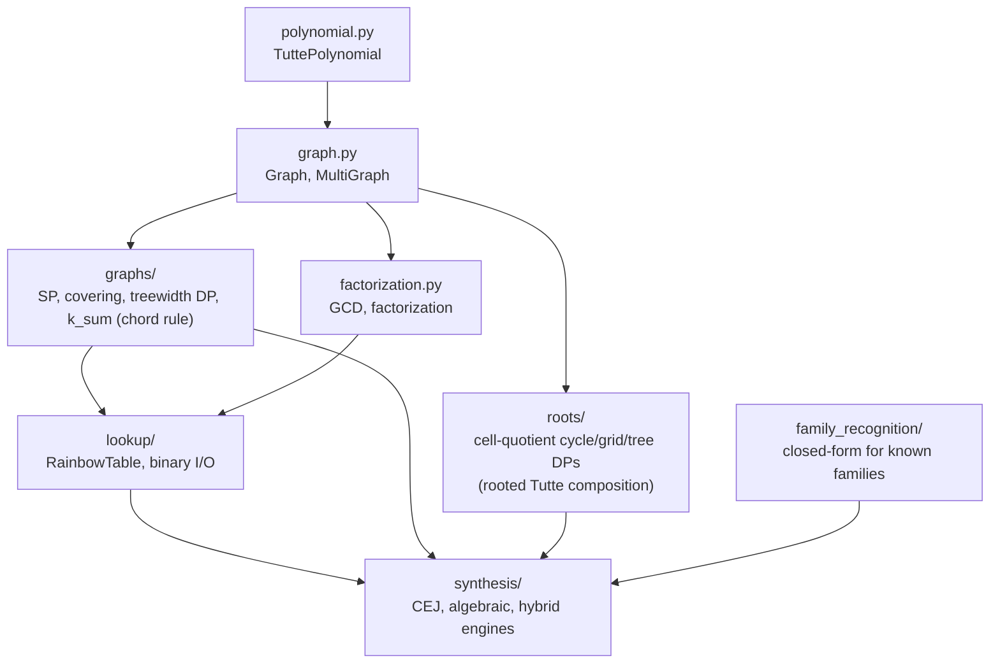
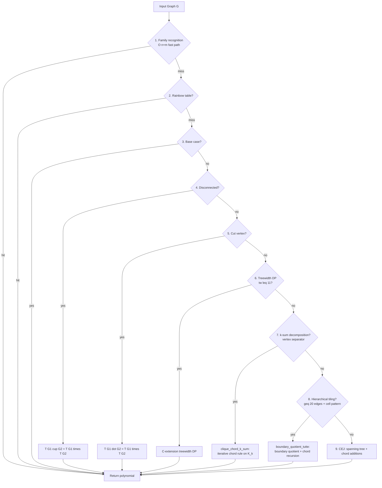

# Tutte Polynomial Synthesis Library

Tools for computing Tutte polynomials of graphs via structural decomposition and approximate graph covers. These polynomials are used to canonically determine the difficulty of a collection of Ising Models in the Quip Protocol's initial quantum proof of work. Future applications may include efficient construction of embeddings for arbitrary input graphs onto specified processor graphs.

## Package Structure



| Subpackage                                              | Description                                                                                                   |
| ------------------------------------------------------- | ------------------------------------------------------------------------------------------------------------- |
| [`graphs/`](graphs/README.md)                           | Series-parallel recognition, subgraph covering, treewidth DP, **k-sum chord rule** (`k_sum.py`)               |
| [`roots/`](roots/README.md)                             | Rooted Tutte composition for cell-decomposable graphs: cycle, grid, **tree** DPs over cell-quotient topology, plus **orbit-aware hybrid** for cyclic quotients with cross-cell vertex identifications |
| [`family_recognition/`](family_recognition/__init__.py) | O(n+m) closed-form polynomials for known families: trees, cycles, wheels, fans, ladders, prisms, books, gears |
| [`lookup/`](lookup/README.md)                           | Rainbow table: O(1) polynomial lookup, binary serialization                                                   |
| [`synthesis/`](synthesis/README.md)                     | CEJ, algebraic, and hybrid synthesis engines                                                                  |
| [`data/`](data/README.md)                               | Pre-computed lookup tables and benchmark results                                                              |
| [`tests/`](tests/README.md)                             | Parametrized test suite (Kirchhoff + NetworkX cross-validation)                                               |
| [`benchmarks/`](benchmarks/README.md)                   | Standalone benchmark suite                                                                                    |
| [`docs/`](docs/README.md)                               | Per-technique documentation + chord-rule formalization                                                        |

> **Note (April 2026)**: The legacy `tutte/matroids/` package (Bonin-de Mier Theorem 6 / Theorem 10, flat lattices, BivariateLaurentPoly) has been **retired**. Its functionality is fully subsumed by the chord-rule pipeline in `tutte/graphs/k_sum.py`. See [`docs/08_2_chord_rule_formalization.md`](docs/08_2_chord_rule_formalization.md) for the formalization and validation.

### Core Modules

| Module             | Description                                                            |
| ------------------ | ---------------------------------------------------------------------- |
| `graph.py`         | `Graph` and `MultiGraph` classes, graph builders, WL canonical hashing |
| `polynomial.py`    | `TuttePolynomial` class with bitstring encoding                        |
| `factorization.py` | Polynomial GCD and factorization                                       |
| `validation.py`    | Kirchhoff verification, NetworkX cross-checks                          |

## Synthesis Pipeline

Single primary engine (`SynthesisEngine`) tries techniques in order; first success wins. See [`docs/README.md`](docs/README.md) for the full per-step reference.



The chord-rule paths (steps 7 and 8) replaced the matroid-theoretic Theorem 6 / Theorem 10 in April 2026. They share an implementation in `tutte/graphs/k_sum.py` and use only the standard deletion-contraction identity — no flat lattices, no Möbius function. See [`docs/08_2_chord_rule_formalization.md`](docs/08_2_chord_rule_formalization.md).

## Key Formulas

| Operation         | Formula                                    | When                            |
| ----------------- | ------------------------------------------ | ------------------------------- |
| Bridge (cut edge) | `T(G+e) = x × T(G)`                        | e connects different components |
| Chord             | `T(G+e) = T(G) + T(G/{u,v})`               | e connects same component       |
| Cut vertex        | `T(G₁ · G₂) = T(G₁) × T(G₂)`               | graphs share single vertex      |
| Disjoint union    | `T(G₁ ∪ G₂) = T(G₁) × T(G₂)`               | no shared vertices              |
| Loop              | `T(G) = y × T(G-e)`                        | e is a self-loop                |
| Parallel edges    | `T(k parallel) = x + y + y² + ⋯ + y^(k-1)` | k edges between same pair       |

## Graph Families

| Family         | Builder                             | Notes                       |
| -------------- | ----------------------------------- | --------------------------- |
| Complete K_n   | `complete_graph(n)`                 | Up to K_8 in rainbow table  |
| Cycle C_n      | `cycle_graph(n)`                    | Up to C_24                  |
| Path P_n       | `path_graph(n)`                     | Up to P_24                  |
| Wheel W_n      | `wheel_graph(n)`                    | Up to W_11                  |
| Grid m×n       | `grid_graph(m, n)`                  | Up to 5×3                   |
| Petersen       | `petersen_graph()`                  | 10 nodes, 15 edges          |
| D-Wave Chimera | `dwave_networkx.chimera_graph(m)`   | Requires dwave-networkx     |
| D-Wave Zephyr  | `dwave_networkx.zephyr_graph(m, t)` | Z(1,1) = 12 nodes, 22 edges |
| D-Wave Pegasus | `dwave_networkx.pegasus_graph(m)`   | Requires dwave-networkx     |

## Known Limitations

- **Treewidth cap**: `treewidth_dp` only attempts graphs with treewidth ≤ 11 (configurable). Larger D-Wave topologies (Cm₃+, Pm₃+, Z(2,t)+) exceed this and route through the chord-rule path instead.
- **Hierarchical tiling currently isomorphic-only**: `try_hierarchical_partition` finds k _identical_ cells. A heterogeneous extension (e.g. Cm₃ = 2 × Cm₂ + 2 × Cm₁) is on the optimization roadmap — `boundary_quotient_tutte` already supports per-cell `T(C_i)`, the gap is in the partitioner.
- **Cm₃ end-to-end polynomial pending**: Phase B Rounds 7-13 (May 2026) solved the memory wall and shipped the precision-safe modular point-value path (`precompute_M_table_mod` + Lagrange + CRT). Single-point pure-Python convolve is ~2-3 h; Round 14 (C ext mirroring the existing polynomial-path `_partition_c.batched_inner_iterations_c`) + multiprocessing across `(x, y, p)` triples is the remaining work to make full polynomial recovery (~26 K modular DP runs) realistic. See [`docs/06_5_cell_quotient_grid_dp.md`](docs/06_5_cell_quotient_grid_dp.md) Rounds 7-13 section.
- **Exponential worst case**: Deletion-contraction is O(2^m). Practical for ≤25 edges without structural shortcuts.

## Lookup Table

Pre-computed Tutte polynomials for graph minors in `data/lookup_table.json` (also binary format in `.bin`).

```python
from tutte.lookup import load_default_table

table = load_default_table()
entry = table.get_entry("Petersen")
print(f"Spanning trees: {entry.polynomial.num_spanning_trees()}")  # 2000
```

## Running Tests

```bash
# Full test suite
python -m pytest tutte/tests/ -v

# Skip slow tests (graph atlas exhaustive)
python -m pytest tutte/tests/ -v -m "not slow"

# Update rainbow table with newly computed polynomials
python -m pytest tutte/tests/ -v --update-rainbow-table

# Run with benchmarks
python -m pytest tutte/tests/ -v --benchmark
```

## Running Benchmarks

```bash
# Standalone benchmark
python -m tutte.benchmarks.benchmark --timeout 300 --nx-timeout 300

# Compare two benchmark runs (e.g., across branches)
python -m tutte.benchmarks.benchmark --compare benchmark_results_0.json benchmark_results_1.json
```

## Performance vs NetworkX

Speedup of Hybrid engine over NetworkX `nx.tutte_polynomial()` (deletion-contraction),
measured from empty rainbow tables across 1000+ graphs:

| Edges | Graphs | Hybrid avg | NX avg   | Speedup    |
| ----- | ------ | ---------- | -------- | ---------- |
| 1-5   | ~200   | 0.1-0.5ms  | 0.5-5ms  | ~5-10x     |
| 6-10  | ~500   | 0.3-2ms    | 5-100ms  | ~20-50x    |
| 11-15 | ~250   | 1-5ms      | 100ms-5s | ~100-500x  |
| 16-19 | ~50    | 2-5ms      | 1-30s    | ~500-5000x |
| 20+   | ~10    | 3-10ms     | TIMEOUT  | -          |

Key graph timings (Hybrid engine, empty table):

- **Petersen** (15 edges): ~1ms Hybrid, ~800ms NX
- **Chimera C1** (16 edges): ~3ms Hybrid, ~1.5s NX
- **Zephyr Z(1,1)** (22 edges): ~5ms Hybrid, NX timeout
- **Chimera C2** (80 edges): ~55s engine (`kmatching_formula`); ~36s
  via the v5 streamed cell-quotient grid DP (research recipe — see
  [`docs/06_5_cell_quotient_grid_dp.md`](docs/06_5_cell_quotient_grid_dp.md)
  Phase B Round 6 section and
  [`research/scripts/cm2_via_v5_streamed.py`](research/scripts/cm2_via_v5_streamed.py))
- **Chimera C3** (192 edges): not yet computable end-to-end. Polynomial
  recovery via Round 13 modular point-value DP (`precompute_M_table_mod`)
  + bivariate Lagrange + CRT is **mathematically complete** but
  single-point pure-Python convolve is ~2-3 h (8 784 grid × 3+ primes
  ≈ 6-9 yr serial). Round 14 mirrors the existing polynomial-path
  `_partition_c` batched inner loop for modular accumulation
  (~10× expected), with multiprocessing as the final factor.

### Optimizations

| Optimization              | Impact                                         | Mechanism                                                  |
| ------------------------- | ---------------------------------------------- | ---------------------------------------------------------- |
| Series-parallel fast path | O(n) vs O(2^n) for SP graphs                   | SP decomposition tree avoids deletion-contraction          |
| WL canonical hashing      | 2x speedup on Z(1,1), 3.4x fewer cache entries | Isomorphism-invariant keys eliminate redundant computation |
| `skip_minor_search`       | Avoids VF2 on intermediate graphs              | Skips expensive subgraph isomorphism during chord addition |

## Usage

```python
from tutte.graph import complete_graph, petersen_graph
from tutte.synthesis import SynthesisEngine
from tutte.lookup import load_default_table

table = load_default_table()
engine = SynthesisEngine(table)

# Compute Tutte polynomial
result = engine.synthesize(petersen_graph())
print(f"T(Petersen; 1,1) = {result.polynomial.num_spanning_trees()}")  # 2000
```

## References

- Tutte, W.T. (1954). "A contribution to the theory of chromatic polynomials"
- Bonin, J. & de Mier, A. (2008). "The lattice of cyclic flats of a matroid"
