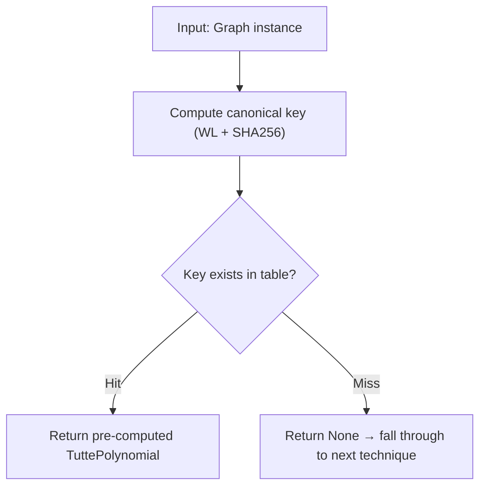

# 1. Rainbow Table Lookup

## Summary

O(1) lookup of pre-computed Tutte polynomials by canonical graph key. If the input graph (or any isomorphic copy of it) was previously computed and stored in the rainbow table, its polynomial is returned immediately without any computation.

## When It's Used

**Priority 1** — the first check in `synthesize()`, before any structural analysis. Also checked in `_synthesize_fast()`, a reduced synthesis path used for intermediate merged graphs produced during multigraph synthesis. This fast path skips VF2 minor search and hierarchical tiling but still performs rainbow table lookup as its first step.

Triggers when `table.lookup(graph)` returns a non-None polynomial, meaning the graph's canonical key exists in the table.

## Lookup Flow



Both `synthesize()` and `table.lookup()` accept a `Graph` instance (defined in `tutte/graph.py`), not a NetworkX graph. Callers that start with an `nx.Graph` must first convert it via `Graph.from_networkx()` before invoking the synthesis pipeline.

## Canonical Key Computation

The canonical key is a fixed-length string (64 hex characters) that is the same for any two isomorphic graphs, regardless of node labeling. It is computed as follows:

1. **Color refinement** (Weisfeiler-Lehman algorithm):
   - Initialize each node's color as its degree
   - Iteratively refine: new color = (current color, sorted neighbor colors)
   - Stop when the number of color groups stabilizes (no new groups created)
   - Maximum `n` rounds (where n = number of nodes), but usually converges in 2-3
2. **Canonical ordering**: sort nodes by their final color, breaking ties by sorted neighbor indices
3. **Relabel**: map nodes to canonical integer labels (0, 1, 2, ...)
4. **Edge list**: build sorted edge list from canonical labels
5. **Hash**: SHA256 of `"{node_count}:{sorted_edge_list}"` → 64-character hex string

The key property: **same graph structure → same canonical key**, no matter how the nodes are labeled.

### Why Weisfeiler-Lehman?

The canonical key must be **isomorphism-invariant**: two isomorphic graphs must produce the same key, regardless of how their nodes are labeled. WL refinement achieves this by:
- Assigning each node a "color" based on its local neighborhood structure
- Iteratively incorporating information from farther neighbors
- After convergence, nodes with the same color are structurally equivalent

This is faster than computing a full graph6 encoding and more reliable for cache hits. The WL algorithm correctly distinguishes almost all non-isomorphic graphs (fails only on highly regular graphs like Shrikhande vs 4x4 rook's graph — rare in practice).

## Data Structures

### RainbowTable (the lookup structure)

```python
@dataclass
class RainbowTable:
    entries: Dict[str, MinorEntry]       # canonical_key -> entry
    name_index: Dict[str, str]           # name -> canonical_key
    minor_relationships: Dict[str, List[str]]  # key -> list of minor keys
    _sorted_by_complexity: List[str]     # keys sorted largest-first
```

Two lookup paths:
- `lookup(graph)` — by canonical key (main synthesis path)
- `lookup_by_name(name)` — by human-readable name (convenience)

### MinorEntry (one row in the table)

```python
@dataclass
class MinorEntry:
    name: str               # Human-readable name, e.g. "K_4", "Petersen"
    polynomial: TuttePolynomial
    node_count: int
    edge_count: int
    canonical_key: str      # SHA256 hash (the lookup key)
    spanning_trees: int     # T(1,1) — used for quick filtering
    num_terms: int          # Number of non-zero coefficients
    graph: Optional[Graph]  # Stored graph (for tiling/VF2)
    signature: Optional[CellSignature]  # Fast structural matching
```

The `complexity` property (`edge_count * 1000 + node_count * 100 + spanning_trees`) is used to sort entries largest-first for tiling.

### Table Contents

The table is bootstrapped in two phases (`bootstrap.py`):

**Phase 1 — Closed-form formulas** (no computation):
- Complete graphs K_2 through K_5
- Cycle graphs C_3 through C_12: `T(C_n) = x^(n-1) + x^(n-2) + ... + x + y`
- Path graphs P_2 through P_10: `T(P_n) = x^(n-1)`
- Star graphs S_3 through S_8: `T(S_n) = x^n`

**Phase 2 — Self-synthesis** (uses seeded table):
- Complete graphs K_6 through K_8
- Wheel graphs W_4 through W_8
- Petersen graph
- Small grid graphs (up to 3x4)

Additional entries are added during test runs and benchmarks. The table grows as new graphs are synthesized.

### Persistence

Two formats:
- **Binary** (`lookup_table.bin`, ~465 KB) — compact bitstring encoding, loaded by default
- **JSON** (`lookup_table.json`, ~17 MB) — human-readable fallback

`load_default_table()` tries binary first, falls back to JSON.

## Example

```
Input: Petersen graph (10 nodes, 15 edges)

Step 1: Compute canonical key
  - WL refinement: all nodes get same color (3-regular)
  - Tie-breaking by neighbor indices produces canonical ordering
  - canonical_key = SHA256("10:[(0,1), (0,4), (0,5), ...]") = "a3f7..."

Step 2: Table lookup
  - entries["a3f7..."] -> MinorEntry(name="Petersen", spanning_trees=2000, ...)

Step 3: Return T(Petersen) immediately
  - No structural decomposition needed
```

## Complexity

- **Canonical key computation**: O(n^2 * d) where n = nodes, d = max degree (WL iterations x neighbor sorting)
- **Table lookup**: O(1) hash table access
- **Total**: O(n^2 * d) — dominated by key computation

## Beyond Simple Lookup

The rainbow table also supports methods used by other techniques (not by the simple lookup path):
- **`find_minors_of(graph)`** — find all table entries that could be structural minors of a graph. If comprehensive minor relationships have been pre-computed via `compute_minor_relationships()` (indicated by the `_structural_minors_computed` flag), the method performs an O(1) lookup of the graph's canonical key in the `minor_relationships` dictionary. Otherwise, it falls back to size-based filtering: entries are excluded if their node count or edge count exceeds that of the input graph. Results are sorted by complexity (descending). Used by hierarchical tiling (technique 5) and creation-expansion-join (technique 6).
- **`find_factors_of(polynomial)`** — find all table entries whose polynomial divides a target polynomial. Pre-filters by spanning tree count divisibility (`T(1,1)` of the entry must divide `T(1,1)` of the target), then attempts polynomial division. Used by `AlgebraicSynthesisEngine` (a separate engine variant, not part of the numbered pipeline).
- **`compute_minor_relationships()`** — pre-compute structural minor relationships between all entries. Phase 1 uses coefficient domination (if H is a minor of G, every coefficient of T(H) <= T(G)). Phase 2 verifies suspicious pairs with actual `is_graph_minor()` checks.
- **`compute_gcd_relationships()`** — index polynomial GCD relationships between entries. Pre-filters by `gcd(spanning_trees_i, spanning_trees_j) != 1`.

## Limitations

- **WL is not a complete graph isomorphism test** — strongly regular graphs with the same parameters can produce the same WL coloring despite being non-isomorphic. This means two non-isomorphic graphs could (rarely) get the same key, causing a wrong lookup. In practice this doesn't happen for graphs in the table.
- **Key computation cost** — even though lookup is O(1), computing the canonical key requires building a NetworkX graph and running WL refinement. For very small graphs (1-3 edges), the overhead of key computation can exceed the cost of direct polynomial computation.
- **Table size** — the default table has 1003 entries. Graphs not in the table fall through to more expensive techniques. The table can be grown by running benchmarks or tests with `--update-rainbow-table`.
