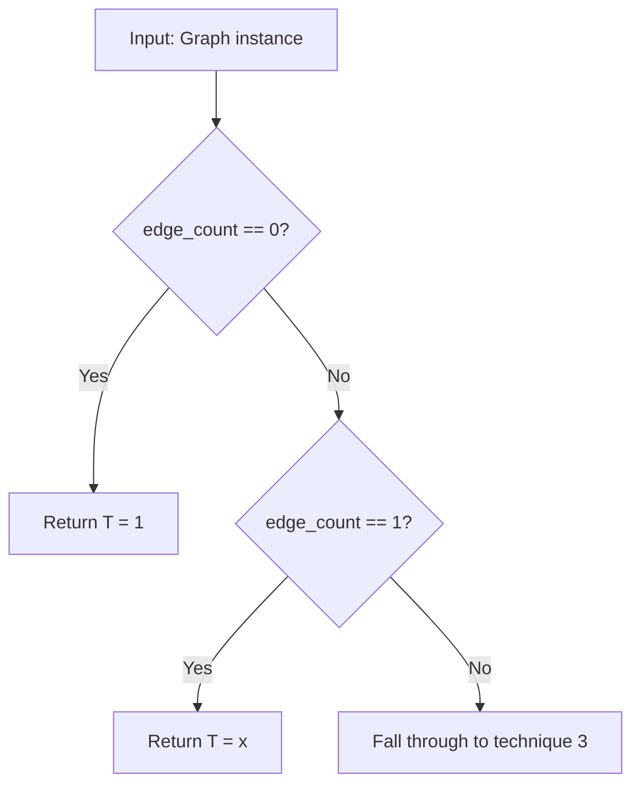

# 2. Base Cases

## Summary

Base case detection provides immediate polynomial return for graphs with zero or one edges. These are the terminal cases to which every recursive technique in the pipeline eventually reduces.

## When It's Used

**Priority 2** — checked immediately after rainbow table lookup returns a miss. Triggers when `graph.edge_count()` is 0 or 1.

## Algorithm



## Cases

### Case 1: Empty Graph (0 edges)

A graph containing only vertices and no edges. This includes a single isolated node or multiple disconnected nodes with no edges between them.

**Formula**: `T(G) = 1`

```
Example:

    A       B       C          (3 isolated nodes, 0 edges)

    T(G) = 1
```

### Case 2: Single Edge (1 edge)

A graph containing exactly one edge connecting two nodes (isomorphic to K₂).

**Formula**: `T(G) = x`

```
Example:

    A ——— B                    (2 nodes, 1 edge)

    T(G) = x
```

## Design Rationale

The engine defines only two base cases because all other small graphs (K₃, C₄, paths, etc.) are already present in the rainbow table (technique 1). Base cases exist solely to terminate recursion at the irreducible minimum. Every other technique in the pipeline eventually reduces graphs to these two cases:

- **Spanning tree expansion** constructs a tree from single edges, each contributing T = x.
- **Cut vertex factorization** splits graphs into smaller components that eventually reduce to single edges.
- **Disconnected factorization** splits into components that may be empty or single-edged.

## Complexity

O(1) — a single integer comparison on `edge_count`, returning a constant polynomial.

## Limitations

- Only handles graphs with 0 or 1 edges. Any graph with 2 or more edges falls through to disconnected factorization (technique 3).