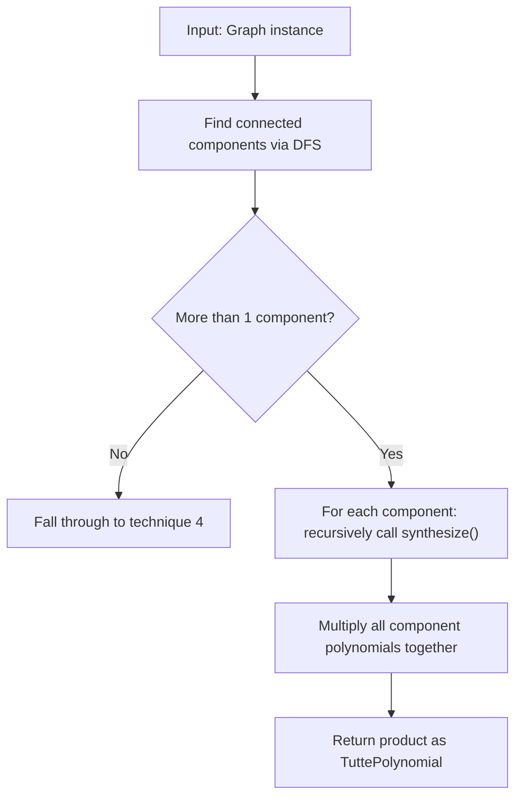

# 3. Disconnected Factorization

## Summary

If a graph consists of multiple disconnected components (subgraphs with no edges between them), the Tutte polynomial of the full graph equals the product of the Tutte polynomials of each component. This is an exact identity — no approximation is involved.

## When It's Used

**Priority 3** — checked after rainbow table lookup and base cases. Triggers when `graph.connected_components()` returns more than one component.

## Formula

```
T(G₁ ∪ G₂ ∪ ... ∪ Gₖ) = T(G₁) × T(G₂) × ... × T(Gₖ)
```

The Tutte polynomial is multiplicative over disjoint components. This is a fundamental property: since the components share no edges, every spanning subgraph of the full graph is a combination of spanning subgraphs from each component independently.

## Algorithm



Each component is synthesized recursively through the full pipeline (rainbow table lookup → base cases → etc.). A component may resolve via a rainbow table hit, or may itself require further decomposition.

## Component Detection

Connected components are identified via depth-first search using an explicit stack (`graph.py:318–345`):

| Step | Operation |
|------|-----------|
| 1 | Select an unvisited node as the starting point |
| 2 | Push it onto the stack. While the stack is non-empty, pop a node, mark it as visited, and push all unvisited neighbors |
| 3 | All visited nodes from this traversal form one component — extract as a subgraph via `self.subgraph(component_nodes)` |
| 4 | Repeat from step 1 for any remaining unvisited nodes |

This is standard DFS graph traversal in O(n + m) time, where n = number of nodes and m = number of edges.

## Example

```
Input graph (6 nodes, 4 edges):

    A ——— B         D ——— E
    |               |
    C               F

Component 1: path {A, B, C} with 2 edges
Component 2: path {D, E, F} with 2 edges

T(Component 1) = x²       (path graph P₃)
T(Component 2) = x²       (path graph P₃)

T(G) = T(C₁) × T(C₂) = x² × x² = x⁴
```

## Complexity

| Operation | Time |
|-----------|------|
| Component detection | O(n + m) — single DFS pass |
| Per-component synthesis | Varies — depends on which technique handles each component |
| Polynomial multiplication | O(t₁ × t₂) per pair, where t₁ and t₂ are the number of terms in each polynomial |

## Limitations

- Only applies to disconnected graphs. If every node is reachable from every other node, this technique does not trigger.
- Most graphs encountered in practice (atlas graphs, D-Wave topologies) are connected, so this technique fires less frequently than cut vertex factorization (technique 4).
- The recursive synthesis calls for each component can remain expensive if the components are large.