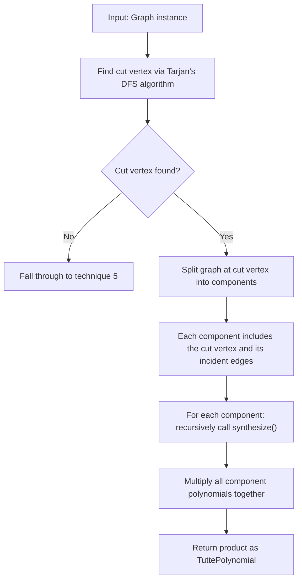

# 4. Cut Vertex Factorization

## Summary

If a graph contains a cut vertex (a node whose removal disconnects the graph), the graph is split at that vertex into smaller components. The Tutte polynomial of the full graph equals the product of the Tutte polynomials of the resulting components. This is an exact identity, analogous to disconnected factorization (technique 3), except that the components share a single vertex rather than being completely disjoint.

## When It's Used

**Priority 4** — checked after rainbow table lookup, base cases, and disconnected factorization. Triggers when `graph.has_cut_vertex()` returns a non-None node.

## Definition

A **cut vertex** (also called an **articulation point**) is a node v such that removing v and all its incident edges disconnects the graph into two or more components. A graph with no cut vertex is called **biconnected**.

```
Example: node C is a cut vertex

    A ——— B               D ——— E
     \   /                 |   /
      \ /                  |  /
       C ——————————————————F
       ^
  cut vertex

Remove C → left piece {A, B} and right piece {D, E, F} become disconnected.
```

## Formula

```
T(G₁ ·ᵥ G₂) = T(G₁) × T(G₂)
```

Where `G₁ ·ᵥ G₂` denotes two subgraphs sharing a single vertex v. The polynomial is multiplicative — identical to the disconnected case, since the shared vertex contributes no additional structural interaction between the two sides.

## Algorithm



## Split Procedure

The split at cut vertex v proceeds as follows (`graph.py:455–494`):

| Step | Operation |
|------|-----------|
| 1 | Remove v from the node set, producing `other_nodes = self.nodes - {v}` |
| 2 | Find connected components of `other_nodes` via DFS (skipping v during traversal) |
| 3 | For each component, add v back to the node set |
| 4 | Extract the induced subgraph: include all edges from the original graph whose both endpoints belong to the component's node set (including edges incident to v) |

The cut vertex v appears in every resulting component. This ensures that all edges incident to v are accounted for exactly once, since each such edge connects v to a node in exactly one component.

```
Original graph:

    A ——— B
     \   /
      \ /
       C ——— D ——— E
       ^
  cut vertex

Split at C:

  Component 1:        Component 2:
    A ——— B             C ——— D ——— E
     \   /
      \ /
       C

  T(G) = T(C₁) × T(C₂)
```

## Cut Vertex Detection (Tarjan's Algorithm)

The engine uses Tarjan's DFS-based algorithm (`graph.py:369–414`) to find articulation points in O(n + m) time. The algorithm maintains two arrays during a single DFS traversal:

| Array | Definition |
|-------|------------|
| `disc[u]` | Discovery time of node u — a monotonically increasing counter (0, 1, 2, ...) assigned when u is first visited |
| `low[u]` | The minimum discovery time reachable from u's DFS subtree via back edges |

A node u is identified as a cut vertex if either condition holds:

1. **Root condition**: u is the root of the DFS tree and has two or more children in the DFS tree (`parent.get(u) is None and children > 1`).
2. **Non-root condition**: u is not the root and has a child v such that `low[v] >= disc[u]`. This indicates that v's subtree has no back edge reaching any ancestor of u, so removing u would disconnect v's subtree from the rest of the graph.

The method returns the first cut vertex found, or None if the graph is biconnected. To find all cut vertices, the engine provides `find_all_cut_vertices()`.

## Example

```
Input: Two triangles sharing a vertex (bowtie graph)

    A ——— B         D ——— E
     \   /           \   /
      \ /             \ /
       C ——————————————C
       ^
  cut vertex

Component 1: Triangle {A, B, C}
    T(K₃) = x² + x + y

Component 2: Triangle {C, D, E}
    T(K₃) = x² + x + y

T(bowtie) = (x² + x + y) × (x² + x + y)
           = (x² + x + y)²
```

## Complexity

| Operation | Time |
|-----------|------|
| Cut vertex detection | O(n + m) — Tarjan's algorithm, single DFS pass |
| Split at cut vertex | O(n + m) — DFS on the graph with cut vertex removed |
| Per-component synthesis | Varies — depends on which technique handles each component recursively |
| Polynomial multiplication | O(t₁ × t₂) per pair, where t₁ and t₂ are the number of terms in each polynomial |

## Limitations

- Only applies to graphs that contain a cut vertex. Biconnected graphs fall through to hierarchical tiling (technique 5) or creation-expansion-join (technique 6).
- The engine finds one cut vertex per invocation and splits there. The resulting components may themselves contain cut vertices, which are detected and split in subsequent recursive calls to `synthesize()`.
- Provides no benefit for biconnected graphs such as cycles, complete graphs, or Petersen-like structures.