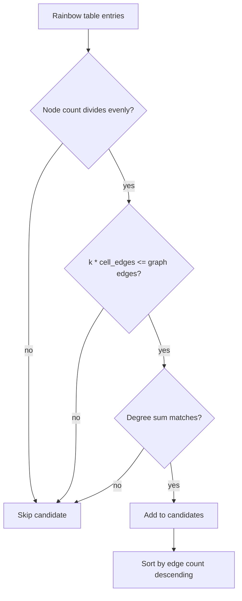
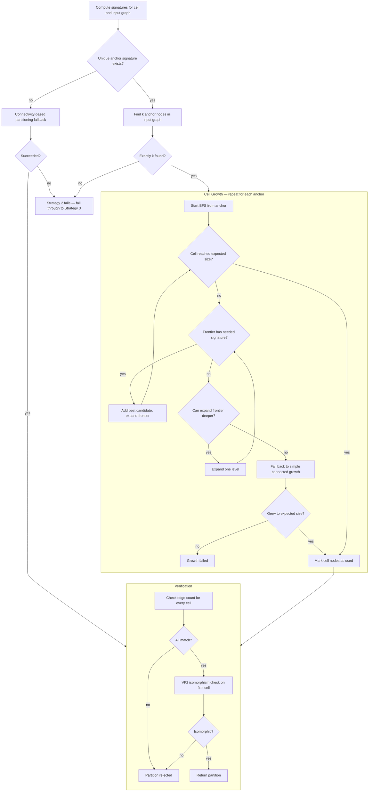

# 5.1 Find and Partition Cells

## Summary

Before hierarchical tiling can compute a polynomial, it needs to answer two questions: "What repeating pattern (cell) does this graph have?" and "How do I split the graph's nodes into copies of that cell?" This sub-technique handles both.

**Important**: hierarchical tiling uses a **single cell type** to tile the entire graph. It does not mix different cells. The algorithm tries candidates one at a time (largest first), and the first one that successfully partitions all nodes into k isomorphic copies is used.

## Finding a Cell

The engine scans the rainbow table for entries that could tile the input graph. Candidates are filtered using cheap arithmetic checks before any expensive isomorphism testing:

1. **Node count divisibility**: cell node count must evenly divide the graph's node count (gives k = number of cells).

   Since we use a single cell type and every node must belong to exactly one cell, a remainder means this candidate can never tile all nodes — e.g., a 4-node cell can't tile a 13-node graph (13 % 4 = 1 leftover node).
2. **Edge count consistency**: the total number of edges across all k cells must be less than or equal to the graph's edge count. The remaining edges are inter-cell edges.

   If the cell has 6 edges and k=3, the cells alone account for 18 edges. If the input graph has 20 edges, then 20 - 18 = 2 inter-cell edges — that's fine. But if the input graph only has 15 edges, then 15 - 18 = -3, which means we'd need negative inter-cell edges. That's impossible, so skip this candidate.
3. **Degree sum compatibility**: the degree sum of k cells plus 2 per inter-cell edge must equal the graph's degree sum.

   > **Note — Degree sum**: the sum of every node's degree across the entire graph. For example, in a triangle (3 nodes, 3 edges), each node has degree 2, so the degree sum is 2 + 2 + 2 = 6. The degree sum always equals twice the edge count.

   Each inter-cell edge contributes 1 to the degree of each of its two endpoints, adding 2 to the total degree sum. So the expected degree sum is (k × cell degree sum) + (2 × inter-cell edge count). If this doesn't match the graph's actual degree sum, the candidate can't tile the graph.

Candidates are sorted by edge count descending — larger cells are tried first since they cover more of the graph per tile.



## Partitioning Nodes into Cells

Given a cell candidate with k expected copies, the engine tries to split the graph's nodes into k groups where each group's induced subgraph is isomorphic to the cell. Three strategies are tried in order:

### Strategy 1: Disconnected Components

If the graph has exactly k connected components and each has the right number of nodes, use them directly. This is the trivial case — no computation needed.

In practice, this strategy never triggers in the main pipeline. By the time a graph reaches **hierarchical tiling** (technique 5), **disconnected factorization** (technique 3) has already split any disconnected graph into its components. This check exists as a safety net for cases where the partitioning logic is called from a different context.

### Strategy 2: Node Signature Matching

#### Computing Node Signatures

Before the matching algorithm begins, a **signature** is computed for every node in both the cell and the input graph. The idea is that nodes playing the same structural role in the cell will have the same signature.

For each node in the graph, compute the following three values:

1. **degree** — count the number of edges connected to this node.
2. **neighbor degree sum** — for each neighbor of this node, look up its degree. Sum all those degrees together. This captures how "connected" the surrounding neighborhood is. A node with 3 neighbors of degree 5 has a neighbor degree sum of 15, while a node with 3 neighbors of degree 2 has a neighbor degree sum of 6.
3. **triangles** — for each pair of this node's neighbors, check whether those two neighbors are connected to each other by an edge. Each such connected pair forms a triangle with the original node. Count the total number of such pairs.

   For example, suppose node A has three neighbors: B, C, and D. If B and C are connected but neither B-D nor C-D are connected, then only one pair of neighbors shares an edge. Node A participates in exactly 1 triangle.

These three values together form the node's signature. Store the signature for every node in a dictionary mapping node ID to its signature. Do this once for the cell and once for the input graph.

#### Signature Matching Algorithm

Once all signatures are computed, the matching algorithm proceeds through the following steps:

**Step 1 — Find the anchor signature in the cell**: Count how many times each signature appears among the cell's nodes. The goal is to find a signature that appears exactly once — this will be used as the "anchor" signature. A unique signature means there is exactly one node in the cell with that combination of degree, neighbor degree sum, and triangles, so it can reliably identify the same role across copies.

If multiple unique signatures exist, the algorithm just picks the first one. Only one anchor signature is needed to identify one node per cell copy.

If no unique signature exists (all nodes in the cell share the same signature), this strategy cannot find anchors. It falls back to connectivity-based partitioning, which grows connected subgraphs of the right size without any signature guidance. If that also fails, the entire Strategy 2 returns nothing and the engine moves on to Strategy 3 (VF2 structural matching).

**Step 2 — Find anchor nodes in the input graph**: Now compare against the input graph's signature dictionary. Scan every node in the input graph and collect those whose signature values (degree, neighbor degree sum, triangles) are the same as the anchor signature found in the cell in Step 1. There should be exactly k of them, one per cell copy. If the count is not exactly k, the strategy fails and returns nothing.

**Step 3 — Grow cells from anchors using BFS**: The algorithm processes the k anchor nodes one at a time. For each anchor node, it builds a cell by collecting nearby nodes that match the signatures the cell requires. Here is how one cell is grown:

1. Place the anchor node into the cell. Look at the anchor's neighbors in the input graph and exclude any that were already used by a previously grown cell. The remaining neighbors become the **frontier** — the set of candidate nodes that could be added to this cell next.

2. Build a **needed signatures counter** from the cell's signature dictionary. This counter tracks how many nodes of each signature the cell still needs. Since the anchor is already placed, decrement its signature from the counter.

3. Scan the frontier for the best candidate to add next. A candidate must satisfy two conditions: its signature must still be needed by the counter, and it must not have been used by a previous cell. Among all valid candidates, pick the one with the most edges connecting back into the current cell. This greedy choice keeps the growing cell tightly connected rather than sprawling outward.

4. Add the best candidate to the cell, decrement its signature from the needed counter, and add its unused neighbors to the frontier.

5. If no node in the frontier has a needed signature, expand the frontier one level deeper. Collect all unused neighbors of every node already in the cell and use them as the new frontier.

6. Repeat steps 3 through 5 until the cell reaches the expected size. If the frontier is completely exhausted before the cell is full, growth has failed for this anchor.

If signature-based growth fails for a specific anchor, the algorithm falls back to a simpler method. This fallback ignores signatures entirely and just picks the frontier node with the most connections to the current cell. It only cares about growing a connected subgraph of the right size.

**Step 4 — Track used nodes**: After each cell is successfully grown, all of its nodes are marked as used. The next anchor's BFS will not consider these nodes, ensuring cells do not overlap.

**Step 5 — Verify the partition**: After all k cells are grown, two checks are run on the result. First, every cell must have exactly the same number of edges as the original cell pattern. Second, one cell is checked for full structural isomorphism against the cell pattern using VF2. If either check fails, the partition is rejected.

#### Flowchart



#### Example

```
Cell is a wheel graph W4 with a hub and 4 spokes.

Hub node has degree 4, neighbor degree sum 12, and sits in 4 triangles.
Spoke nodes have degree 3, neighbor degree sum 9, and sit in 2 triangles.

Step 1: The hub signature appears once in the cell. It becomes the anchor.
Step 2: Scan the input graph — find exactly k nodes with the hub signature.
Step 3: From each hub anchor, BFS outward. The needed counter says we still
        need 4 spoke-signature nodes. Pick spoke-signature neighbors with
        the most edges back into the growing cell. Repeat until 5 nodes collected.
Step 4: Mark those 5 nodes as used before growing the next cell.
Step 5: Check each cell has 8 edges (W4 has 8). VF2-check one cell against W4.
```

### Strategy 3: VF2 Structural Matching

When signature matching fails (e.g., all nodes look the same in a regular graph), fall back to VF2 subgraph isomorphism:

1. Find all subgraph isomorphisms of the cell in the graph using NetworkX VF2 (capped at 1001 matches — the loop breaks when `len(all_matches) > 1000`)
2. Find k disjoint copies that cover all nodes using **backtracking search**
3. Return the partition if found

This is slower but handles cases where node signatures are ambiguous.

## Partition Verification

Partition verification occurs at two levels.

### Internal verification (inside `partition_into_cells`, Strategy 2 Step 5)

After all k cells are grown, two checks are performed on the result:

1. **Edge count check**: every cell must have exactly the same number of edges as the cell pattern.
2. **VF2 isomorphism check on one cell**: the first cell's induced subgraph is verified as isomorphic to the cell pattern via VF2.

If either check fails, the partition is rejected.

### External verification (`verify_cell_partition`, called by `try_hierarchical_partition`)

After `partition_into_cells` returns a candidate partition, `try_hierarchical_partition` (`covering.py:1175`) calls `verify_cell_partition` as a second, more thorough verification pass. This function iterates over **every** cell in the partition and performs three checks per cell:

1. **Signature compatibility**: compute `CellSignature` for the cell's induced subgraph and verify it matches the cell pattern's signature via `could_match()`.
2. **Edge count check**: the induced subgraph must have exactly `cell.edge_count` edges.
3. **VF2 isomorphism check**: verify the induced subgraph is isomorphic to the cell pattern via `nx.is_isomorphic()`.

If any cell fails any check, the entire partition is rejected and the engine tries the next candidate. This ensures that partitions produced by the BFS heuristic in Strategy 2 — which only verifies one cell internally — are fully validated before proceeding.

## Complexity

| Operation | Time |
|-----------|------|
| Candidate filtering (per rainbow table entry) | O(1) — arithmetic checks on node count, edge count, degree sum |
| Candidate sorting | O(t log t), where t = number of candidates passing filters |
| Signature computation (cell + input graph) | O(n × d²), where d = max degree — triangle counting dominates |
| Anchor identification | O(n) — single scan of input graph signatures |
| BFS cell growth (per cell) | O(n × d) — frontier scanning with greedy edge-count ranking |
| Partition verification (edge count check) | O(m) — count edges per cell |
| Partition verification (VF2 isomorphism) | O(n! / automorphisms) worst case, O(n²) typical for structured graphs |
| VF2 fallback (Strategy 3) | O(n! × k) worst case — up to 1001 matches, backtracking over k cells |
| **Total (Strategy 2, typical)** | **O(t + n × d²)** |
| **Total (Strategy 3, worst case)** | **O(t + n!)** |

The dominant cost varies by strategy. Strategy 2 (signature matching) is dominated by triangle counting during signature computation. Strategy 3 (VF2 fallback) is dominated by subgraph isomorphism enumeration, which has exponential worst-case complexity but is constrained by the 1001-match cap.

## Inter-Cell Edge Analysis

> **Note**: Inter-cell edges are not part of any cell. Each cell's Tutte polynomial (from the rainbow table) is computed only on its internal edges. Inter-cell edges exist only in the input graph, connecting a node in one cell to a node in a different cell. They are identified after partitioning and handled separately by later sub-techniques (product formula, Theorem 6, or edge-by-edge addition).

After partitioning, edges that cross between different cells are collected. The engine records:

- **Inter-cell edges**: edges where the two endpoints belong to different cells
- **Regularity**: whether each adjacent cell pair has the same number of connecting edges
- **Cell adjacencies**: which cell pairs are connected

This information is packaged as `InterCellInfo` and passed to the next phase (product formula, Theorem 6, or edge-by-edge addition).
