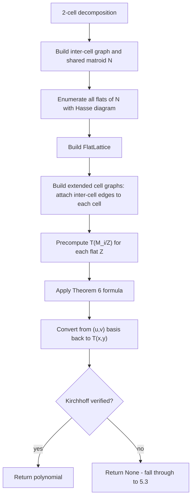
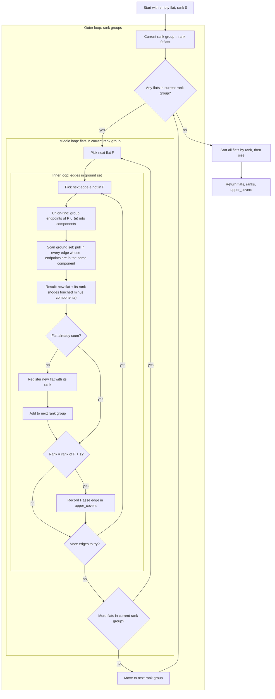

# 5.2 Theorem 6 Parallel Connection

## Summary

When the product formula fails for a **2-cell decomposition**, the engine tries the **Bonin-de Mier Theorem 6** — a matroid-theory formula that computes the Tutte polynomial of two graphs connected by shared edges, using the lattice of flats of the shared matroid.

## When It's Used

Only when:
- Product formula (T(cell)^k * product of inter-cell components) failed Kirchhoff verification
- There are **exactly 2 cells** in the partition

If Theorem 6 also fails verification, the engine falls through to [5.3 Edge-by-Edge Addition](05_3_edge_by_edge_addition.md).

## The Setup

> **Note**: Inter-cell edges are not part of any cell. Each cell's Tutte polynomial (from the rainbow table) is computed only on its internal edges. Inter-cell edges exist only in the input graph, connecting a node in one cell to a node in a different cell. Theorem 6 needs to reason about these inter-cell edges, so it builds "extended" cell graphs that include them.

```
Inter-cell graph:  only the inter-cell edges and the nodes they touch
Cell 1 (extended): subgraph of partition[0] + inter-cell edges touching it
Cell 2 (extended): subgraph of partition[1] + inter-cell edges touching it
Shared matroid N:  graphic matroid whose ground set = inter-cell edges
```

The shared matroid N captures the structure of how the two cells are connected. The extended cell graphs include both intra-cell edges and inter-cell edges, and are used later for contraction.

## Algorithm



### Step 1: Build Shared Matroid

> **Note — Matroid**: A matroid is a collection of subsets of some ground set, where each subset is classified as independent or dependent based on a rule.
>
> A **graphic matroid** uses edges as the ground set. The independence rule is that the subset must not contain a cycle. Any cycle-free subset of edges is independent, meaning it forms a forest. A subset that contains a cycle is dependent.

The inter-cell edges were already identified by [5.1 Find and Partition Cells](05_1_find_and_partition_cells.md) and stored in an `InterCellInfo` object. Step 1 takes those edges from `InterCellInfo.edges` and wraps them into a `Graph` containing only the inter-cell edges and the nodes they touch. No cell internal edges are in this graph. Then it creates a `GraphicMatroid` from that inter-cell graph. The ground set is just the edges connecting the two cells, which keeps it small.

The `GraphicMatroid` stores the following fields (`matroids/core.py:42–54`):

| Field | Visibility | Type | Description |
|-------|-----------|------|-------------|
| `graph` | public | `Graph` | The original inter-cell graph passed in during construction |
| `ground_set` | public property | `FrozenSet[Edge]` | The set of inter-cell edges, extracted from `graph.edges` |
| `_nodes` | private | `FrozenSet[int]` | The set of all nodes touched by these edges |
| `_edge_endpoints` | private | `Dict[Edge, Tuple[int, int]]` | A mapping from each edge to its two endpoint nodes |
| `_node_edges` | private | `Dict[int, Set[Edge]]` | A mapping from each node to all edges that touch it |

The rank function counts the number of nodes touched minus the number of connected components for any subset of these inter-cell edges. It uses union-find internally to count components efficiently.

### Step 2: Enumerate Flats

> **Note**
>
> **Flat**: A subset of edges that is "closed." Every edge outside the flat would increase the rank if added.
>
> If an edge could be added without increasing the rank, the flat would need to contain it to be closed. The empty set and the full ground set are always flats.
>
> **Closure**: The closure of a set of edges is the smallest flat that contains all of those edges.
>
> For a graphic matroid, it is computed by finding the connected components formed by the edges, then collecting every edge from the ground set whose two endpoints fall in the same component.
>
> **Hasse diagram**: A structure that connects each flat only to the flats directly above and directly below it in the lattice. "Directly above" means there is no other flat between them.
>
> This is more efficient than storing all pairwise containment relationships.
>
> **Lattice of flats**: The collection of all flats ordered by containment. Every pair of flats has a unique smallest flat containing both of them, and a unique largest flat contained in both of them.
>
> The Hasse diagram is the compact representation of this lattice.

#### Enumeration Algorithm

The function `enumerate_flats_with_hasse` takes the `GraphicMatroid` built in Step 1 as its only input. It produces three outputs in a single pass: a list of every flat in the matroid, each flat's rank, and the Hasse diagram recording which flats directly cover which other flats.

The core idea is that you never need to check whether a set of edges is a flat. Instead, you can turn any set of edges into a flat by calling the closure function. The output is guaranteed to be a flat because closure pulls in every edge from the ground set whose endpoints are already in the same connected component — there are no edges left outside that could be added without increasing the rank.

For example, suppose the ground set is AB, BC, AC, and CD. Starting from `{AB, BC}`, the union-find connects A, B, and C into one component. Closure scans the ground set: AB, BC, and AC all have both endpoints in that component, so they get pulled in. CD does not — C and D are in separate components. The closure returns `{AB, BC, AC}`.

1. Start with the empty flat at rank 0 and add it to the current BFS level.
2. For each flat F in the current level, try adding each edge e from the ground set that is not already in F.
3. Compute `closure(F ∪ {e})` to get a new flat. The closure's union-find also gives the rank of this flat for free.
4. If this flat has not been seen before, register it with its rank and add it to the next BFS level.
5. If the new flat's rank is exactly one more than F's rank, record a covering relation from F to the new flat. This is a Hasse edge.
6. Once all edges have been tried for all flats in the current level, move to the next level.
7. Repeat until no new flats are discovered.
8. Sort all flats by rank then by size for consistent ordering.



#### Output

The function `enumerate_flats_with_hasse` returns three values:

- **flats**: a list of `FrozenSet[Edge]` sorted by rank then by size. Each flat is an immutable set of edge tuples. The first element is always the empty flat, and the last element is always the full ground set.
- **ranks**: a parallel list of integers where `ranks[i]` is the rank of `flats[i]`.
- **upper_covers**: a dictionary mapping each flat's index to the list of flat indices that directly cover it. This is the Hasse diagram. For example, `upper_covers[0] = [1, 2, 3]` means the empty flat is directly covered by flats at indices 1, 2, and 3.

### Step 3: Build FlatLattice

> **Note**
>
> **Lattice of flats**: The collection of all flats ordered by containment.
>
> Every pair of flats has a unique smallest flat containing both of them, and a unique largest flat contained in both of them.
>
> The Hasse diagram is the compact representation of this lattice.
>
> **Möbius function**: A weight assigned to each pair of flats where one contains the other.
>
> For any flat F, `mu(F, F) = 1`. For a flat W contained in a larger flat Z, `mu(W, Z) = -sum of mu(W, K)` for every flat K that sits strictly between W and Z.
>
> The Möbius function is used for inclusion-exclusion over the lattice, and it is the key ingredient in Theorem 6's formula.

Step 2 returns three raw lists: flats, ranks, and upper covers. Step 3 wraps them into a `FlatLattice` data structure that adds fast lookups and Möbius function support. The later steps never touch the raw lists directly — they go through the lattice.

The constructor also stores a reference to the original `GraphicMatroid` from Step 1. Some methods fall back to calling the matroid's rank function directly if a flat is not found in the index.

The constructor takes the three outputs from Step 2 and builds four additional structures on top of them:

- **flat_index**: maps each flat to its position in the list. This is the reverse of the flats list — given a frozenset of edges, it returns the index without scanning.

- **flats_by_rank**: groups flat indices by rank. For example, `flats_by_rank[2] = [3, 5, 7]` means flats at indices 3, 5, and 7 all have rank 2. Later steps use this to quickly grab all flats at a given rank.

- **lower_covers**: the downward direction of the Hasse diagram. Step 2 only produced upper covers, which say "flat A is directly below flat B." Lower covers say the reverse: "flat B is directly above flat A." The Möbius computation needs to walk the lattice in both directions.

- **Möbius caches**: two lazily populated caches used by later steps.
  - `_mobius_cache`: `Dict[Tuple[int, int], int]` — initialized as an empty dictionary. Stores `mu(W, Z)` for arbitrary flat pairs, computed on demand. Used by the inner sums in the Theorem 6 formula.
  - `_mobius_from_bottom`: `Optional[Dict[int, int]]` — initialized as `None`. When populated (via `precompute_all_mobius_from_bottom`), stores `mu(0, F)` for every flat F from the bottom element. Used by the outer sum in the Theorem 6 formula. Both caches are filled by walking the lattice bottom-up using the recursive Möbius definition.

### Step 4: Build Extended Cell Graphs

Each cell on its own only has intra-cell edges, but Theorem 6 needs the inter-cell edges included too. The function `build_extended_cell_graph` extends each cell by:

1. Collecting all intra-cell edges — edges from the full graph where both endpoints belong to the cell.
2. Collecting all inter-cell edges that touch this cell — edges where at least one endpoint belongs to the cell. Any endpoint from the other cell gets added to the node set as well.
3. Combining both edge sets into a single `Graph`.

This is done once for each cell. The inter-cell edges that both extended cells share are exactly the ground set of the matroid built in Step 1.

The function returns two values:

- **extended_graph**: a `Graph` containing the cell's own nodes, any nodes from the other cell that inter-cell edges pull in, and all intra-cell plus relevant inter-cell edges.
- **shared_edges**: the subset of inter-cell edges that were included in this extended graph. This is used later by Step 5 to know which edges in the extended graph are inter-cell edges that flats can contract.

### Step 5: Precompute Contractions

> **Note**
>
> **Contraction**: Contracting an edge means merging its two endpoints into a single node. The edge itself disappears, and any other edges that connected to either endpoint now connect to the merged node. If merging would create a self-loop, that loop is removed.

Step 6 needs to combine the two cell polynomials into a single polynomial for the whole graph. To do that, it needs to know how each cell behaves when various subsets of the shared inter-cell edges are contracted. This step precomputes those values so Step 6 can look them up directly.

The function `precompute_contractions` takes an extended cell graph from Step 4 and the lattice from Step 3. It loops over every flat in the lattice. Each flat is a subset of inter-cell edges only — it never contains internal cell edges. For each flat Z, the function contracts the inter-cell edges in Z within the extended cell graph. The cell's internal edges stay intact. The Tutte polynomial is then computed on the whole remaining graph: all internal edges plus whatever inter-cell edges were not in the flat.

The contraction itself uses union-find to merge the endpoints of each edge in the flat (`parallel_connection.py:498–541`). For each edge in the flat, the guard `if u in all_nodes and v in all_nodes` checks that both endpoints exist in the extended cell graph's node set before performing the merge. Edges whose endpoints fall outside the extended cell graph (which can occur when a flat edge connects to a node belonging exclusively to the other cell) are silently skipped. After merging, any edge whose two endpoints now map to the same merged node becomes a self-loop and is dropped. This is part of the definition of contraction on simple graphs — a self-loop carries no structural information.

There are two special cases. If the flat is empty, there is nothing to contract, so the engine synthesizes the Tutte polynomial of the extended cell graph as-is. If the contraction removes all edges from the graph, the result is T = 1.

After synthesis, each Tutte polynomial is converted from T(x,y) into the (u,v) basis using `BivariateLaurentPoly.from_tutte()`, where u = x-1 and v = y-1. This conversion is needed because Theorem 6's formula in Step 6 works entirely in the (u,v) basis. See the [BivariateLaurentPoly](#bivariateLaurentpoly) section for details on this representation.

This function is called once per cell, producing two output dictionaries:

- **T_M1_contracted**: `Dict[int, BivariateLaurentPoly]` — for cell 1. Maps flat index to T(cell 1 with that flat contracted), in (u,v) form.
- **T_M2_contracted**: `Dict[int, BivariateLaurentPoly]` — for cell 2. Maps flat index to T(cell 2 with that flat contracted), in (u,v) form.

For example, if the lattice has 5 flats (indices 0 through 4), each dictionary has 5 entries. Entry 0 is the uncontracted cell polynomial (empty flat), and entry 4 is the polynomial after contracting all inter-cell edges (full ground set flat). Step 6 looks up values from both dictionaries when computing its formula.

### Step 6: Apply Theorem 6 Formula

This step takes the precomputed contraction polynomials from Step 5 and combines them into the Tutte polynomial of the full graph. It first computes Möbius function values from the lattice built in Step 3, then uses those values as inclusion-exclusion weights in the summation formula: each flat's contribution corrects for overcounting caused by the flats below it.

The formula is expressed in terms of **u = x-1 and v = y-1** instead of x and y directly. Since v = y-1, division by (y-1)^r(N) reduces to a shift of v-exponents by -r(N), eliminating the need for polynomial long division.

Arithmetic in these variables is handled by the `BivariateLaurentPoly` class. These exponent shifts can produce temporarily negative v-powers during intermediate steps, but they must all cancel out in the final result. If any negative v-powers remain after the summation, `to_tutte_poly()` raises a `ValueError` — this signals that the computation is incorrect, analogous to a non-zero remainder in polynomial division.

The Bonin-de Mier Theorem 6 formula, expressed in these variables, computes the Tutte polynomial of the full graph P_N(M1, M2) — the parallel connection of cells M1 and M2 along the shared matroid N. For each flat A, the formula asks: given this pattern of connectivity among the inter-cell edges, how does each cell contribute?

```
R(P_N(M1,M2)) = v^{-r(N)} * sum_{A flat of N} mu(0,A) * (v+1)^|A| * f_1(A) * f_2(A)
```

where:
- r(N) = rank of the shared matroid
- mu(0,A) = Möbius function from bottom element to flat A — the inclusion-exclusion weight
- (v+1)^|A| = scaling factor based on the number of edges in flat A
- f_i(A) = sum_{B >= A} mu(A,B) * R(M_i/B) * v^{r(A)-r(B)}
- R(M_i/B) = rank-generating polynomial of cell i with flat B contracted (from Step 5)
- v^{-r(N)} = final normalization — the exponent shift that requires the (u, v) variable change

The f_i(A) term is an inclusion-exclusion sum over all flats above A: it captures how cell i behaves across all possible contractions above flat A, weighted by the Möbius function to correct for overlapping contributions.

> **Note on the formula**: The formula above is a reformulation in (u, v) variables of Theorem 6, Section 4 of Bonin & de Mier (2004). The original paper states the formula in (x, y) with an explicit chi(N/W) denominator — a characteristic polynomial of the contracted shared matroid. The (u, v) reformulation absorbs that denominator into the Möbius-weighted sum structure, which is why the code does not compute chi(N/W) as a separate division step.

The algorithm:
1. Precompute mu(0, F) for all flats F in one bottom-up pass
2. For each flat A where mu(0, A) is nonzero, compute f_1(A) and f_2(A) by summing over all flats B >= A
3. Multiply: mu(0,A) * (v+1)^|A| * f_1(A) * f_2(A)
4. Skip if either f_1(A) or f_2(A) is zero
5. Sum over all flats A
6. Multiply result by v^{-r(N)} (shift all v-powers down)
7. Convert back from (u,v) basis to standard T(x,y) via `to_tutte_poly()`

Steps 2 and 4 are the early exits that make the formula practical despite O(flats^2) theoretical cost — many flats have zero Möbius values or produce zero f_i terms and get skipped entirely.

### Step 7: Convert and Verify

The result from Step 6 is verified using Kirchhoff's matrix-tree theorem: T(1,1) must equal the number of spanning trees of the full graph. If verification fails, `_try_parallel_connection` returns None and the engine falls through to [5.3 Edge-by-Edge Addition](05_3_edge_by_edge_addition.md).

## Complexity

| Operation | Time |
|-----------|------|
| Build shared matroid (Step 1) | O(e), where e = number of inter-cell edges |
| Flat enumeration (Step 2) | O(F × e × α(n)) per closure, where F = number of flats |
| FlatLattice construction (Step 3) | O(F²) — Hasse diagram inversion and index building |
| Extended cell graph construction (Step 4) | O(n + m) per cell |
| Precompute contractions (Step 5) | O(F × synthesis_cost) — one full polynomial synthesis per flat per cell |
| Theorem 6 formula (Step 6) | O(F² × polynomial_multiplication_cost) — nested sum over flat pairs |
| Conversion and verification (Step 7) | O(terms) for basis conversion, O(n³) for Kirchhoff verification |
| **Total** | **O(F² × synthesis_cost)** |

The dominant cost is the nested summation in Step 6, which iterates over all pairs of flats (A, B) where B ≥ A. The number of flats F is bounded by 2^e in the worst case (where e is the number of inter-cell edges), though the 50,000-flat cap prevents unbounded growth. Each flat pair requires a polynomial multiplication, and each flat requires a precomputed contraction synthesis from Step 5.

## Limitations

- Only works for **exactly 2 cells**
- Flat enumeration is capped at 50,000 flats
- Each contraction requires a full polynomial synthesis (expensive for large cells)
- The formula involves summing over all pairs of flats, so cost grows with the number of flats squared