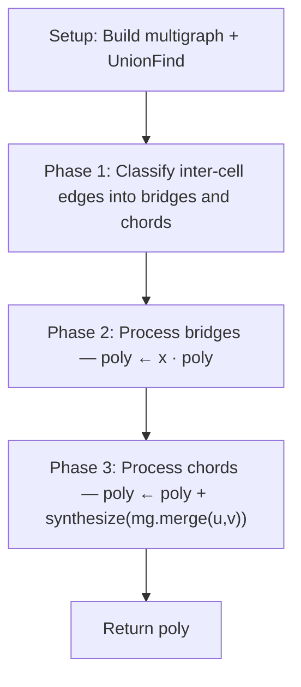

# 5.3 Edge-by-Edge Addition Fallback

## Summary

Edge-by-edge addition is the final fallback within hierarchical tiling. It incorporates inter-cell edges into the polynomial individually, classifying each as either a bridge or a chord and applying the corresponding formula.

Unlike the product formula and Theorem 6, this technique is guaranteed to produce a correct result for any number of cells, at the cost of being the slowest of the three approaches.

## When It's Used

This technique is invoked as the last resort within `_synthesize_hierarchical_tiling`, under the following conditions:
- The product formula failed Kirchhoff verification.
- For 2-cell decompositions, Theorem 6 was also attempted and either failed or threw an exception. For decompositions with 3 or more cells, Theorem 6 is not applicable, so this fallback is reached directly after the product formula.

The base polynomial `T(cell)^k` is computed upstream and passed into `_add_inter_cell_edges_optimized`. This function is responsible solely for adding the inter-cell edges to that base polynomial.

## Algorithm

The algorithm operates in three sequential phases: classify all inter-cell edges, process all bridges, then process all chords.



### Step 1: Build Initial Multigraph

| | |
|---|---|
| **Input** | `graph: Graph` (the input graph), `partition: List[Set[int]]` (node sets, one per cell) |
| **Output** | `current_mg: MultiGraph` (immutable dataclass, defined in `tutte/graph.py`) |

For each edge in the input graph, the function checks whether both endpoints belong to the same cell. Only those edges are retained. The partition is disjoint — each node belongs to exactly one cell — so each retained edge maps to exactly one cell.

The resulting `MultiGraph` contains all intra-cell edges with multiplicity 1 and no loops, since the input graph is simple. This instance serves as the running graph state for the remainder of the algorithm: later phases add edges to it, and chord contractions may introduce parallel edges and loops.

### Step 2: Initialize UnionFind

| | |
|---|---|
| **Input** | All nodes from the input graph, `partition: List[Set[int]]` |
| **Output** | `uf: UnionFind` (defined in `tutte/synthesis/base.py`) |

A `UnionFind` is created with one entry per node in the input graph, each initially in its own singleton component. For each cell in the partition, every node is unioned with the cell's first node, collapsing the entire cell into a single component. Nodes in different cells remain in separate components.

After initialization, the following invariant holds: `uf.find(u) == uf.find(v)` if and only if u and v belong to the same cell. This allows each inter-cell edge to be classified as a bridge or chord in O(α(n)) time in Step 3.

> **Note — O(α(n))**: The inverse Ackermann function α(n) grows so slowly that it does not exceed 4 for any input size that could arise in practice (α(n) ≤ 4 for n < 2^{65536}). For all practical purposes, UnionFind's `find` and `union` operations are constant time.

### Step 3: Classify All Inter-Cell Edges

| | |
|---|---|
| **Input** | `inter_info.edges: List[Tuple[int, int]]` (from `InterCellInfo`, defined in `tutte/graphs/covering.py`), `uf: UnionFind` from Step 2 |
| **Output** | `bridges: List[Tuple[int, int]]`, `chords: List[Tuple[int, int]]` |

The function iterates through all inter-cell edges in a single pass and classifies each into one of two lists:

- **Bridge**: `uf.find(u) != uf.find(v)` — the endpoints belong to different components. The edge is appended to the bridge list. `uf.union(u, v)` is called immediately, so that subsequent edges in this pass observe the updated connectivity.
- **Chord**: `uf.find(u) == uf.find(v)` — the endpoints already belong to the same component, either because they share a cell or because an earlier bridge in this pass connected their components.

The immediate union during classification is essential. Without it, two inter-cell edges connecting the same pair of components would both be classified as bridges, when only the first is a true bridge and the second is a chord.

### Step 4: Process All Bridges

| | |
|---|---|
| **Input** | `bridges` from Step 3, `poly` (initialized to `base_poly = T(cell)^k`), `current_mg` from Step 1 |
| **Output** | Updated `poly` and `current_mg` with all bridge edges incorporated |

For each bridge edge, the running polynomial is multiplied by x:

```
T(G + e) = x · T(G)
```

A bridge connects two components that are not yet linked. Adding it creates a cut vertex — so by the cut vertex factorization property (technique 4), the polynomial of the combined graph is the product of the two component polynomials. Since the Tutte polynomial of a single bridge edge is x, this reduces to multiplying the running polynomial by x.

The running polynomial begins as `base_poly = T(cell)^k` and accumulates one factor of x per bridge:

```
After 0 bridges:  poly = T(cell)^k
After 1 bridge:   poly = x · T(cell)^k
After 2 bridges:  poly = x^2 · T(cell)^k
...
After b bridges:  poly = x^b · T(cell)^k
```

After each multiplication, the bridge edge (u, v) is added to the running multigraph. Both u and v already exist as nodes in the multigraph — they were included in Step 1 when all nodes from the partition were collected. The edge is normalized to `(min(u, v), max(u, v))` and inserted into the multigraph's `edge_counts` with multiplicity 1. Since `MultiGraph` is immutable, a new instance is created with the updated edge counts after each bridge.

This multigraph update ensures that chord contractions in Step 5 operate on a graph that includes all bridge edges.

### Step 5: Process All Chords

| | |
|---|---|
| **Input** | `chords` from Step 3, `poly` (after all bridges from Step 4), `current_mg` (after all bridges from Step 4) |
| **Output** | Final `poly` — the Tutte polynomial of the complete input graph |

Unlike bridges, chords create cycles. They cannot be handled by a simple multiplication — instead, each chord requires the deletion-contraction identity:

```
T(G + e) = T(G) + T(G/{u,v})
```

This identity holds because applying deletion-contraction to the newly added edge e = (u, v) yields two terms: deleting e recovers the graph before addition (giving T(G)), and contracting e merges u and v (giving T(G/{u,v})).

For each chord edge (u, v), the function performs the following operations:

1. **Contract**: Call `current_mg.merge_nodes(u, v)` to produce a new multigraph with u and v identified into a single node. This contraction may introduce loops (from other edges between u and v) and parallel edges (from edges that both u and v shared with a common neighbor).

2. **Synthesize**: Compute the Tutte polynomial of the contracted multigraph via `_synthesize_multigraph` with `skip_minor_search=True`. This flag bypasses the expensive VF2 minor search on the contracted graph, relying instead on cheaper structural decompositions (loop extraction, parallel edge formulas, cut vertex splitting, cache lookup).

3. **Accumulate**: Add the synthesized polynomial to the running total: `poly ← poly + T(contracted)`.

4. **Update multigraph**: Add the chord edge (u, v) to the running multigraph, normalized to `(min(u, v), max(u, v))` with multiplicity 1. This ensures that subsequent chord contractions see a graph that includes this chord.

> **Note — Running multigraph**: Both bridge processing (Step 4) and chord processing (Step 5) update the running multigraph after each edge. By the time the i-th chord is processed, the multigraph contains all intra-cell edges, all bridge edges, and all previously processed chord edges.

## Why Bridges Before Chords?

Bridges require only a polynomial multiplication by x, which is O(terms) in the size of the current polynomial. Chords require synthesizing the Tutte polynomial of a contracted multigraph, which is significantly more expensive. Processing all bridges first ensures that all O(terms) operations complete before any expensive synthesis calls begin.

Both orderings produce the same final polynomial — the result is independent of the order in which edges are added. The separation into phases is purely a performance optimization.

## Complexity

| Operation | Time |
|-----------|------|
| UnionFind initialization | O(n) |
| Edge classification | O(α(n)) per edge |
| Bridge processing | O(terms) per bridge |
| Chord processing | O(synthesis cost) per chord |
| **Total** | **O(bridges × terms + chords × synthesis cost)** |

The total cost is dominated by chord processing. Each chord requires synthesizing the Tutte polynomial of a contracted multigraph, which may itself contain loops, parallel edges, and disconnected components. The `_synthesize_multigraph` method handles these through a cascade of pattern recognition steps: loop extraction, parallel edge formulas, disconnected factorization, cut vertex splitting, cache lookup, and parallel edge reduction via deletion-contraction.

## Limitations

- **Chord processing is expensive**: Each chord requires a full multigraph synthesis, though `skip_minor_search=True` avoids the most expensive sub-step (VF2 minor search on the contracted graph).
- **Unused parameter**: The `cell` parameter is accepted by `_add_inter_cell_edges_optimized` but is not referenced in the function body.
- **Verification is external**: Unlike the product formula, which is verified internally via Kirchhoff's theorem before returning, this function does not verify its own result. The caller (`_synthesize_hierarchical_tiling`) performs Kirchhoff verification on the returned polynomial.
- **Order independence**: The order in which chords are processed affects the size of intermediate multigraphs and therefore the cost of each synthesis call, but the final polynomial is the same regardless of ordering.
