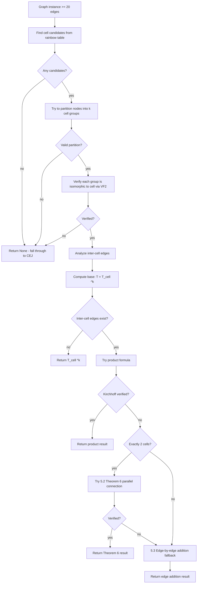

# 5. Hierarchical Tiling

## Summary

For large graphs (>= 20 edges) that have a **repeating structure**, hierarchical tiling avoids computing the Tutte polynomial from scratch. It finds a known graph (called a "cell") from the rainbow table that tiles the input — meaning the input can be split into k copies of this cell connected by some inter-cell edges. The polynomial is then computed as T(cell)^k adjusted for the inter-cell connections.

## When It's Used

Step 5 in the pipeline, after cut vertex factorization. By the time a graph reaches this step, we already know:
- It's **not in the rainbow table** (step 1 missed — no exact match)
- It's **not a base case** (has 2+ edges)
- It's **connected** (step 3 would have split it otherwise)
- It has **no cut vertices** (step 4 would have split it otherwise — so the graph is biconnected)

Additional conditions for hierarchical tiling to proceed:
- Graph has **>= 20 edges** (not worth the overhead for small graphs)
- At least **2 cells** are found (otherwise just use CEJ directly)
- Cell has **non-trivial structure** (not a tree/forest)

If no valid tiling is found, the engine falls through to CEJ (technique 6).

## Algorithm



## Sub-Techniques

| # | Sub-Technique | File | Purpose |
|---|---|---|---|
| 5.1 | [Find and Partition Cells](05_1_find_and_partition_cells.md) | `graphs/covering.py` | Find a cell from rainbow table, partition nodes into k groups |
| 5.2 | [Theorem 6 Parallel Connection](05_2_theorem6_parallel_connection.md) | `matroids/parallel_connection.py` | Bonin-de Mier formula for 2-cell decomposition (includes series-parallel fast path) |
| 5.3 | [Edge-by-Edge Addition Fallback](05_3_edge_by_edge_addition.md) | `synthesis/engine.py` | Add inter-cell edges one at a time using bridge/chord formulas |

## Example

Consider a graph composed of 3 copies of K₄ (complete graph on 4 nodes) connected in a chain:

```
[K₄] --- [K₄] --- [K₄]
 4 nodes   4 nodes   4 nodes
 6 edges   6 edges   6 edges
      + 1 inter + 1 inter = 20 edges total
```

1. **Find cell** (5.1): K₄ passes arithmetic filters (12 nodes / 4 = 3 cells, 3 × 6 = 18 ≤ 20, inter-cell edges = 2).
2. **Partition** (5.1): 3 groups of 4 nodes each, verified isomorphic to K₄.
3. **Base polynomial**: T = T(K₄)³.
4. **Product formula**: build the inter-cell graph from the 2 inter-cell edges and their endpoints. Split it into connected components (here, 2 single-edge components). Compute T(K₄)³ × Π T(component_i). Verify via Kirchhoff.
5. If verification fails and k ≠ 2, fall back to **edge-by-edge addition** (5.3): each bridge multiplies by x, each chord applies the deletion-contraction identity.

## Complexity

| Phase | Time |
|-------|------|
| Find cell candidates (5.1) | O(table_size * n) — arithmetic filters |
| Partition - signature matching (5.1) | O(n * k) — BFS per anchor |
| Partition - VF2 fallback (5.1) | O(?) — VF2 on small cells is fast, backtracking for k disjoint copies can be exponential worst case |
| Verify partition (5.1) | O(k * cell_size) — edge count + one VF2 on small graph |
| Product formula | O(k * synthesis_cost) — synthesize each inter-cell component |
| Theorem 6 (5.2) | O(flats^2 * synthesis_cost) — enumerate flats, compute Mobius, synthesize contractions |
| Edge-by-edge fallback (5.3) | O(inter_edges * multigraph_synthesis_cost) |

## Limitations

- Only works when the graph has a **repeating cell structure** that happens to be in the rainbow table
- **Node count must divide evenly** by the cell size — off-by-one means no tiling
- **Theorem 6** only works for **exactly 2 cells** (not 3+)
- Product formula only works for specific topologies (e.g., Zephyr) — for arbitrary graphs it usually fails verification
- Flat enumeration can blow up for matroids with many flats (capped at 50,000)
