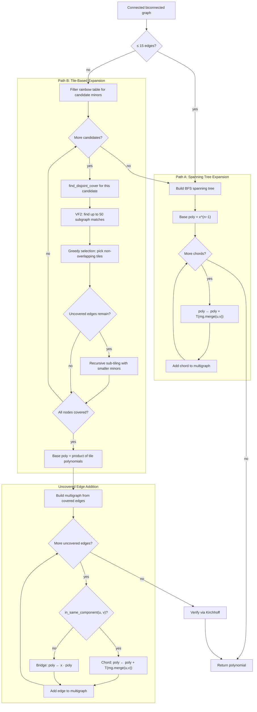

# 6. Creation-Expansion-Join (CEJ)

## Summary

Creation-Expansion-Join is the final technique in the synthesis pipeline. It computes the Tutte polynomial by constructing a base graph with a known polynomial — either a spanning tree or a set of disjoint tiles from the rainbow table — and incorporating the remaining edges one at a time using the deletion-contraction identity.

Unlike hierarchical tiling (technique 5), CEJ does not require a cell decomposition with uniform repeating structure. It operates on any connected, biconnected graph, and is guaranteed to produce a correct result regardless of graph topology.

## When It's Used

This technique is invoked by `_synthesize_connected` when all earlier techniques in the pipeline have either failed or do not apply:

1. **Cache lookup** — the graph's canonical key is not present in the memoization cache (`self._cache`).
2. **Rainbow table lookup** — no match was found for the graph's canonical key.
3. **Base cases** — the graph has more than one edge.
4. **Disconnected factorization** — the graph is connected.
5. **Cut vertex factorization** — the graph is biconnected (no articulation points).
6. **Hierarchical tiling** — either the graph has fewer than 20 edges, no repeating cell structure was found, or the tiling approach failed Kirchhoff verification.

CEJ is the last resort in the pipeline. It is guaranteed to produce a correct result for any graph, at the cost of potentially exponential computation in the number of chord edges.

## Algorithm

CEJ selects one of two paths depending on graph size and whether a useful tiling can be found:



### Path A: Spanning Tree Expansion (`_synthesize_from_k2`)

Used when the graph has 15 or fewer edges, or when no candidate minor produces a cover that spans all nodes.

| | |
|---|---|
| **Input** | `graph: Graph` (connected, biconnected) |
| **Output** | `SynthesisResult` with the computed polynomial |

#### Step 1: Build Spanning Tree

A BFS spanning tree is constructed starting from an arbitrary node. This partitions the edges of the input graph into two disjoint sets:

- **Tree edges**: The n−1 edges that form the spanning tree, where n is the number of nodes.
- **Chords**: All remaining edges — those present in the input graph but not in the spanning tree.

#### Step 2: Initialize Base Polynomial

The Tutte polynomial of a tree with n−1 edges is `x^(n−1)`, since every edge in a tree is a bridge. This value serves as the initial running polynomial.

A `MultiGraph` is constructed containing only the tree edges, with all multiplicities set to 1 and no loops. This multigraph serves as the running graph state for the remainder of the algorithm.

#### Step 3: Add Chords

Each chord edge (u, v) is incorporated into the running polynomial using the deletion-contraction identity:

```
T(G + e) = T(G) + T(G/{u,v})
```

Since the spanning tree is connected, every chord connects two nodes that are already in the same component. There are no bridges in this phase — every uncovered edge is a chord. For each chord, the following operations are performed:

1. **Contract**: Call `current_mg.merge_nodes(u, v)` to produce a contracted multigraph with u and v identified into a single node.
2. **Synthesize**: Compute the Tutte polynomial of the contracted multigraph via `_synthesize_multigraph`. This may recursively invoke loop extraction, parallel edge formulas, disconnected factorization, cut vertex splitting, cache lookup, or parallel edge reduction.
3. **Accumulate**: Add the synthesized polynomial to the running total: `poly ← poly + T(contracted)`.
4. **Update multigraph**: Add the chord edge to the running multigraph so that subsequent contractions operate on the correct graph state.

After all chords have been processed, the running polynomial equals the Tutte polynomial of the complete input graph.

### Path B: Tile-Based Expansion (`_synthesize_connected`)

Used when the graph has more than 15 edges and a disjoint tile cover that spans all nodes is found.

| | |
|---|---|
| **Input** | `graph: Graph` (connected, biconnected, > 15 edges) |
| **Output** | `SynthesisResult` with the computed polynomial |

#### Step 1: Find Tile Cover

The engine searches for a rainbow table entry that can tile the graph. This proceeds in two stages: candidate filtering and greedy tiling.

**Stage 1 — Candidate filtering (`_synthesize_connected`, `engine.py:631–636`).** The engine queries `table.find_minors_of(graph)` for all rainbow table entries that are subgraph-isomorphic to the input graph. The resulting list is then filtered within `_synthesize_connected` — not inside `find_disjoint_cover` — to retain only entries that:
- Are explicitly named (not prefixed with `synth_` or `hybrid_`).
- Cover at least `max(|E|/3, 4)` edges — small tiles do not justify the VF2 cost.
- Are not the graph itself (the graph's own canonical key is excluded).

**Stage 2 — Greedy tiling.** Each filtered candidate is tried in sequence. For each candidate minor, `find_disjoint_cover` (defined in `tutte/graphs/covering.py`) attempts to tile the graph:

1. **Find all matches**: VF2 subgraph isomorphism identifies up to 50 occurrences of the candidate minor within the input graph. Each match is a node mapping from minor nodes to graph nodes.

2. **Rank by coverage**: Each match is scored by how many currently-uncovered edges it covers. Matches are sorted in descending order of this score.

3. **Greedy selection**: The sorted matches are iterated in order. A match is accepted as a tile if it covers at least one uncovered edge and does not overlap in nodes with any previously accepted tile. After acceptance, the tile's edges are removed from the uncovered set.

4. **Recursive sub-tiling**: If uncovered edges remain after greedy selection, the function constructs an edge-induced subgraph from the uncovered edges and searches the rainbow table for strictly smaller minors. It recursively invokes `find_disjoint_cover` on the remaining subgraph with each smaller minor, decrementing a depth counter (`max_depth - 1`, initial value 5) to prevent unbounded recursion.

5. **Acceptance criterion**: Before evaluating coverage, the engine checks whether the cover contains any tiles at all (`if not trial_cover.tiles: continue` — `engine.py:645`). If the cover is empty, the candidate is skipped immediately. Otherwise, the candidate is accepted if and only if the resulting cover includes every node in the input graph (`trial_cover.covered_nodes == graph.nodes`). The first candidate to achieve full node coverage is used; subsequent candidates are not evaluated.

> **Note — Node coverage vs edge coverage**: Full node coverage does not imply full edge coverage. An edge may have both endpoints covered by tiles while the edge itself is not part of any tile's subgraph match. These uncovered edges are handled in Step 3.

If no candidate in the pre-filtered list produces a cover that spans all nodes, the engine falls back to Path A (spanning tree expansion).

#### Step 2: Compute Base Polynomial

The base polynomial is the product of the Tutte polynomials of all accepted tiles:

```
poly = T(tile_1) × T(tile_2) × ... × T(tile_k)
```

This product represents the Tutte polynomial of the graph under the assumption that the tiles are disjoint — uncovered edges between tiles are not yet accounted for.

A `MultiGraph` is constructed from all covered edges (those that belong to at least one tile), with each edge having multiplicity equal to the number of tiles that cover it.

#### Step 3: Add Uncovered Edges

Uncovered edges — those present in the input graph but not covered by any tile — are added one by one in sorted order. For each uncovered edge (u, v), the function classifies it using `current_mg.in_same_component(u, v)`, which performs a DFS traversal of the current multigraph:

- **Bridge**: `in_same_component` returns `False` — the endpoints are in different connected components. The running polynomial is multiplied by x: `poly ← x · poly`.
- **Chord**: `in_same_component` returns `True` — the endpoints are already connected. The contracted multigraph is synthesized via `_synthesize_multigraph(merged)` (without `skip_minor_search`, unlike technique 5.3), and the result is added to the running polynomial: `poly ← poly + T(contracted)`.

After each edge (bridge or chord), the edge is added to the running multigraph so that subsequent classifications and contractions operate on the correct graph state.

> **Note — Differences from technique 5.3**: This edge addition differs from technique 5.3 in three ways: (1) it uses DFS-based `in_same_component` instead of UnionFind for classification, (2) bridges and chords are interleaved in processing order rather than separated into phases, and (3) `_synthesize_multigraph` is called without `skip_minor_search=True`, allowing the full synthesis pipeline (including VF2 minor search) on contracted multigraphs.

#### Step 4: Verify

The final polynomial is verified via `verify_spanning_trees` (Kirchhoff's matrix-tree theorem): the value `T(1,1)` must equal the number of spanning trees of the input graph.

## Sub-Techniques

### Spanning Tree Expansion

The foundational operation underlying both paths. A spanning tree of n nodes contains exactly n−1 edges, all of which are bridges, yielding `T = x^(n−1)`. Each chord added via `T(G+e) = T(G) + T(G/{u,v})` introduces one cycle and requires synthesizing one contracted multigraph.

The number of chords is `m − (n−1)`, where m is the total edge count of the input graph. This quantity is the **circuit rank** (also known as the cyclomatic number) of the graph. The cost of CEJ is dominated by the number of chords, since each requires a multigraph synthesis.

### Multigraph Synthesis (`_synthesize_multigraph`)

When a chord is contracted via `merge_nodes`, the resulting graph may contain loops and parallel edges. The `_synthesize_multigraph` method (defined in `tutte/synthesis/base.py`) resolves these through a cascade of pattern recognition steps, applied in the following order:

1. **Loop extraction**: `T(G with loop) = y × T(G without loop)` — all loops are extracted as factors of y.
2. **Parallel edges formula**: For a graph consisting of exactly two nodes connected by k parallel edges: `T = x + y + y^2 + ... + y^(k−1)`.
3. **Disconnected factorization**: `T(G₁ ∪ G₂) = T(G₁) × T(G₂)`.
4. **Cut vertex splitting**: `T(G₁ ·v G₂) = T(G₁) × T(G₂)`.
5. **Cache lookup**: The multigraph's canonical key is checked against a dedicated cache of previously synthesized multigraph polynomials.
6. **Simple graph conversion**: If no parallel edges or loops remain, the multigraph is converted to a simple `Graph` and processed through the full synthesis pipeline (or the fast path if `skip_minor_search=True`).
7. **Parallel edge reduction**: `T(G) = T(G\e) + T(G/e)` — the edge with the highest multiplicity is reduced via deletion-contraction, and both resulting multigraphs are recursively synthesized.

### Fast Synthesis Path (`_synthesize_fast`)

When `_synthesize_multigraph` converts a multigraph to a simple graph with `skip_minor_search=True`, it invokes `_synthesize_fast` instead of the full `synthesize` method. This path omits the expensive VF2 minor search and hierarchical tiling, using only:

1. Cache lookup (`self._cache`)
2. Rainbow table lookup
3. Base cases (empty graph, single edge)
4. Disconnected factorization
5. Cut vertex factorization
6. Direct spanning tree expansion via `_synthesize_from_k2_fast`, which itself passes `skip_minor_search=True` to recursive multigraph synthesis calls

This avoids the O(n!) worst-case VF2 cost on intermediate contracted graphs that are unlikely to match known rainbow table entries.

## Complexity

| Operation | Time |
|-----------|------|
| Spanning tree construction (BFS) | O(n + m) |
| Edge classification (Path A) | Free — all non-tree edges are chords by definition |
| Edge classification (Path B) | O(n + m) per edge — DFS via `in_same_component` |
| Chord processing | O(multigraph_synthesis_cost) per chord |
| Multigraph pattern recognition | O(n + m) for structural checks, O(n²) for canonical key computation |
| **Total** | **O(chords × synthesis_cost)** |

The circuit rank `m − (n−1)` determines the number of chords. For sparse graphs (trees or near-trees), this quantity is small and CEJ completes quickly. For dense graphs, the number of chords grows quadratically, and each contraction produces increasingly complex multigraphs.

## Limitations

- **Exponential worst case**: Each chord contraction may produce a multigraph that itself requires further contraction via parallel edge reduction, leading to exponential branching in the worst case.
- **No UnionFind in Path B**: The tile-based path classifies edges using `in_same_component` (DFS traversal), which is O(n + m) per edge. Technique 5.3 achieves O(α(n)) per edge using UnionFind.
- **No bridge pre-processing in Path B**: Bridges and chords are processed in sorted order without separation into phases. Bridge multiplications (O(terms)) are interleaved with chord syntheses (O(synthesis_cost)).
- **Chord order is not optimized**: The order in which chords are processed affects the size of intermediate multigraphs and therefore the cost of each synthesis call. The engine processes chords in sorted edge order, which may not minimize total computation.
- **`max_depth` not enforced**: The `max_depth` parameter is propagated from `synthesize()` through `_synthesize_connected` to `_synthesize_from_k2`, but is never decremented or checked as a termination condition. Within `_synthesize_from_k2`, calls to `_synthesize_multigraph` use the default value of 10 rather than forwarding the received `max_depth`.
