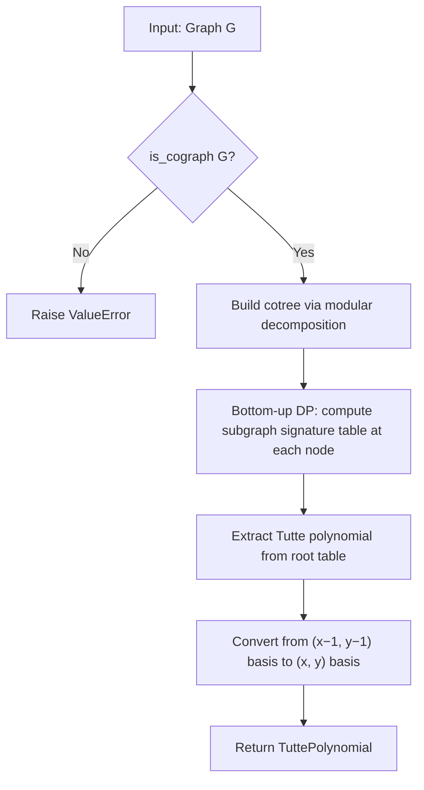

# 7. Cotree-Based Dynamic Programming for Cographs

## Summary

This technique computes the Tutte polynomial for cographs (P₄-free graphs) via dynamic programming on the cotree — a binary decomposition tree of disjoint union (∪) and complete union (⊗) operations. The algorithm enumerates all spanning subgraphs grouped by component-size signature and edge count, then extracts the Tutte polynomial via the rank-nullity formulation. The function returns a `TuttePolynomial` object, or raises `ValueError` if the input graph is not a cograph.

**Paper:** Giménez, Hliněný & Noy (2006) — *Computing the Tutte Polynomial on Graphs of Bounded Clique-Width*, SIAM J. Discrete Math., Vol. 20, No. 4, pp. 932–946. Theorem 1.1, Sections 2–3, Algorithms 2.4, 2.5/2.6, 3.1, 3.2.

**Complexity:** exp(O(num_vertices^{2/3})) — subexponential in the number of vertices.

## Notation

The following notation is used throughout this document.

| Symbol | Definition |
|---|---|
| G = (V, E) | An undirected simple graph with vertex set V and edge set E |
| num_vertices | The number of vertices, \|V\| |
| num_edges | The number of edges, \|E\| |
| num_components | The number of connected components of G |
| F ⊆ E | A subset of the edge set (a spanning subgraph) |
| k(F) | The number of connected components of the spanning subgraph (V, F) |
| r(F) | The rank of spanning subgraph (V, F): r(F) = num_vertices − k(F) |
| α | A signature — a multiset of positive integers representing component sizes |
| \|\|α\|\| | The size of signature α: the sum of all elements (equals num_vertices) |
| \|α\| | The cardinality of signature α: the number of parts (equals k(F)) |
| β | A double-signature — a multiset of (f_size, g_size) pairs |
| S[α, num_edges] | The subgraph signature table: count of spanning subgraphs with signature α and exactly num_edges edges |
| T(G; x, y) | The Tutte polynomial of graph G |
| C(n, k) | The binomial coefficient "n choose k" |
| p(n) | The number of integer partitions of n |

## When It Is Used

This technique operates as a standalone module at `tutte/cotree_dp/`. It is not integrated into the synthesis pipeline. Cographs that fall within the engine's treewidth DP cap (tw ≤ 9) are handled by the existing pipeline (technique 7 in `_synthesize_multigraph`). Cotree DP targets cographs with tw > 9 and n ≤ 35 — specifically complete graphs K_11 through K_35, large complete bipartite K_{a,b}, and threshold graphs — where the engine would otherwise fall through to exponential chord addition / batch-parallel reduction.

**Entry point:** `compute_tutte_cotree_dp(graph) → TuttePolynomial`

**Preconditions:**
- The input must be a simple `Graph` (raises `TypeError` on `MultiGraph`)
- The graph must be a cograph / P₄-free (raises `ValueError` if an induced P₄ is detected)
- The graph must have at most 35 vertices (raises `ValueError` if exceeded)

**Handles disconnected graphs:** The module handles disconnected cographs internally — the cotree's root is a ∪ node whose children are the connected components. No external component splitting is required.

## Definition: Cographs and Cotrees

A **cograph** is a graph that contains no induced path on 4 vertices (P₄-free). Equivalently, every cograph can be constructed from single vertices using exactly two operations:

1. **Disjoint union** (∪): given two graphs F and G, form the graph H = F ∪ G with V(H) = V(F) ∪ V(G) and E(H) = E(F) ∪ E(G). No edges are added between V(F) and V(G).
2. **Complete union** (⊗): given two graphs F and G, form the graph H = F ⊗ G with V(H) = V(F) ∪ V(G) and E(H) = E(F) ∪ E(G) ∪ {(u, v) : u ∈ V(F), v ∈ V(G)}. All possible edges between V(F) and V(G) are added.

Every cograph has a unique **cotree** — a rooted tree where:
- Each **leaf** represents a single vertex of the graph.
- Each **internal node** is labeled either ∪ (disjoint union) or ⊗ (complete union).
- The children of a ∪ node correspond to the connected components of the induced subgraph.
- The children of a ⊗ node correspond to the co-components (connected components of the complement).

```
Examples of cotrees:

  K₄ (complete graph, 4 vertices):       K_{3,3} (complete bipartite):

       ⊗                                       ⊗
     / | \ \                                  /   \
    0  1  2  3                               ∪     ∪
                                            /|\   /|\
                                           0 1 2 3 4 5

  P₃ (path, 3 vertices: 0—1—2):         C₄ (cycle, 4 vertices):

       ∪                                       ⊗
      / \                                    /   \
     ⊗   2                                  ∪     ∪
    / \                                     / \   / \
   0   1                                   0   2 1   3


Non-cographs (each contains an induced P₄):

  C₅ (5-cycle):  any 4 consecutive vertices form an induced P₄
  P₄ (4-path):   the graph itself is an induced P₄
  Petersen:      contains multiple induced P₄ subgraphs
```

**Cograph families:**
- Complete graphs K_n: constructed by ⊗-joining n single vertices
- Complete bipartite graphs K_{a,b}: ⊗ of two ∪ groups of sizes a and b
- Threshold graphs: constructed by alternating dominating-vertex and isolated-vertex additions
- Complements of cographs: the complement of a cograph is also a cograph

**Non-cograph families:**
- Cycles C_n for n ≥ 5
- Paths P_n for n ≥ 4
- Petersen graph
- Wheel graphs W_n for n ≥ 4

## Formula

The Tutte polynomial is defined via the rank-nullity formulation (paper §3, equation on p. 937):

```
T(G; x, y) = Σ_{F ⊆ E}  (x − 1)^{r(E) − r(F)}  ·  (y − 1)^{|F| − r(F)}
```

where:
- F ranges over all subsets of the edge set E (each F defines a spanning subgraph)
- r(F) = num_vertices − k(F), the rank of the spanning subgraph (V, F)
- k(F) = the number of connected components of (V, F)
- |F| = the number of edges in F
- r(E) = num_vertices − num_components, the rank of the full graph G

Computing T(G) is equivalent to determining, for every signature α and every edge count num_edges, the number of spanning subgraphs with component-size signature α and exactly num_edges edges. This information constitutes the **subgraph signature table** S[α, num_edges].

The algorithm computes this table via bottom-up dynamic programming on the cotree, then extracts T(G) by summing over all entries with the appropriate powers of (x − 1) and (y − 1).

## Key Concepts

### Signatures (paper §2.1, Lemma 2.1)

A **signature** is a multiset of positive integers representing the sizes of the connected components of a spanning subgraph. The size of a signature α, denoted ||α||, equals num_vertices (every vertex belongs to exactly one component). The cardinality |α| equals the number of components k(F).

```
Example: a spanning subgraph of a 7-vertex graph with components of sizes {3, 2, 1, 1}

  Signature α = (3, 2, 1, 1)     — sorted in non-increasing order
  Size ||α|| = 3 + 2 + 1 + 1 = 7 = num_vertices
  Cardinality |α| = 4            = number of components
```

The number of distinct signatures of size num_vertices equals the number of integer partitions p(num_vertices). By the Hardy-Ramanujan asymptotic formula, p(num_vertices) = 2^{Θ(√num_vertices)} (Lemma 2.1).

### Double-Signatures (paper §2.1, Lemma 2.2)

A **double-signature** is a multiset of ordered pairs (f_size, g_size) where f_size and g_size are nonnegative integers (excluding the pair (0, 0)). Double-signatures track how each component of a spanning subgraph distributes its vertices across the two sides of a ⊗ operation: f_size vertices originate from the F-side and g_size vertices originate from the G-side.

```
Example (from paper Figure 2.1):

  A spanning forest in F ⊗ G with 4 components:
    Component 1: 2 vertices from F, 1 from G  →  (2, 1)
    Component 2: 1 vertex from F, 2 from G   →  (1, 2)
    Component 3: 0 vertices from F, 1 from G →  (0, 1)
    Component 4: 1 vertex from F, 1 from G   →  (1, 1)

  Double-signature β = {(2, 1), (1, 2), (0, 1), (1, 1)}
```

The number of distinct double-signatures of size num_vertices is exp(Θ(num_vertices^{2/3})) (Lemma 2.2). This quantity dominates the algorithm's time complexity.

### Subgraph Signature Table (paper §3)

The subgraph signature table S maps (signature, num_edges) pairs to integer counts:

```
S[α, num_edges] = the number of spanning subgraphs of G that have
                   component-size signature α and exactly num_edges edges
```

This is the central data structure of the algorithm. Once S is computed for the entire graph, the Tutte polynomial is extracted via the rank-nullity formula:

```
T(G; x, y) = Σ_{(α, num_edges)}  S[α, num_edges]
              · (x − 1)^{rank_graph − rank_subgraph}
              · (y − 1)^{nullity_subgraph}

where:
  rank_graph      = num_vertices − num_components     (rank of the full graph)
  rank_subgraph   = num_vertices − |α|                (|α| = number of parts in α)
  nullity_subgraph = num_edges − rank_subgraph
```

## Algorithm

The algorithm builds the subgraph signature table bottom-up on the cotree in five steps.



### Step 1: Cograph Recognition and Cotree Construction

The algorithm recognizes cographs and builds the cotree simultaneously via recursive modular decomposition (paper §2.1; Corneil, Perl & Stewart, 1985):

1. If the induced subgraph on the current vertex set is **disconnected**, the root is a ∪ node and the children are the connected components. The algorithm recurses on each component.
2. If the **complement** of the induced subgraph is disconnected, the root is a ⊗ node and the children are the co-components (connected components of the complement). The algorithm recurses on each co-component.
3. If **neither** the graph nor its complement is disconnected, the graph contains an induced P₄ and is not a cograph. The function returns None.

```
Example: K_{3,3} with vertices {0, 1, 2, 3, 4, 5}

  Level 1: G is connected                        →  not a ∪ node
  Level 1: complement(G) = K_3 ∪ K_3             →  disconnected
           Result: ⊗ node with co-components {0, 1, 2} and {3, 4, 5}

  Level 2: recurse on {0, 1, 2}: no edges within →  disconnected
           Result: ∪ node with leaves 0, 1, 2

  Level 2: recurse on {3, 4, 5}: no edges within →  disconnected
           Result: ∪ node with leaves 3, 4, 5

  Final cotree: ⊗(∪(0, 1, 2), ∪(3, 4, 5))
```

### Step 2: Leaf Table

For a single vertex v, the subgraph signature table contains one entry:

```
S[α = (1,), num_edges = 0] = 1
```

This represents the unique spanning subgraph of a single vertex: one component of size 1, with zero edges.

### Step 3: Union Combine (paper Algorithm 2.4)

For a ∪ node with children F and G (disjoint union H = F ∪ G), spanning subgraphs of H are independent pairs of spanning subgraphs from F and G. The combine operation multiplies counts and merges signatures:

```
For all (sig_f, edges_f) in S_F and (sig_g, edges_g) in S_G:
    merged_sig = multiset_union(sig_f, sig_g)
    S_H[merged_sig, edges_f + edges_g] += S_F[sig_f, edges_f] · S_G[sig_g, edges_g]
```

Since no edges exist between V(F) and V(G), signatures merge by multiset union and edge counts add. The running time is proportional to |S_F| · |S_G|.

### Step 4: Join Combine (paper Algorithms 2.5/2.6 and 3.1)

For a ⊗ node with children F and G (complete union H = F ⊗ G), the algorithm must account for the |V(F)| · |V(G)| edges of the complete bipartite graph K_{|V(F)|, |V(G)|} that connect all F-side vertices to all G-side vertices. This is the most computationally intensive step.

The algorithm processes each G-side component one at a time (paper §2.2, proof of Algorithm 2.5). For a G-side component of size g_comp_size, the procedure is:

1. **Select a submultiset** γ of the current double-signature β. The elements of γ are the F-side components that will be merged with the current G-side component.
2. **Count edge possibilities** using CellSel (Algorithm 3.2). For each selected F-side component with f_size vertices on the F-side, there are g_comp_size · f_size possible edges in K_{g_comp_size, f_size}. CellSel counts the number of ways to select exactly num_edges_to_add edges such that at least one edge is selected from each cell.
3. **Update the double-signature** by removing the selected components from β, merging them into a single component with the G-side component, and adding the result back.

**CellSel (Algorithm 3.2):** Given num_cells pairwise disjoint cells of sizes d_1, d_2, ..., d_{num_cells}, CellSel counts the number of ways to select exactly total_to_select elements such that **at least one element is selected from every cell**. The recurrence relation is:

```
u[i][j] = Σ_{s=1}^{min(j − (i−1), d_i)}  u[i−1][j−s] · C(d_i, s)
```

where u[i][j] represents the number of valid selections of j elements from the first i cells. The constraint s ≥ 1 enforces the "at least one from every cell" requirement. CellSel runs in O(num_cells · total_to_select²) time.

The "at least one from every cell" constraint is essential for correctness: it ensures that when a G-side component is connected to a subset of F-side components, each F-side component in the subset receives at least one connecting edge. Without this constraint, a selected F-side component could receive zero edges, contradicting its inclusion in the merged component.

### Step 5: Polynomial Extraction

After the bottom-up DP completes, the root node's subgraph signature table S contains all the information required to compute the Tutte polynomial. The extraction proceeds in two phases:

**Phase 1 — Accumulate in the (x − 1, y − 1) basis:**

```
For each (α, num_edges) → count in table S:
    num_parts    = |α|                               (number of components)
    rank_sub     = num_vertices − num_parts
    nullity      = num_edges − rank_sub
    a_power      = rank_graph − rank_sub             (power of (x − 1))
    b_power      = nullity                           (power of (y − 1))

    ab_coeffs[(a_power, b_power)] += count
```

**Phase 2 — Convert to the (x, y) basis via binomial expansion:**

```
(x − 1)^i · (y − 1)^j = Σ_{x_pow=0}^{i}  Σ_{y_pow=0}^{j}
                         C(i, x_pow) · (−1)^{i − x_pow}
                       · C(j, y_pow) · (−1)^{j − y_pow}
                       · x^{x_pow} · y^{y_pow}
```

## Implementation

| Step | Function | File |
|---|---|---|
| Cotree construction | `_build_cotree(graph)` | `cotree_dp/recognition.py` |
| Leaf table | `leaf_subgraph_table(vertex)` | `cotree_dp/subgraph.py` |
| Disjoint union combine | `disjoint_union_subgraph_combine(table_f, table_g)` | `cotree_dp/subgraph.py` |
| Complete union combine | `complete_union_subgraph_combine(table_f, table_g)` | `cotree_dp/subgraph.py` |
| Complete union pair (core) | `complete_union_subgraph_pair(sig_f, sig_g)` | `cotree_dp/subgraph.py` |
| CellSel | `cellsel(cell_sizes, total_to_select)` | `cotree_dp/combinatorics.py` |
| Submultiset enumeration | `distinct_submultisets(multiset)` | `cotree_dp/combinatorics.py` |
| Multiset difference | `multiset_diff(multiset, to_remove)` | `cotree_dp/combinatorics.py` |
| Cache management | `clear_cellsel_cache()` | `cotree_dp/combinatorics.py` |
| Cotree traversal | `_compute_subgraph_table(node)` | `cotree_dp/dp.py` |
| Polynomial extraction | `_extract_tutte_polynomial(table, num_vertices, num_components)` | `cotree_dp/dp.py` |
| Public entry point | `compute_tutte_cotree_dp(graph)` | `cotree_dp/dp.py` |

Cograph recognition is not a separate function — it is performed by `_build_cotree()`, which returns `None` for non-cographs. The public entry point `compute_tutte_cotree_dp()` calls `_build_cotree()` and raises `ValueError` if it returns `None`.

### Data Types

| Type | Definition | File |
|---|---|---|
| `Signature` | `tuple` subclass — component sizes sorted in non-increasing order | `cotree_dp/subgraph.py` |
| `DoubleSig` | `tuple` subclass — (f_size, g_size) pairs sorted in non-increasing order | `cotree_dp/subgraph.py` |
| `SubgraphTable` | `Dict[Tuple[Signature, int], int]` — maps (signature, num_edges) to count | `cotree_dp/subgraph.py` |
| `CotreeNode` | Dataclass with fields `node_type`, `vertex`, `children`, `vertices` | `cotree_dp/recognition.py` |
| `CotreeNodeType` | Enum: `LEAF`, `DISJOINT_UNION_OP`, `COMPLETE_UNION_OP` | `cotree_dp/recognition.py` |

## Example: K₃ (Triangle)

The complete graph K₃ has 3 vertices and 3 edges. Its cotree is ⊗(0, 1, 2).

### Leaf Tables

```
S_0 = { ((1,), 0): 1 }     vertex 0: one component of size 1, zero edges
S_1 = { ((1,), 0): 1 }     vertex 1: one component of size 1, zero edges
S_2 = { ((1,), 0): 1 }     vertex 2: one component of size 1, zero edges
```

### Join Combine: Vertices 0 and 1

The complete union of {0} and {1} introduces one edge (0, 1). For the single pair of signatures (sig_f = (1,), sig_g = (1,)):

- γ = {} (empty submultiset): the G-side vertex remains separate. Double-signature becomes {(1, 0), (0, 1)}, with zero edges added.
- γ = {(1, 0)}: the G-side vertex merges with the F-side vertex. Double-signature becomes {(1, 1)}. CellSel({1}, 1) = 1 (one way to select 1 edge from a cell of size 1). One edge added.

Converting double-signatures to regular signatures:

```
S_{0⊗1} = { ((1, 1), 0): 1,     two components, zero edges (no edge selected)
             ((2,),   1): 1  }   one component, one edge (edge 0-1 selected)
```

### Join Combine: Adding Vertex 2

The algorithm processes vertex 2 (sig_g = (1,)) against S_{0⊗1}. Vertex 2 connects to both vertex 0 and vertex 1 via the edges (0, 2) and (1, 2). After processing all entries and all submultiset choices:

```
S_{K₃} = { ((1, 1, 1), 0): 1,   3 components, 0 edges
            ((2, 1),    1): 3,   2 components, 1 edge (3 ways: one of three edges)
            ((3,),      2): 3,   1 component,  2 edges (3 ways: two of three edges)
            ((3,),      3): 1 }  1 component,  3 edges (all three edges)
```

### Polynomial Extraction

The rank of K₃ is rank_graph = 3 − 1 = 2 (K₃ is connected, so num_components = 1).

| Signature | num_edges | \|α\| | rank_sub | nullity | (x−1) power | (y−1) power | count |
|---|---|---|---|---|---|---|---|
| (1, 1, 1) | 0 | 3 | 0 | 0 | 2 | 0 | 1 |
| (2, 1) | 1 | 2 | 1 | 0 | 1 | 0 | 3 |
| (3,) | 2 | 1 | 2 | 0 | 0 | 0 | 3 |
| (3,) | 3 | 1 | 2 | 1 | 0 | 1 | 1 |

Accumulation in the (x − 1, y − 1) basis:

```
1 · (x − 1)² + 3 · (x − 1)¹ + 3 · (x − 1)⁰ · (y − 1)⁰ + 1 · (y − 1)¹
```

Expansion to the (x, y) basis:

```
(x − 1)² = x² − 2x + 1
3 · (x − 1) = 3x − 3
3 · 1 = 3
1 · (y − 1) = y − 1

Sum: x² − 2x + 1 + 3x − 3 + 3 + y − 1 = x² + x + y
```

**Result:** T(K₃; x, y) = x² + x + y ✓

## Complexity

| Phase | Time | Space |
|---|---|---|
| Cograph recognition | O(num_vertices² + num_vertices · num_edges) | O(num_vertices + num_edges) |
| Cotree construction | Same as recognition | O(num_vertices) |
| Leaf table | O(1) per leaf | O(1) |
| Union combine | O(\|S_F\| · \|S_G\|) | O(\|S_H\|) |
| Join combine (per ⊗ node) | O(\|S_F\| · \|S_G\| · submultisets · CellSel) | O(state table size) |
| CellSel | O(num_cells · total_to_select²) | O(num_cells · total_to_select) |
| Polynomial extraction | O(\|S\| · max_degree²) | O(max_degree²) |
| **Total** | **exp(O(num_vertices^{2/3}))** | **exp(O(num_vertices^{2/3}))** |

The exp(O(num_vertices^{2/3})) bound follows from the number of distinct double-signatures of size num_vertices (Lemma 2.2 in the paper), which bounds the maximum size of the signature tables at ⊗ nodes. This quantity dominates all other costs: union combine, CellSel, and polynomial extraction each process at most this many entries.

The Hardy-Ramanujan asymptotic formula establishes that the number of integer partitions of num_vertices into ordered pairs (which determines the double-signature count) grows as exp(Θ(num_vertices^{2/3})), yielding the subexponential complexity bound stated in Theorem 1.1.

**Practical scaling** (measured on Python 3.14, single core):

| Graph | Vertices | Edges | Time | Peak CellSel cache |
|---|---|---|---|---|
| K₁₀ | 10 | 45 | 0.01s | 437 entries |
| K₁₅ | 15 | 105 | 0.4s | 3,809 entries |
| K₂₀ | 20 | 190 | 6.9s | 22,375 entries |
| K₂₅ | 25 | 300 | 86s | 103,546 entries |
| K₃₀ | 30 | 435 | ~16 min | 405,613 entries |

The CellSel cache is capped at 500,000 entries (`_CELLSEL_CACHE_MAX` in `combinatorics.py`) to bound memory at approximately 100 MB. The cache is auto-cleared after each `compute_tutte_cotree_dp` call.

## Limitations

- **Applicability is restricted to cographs (P₄-free graphs).** Most random graphs, cycles C_n for n ≥ 5, paths P_n for n ≥ 4, and hardware topologies (Zephyr, Chimera) are not cographs. The algorithm cannot be applied to these graph classes.
- **Simple graphs only.** The module rejects `MultiGraph` inputs with a `TypeError`. Cographs are defined for simple graphs — parallel edges and loops are not meaningful in the P₄-free characterization.
- **The complete union combine state table grows combinatorially for large ⊗ nodes.** For K_n (where all n vertices reside under a single ⊗ node), the state table size is bounded by the number of double-signature partitions, which grows as exp(Θ(n^{2/3})). The guard `_MAX_COTREE_DP_VERTICES = 35` in `dp.py` prevents the most expensive cases, but this is a coarse bound — a cograph consisting of small ⊗ blocks (e.g., K₄ ⊗ K₄ ⊗ K₄) would complete efficiently even at num_vertices = 40.
- **Recursive implementation.** Both `_build_cotree` and `_compute_subgraph_table` use Python recursion. For threshold graphs with deep linear cotrees (e.g., a sequence of 30 dominating-vertex additions), the combined recursion depth approaches 60 frames. The recognition module caps at `_MAX_RECOGNITION_VERTICES = 500` to stay within Python's default recursion limit of 1000.
- **Complement graph traversal is O(num_vertices²).** The `_find_co_components` function iterates over all vertex pairs that are not adjacent, which requires O(num_vertices²) work for sparse graphs. For dense cographs (the primary target), most vertex pairs are adjacent, reducing the effective cost to O(num_vertices).
