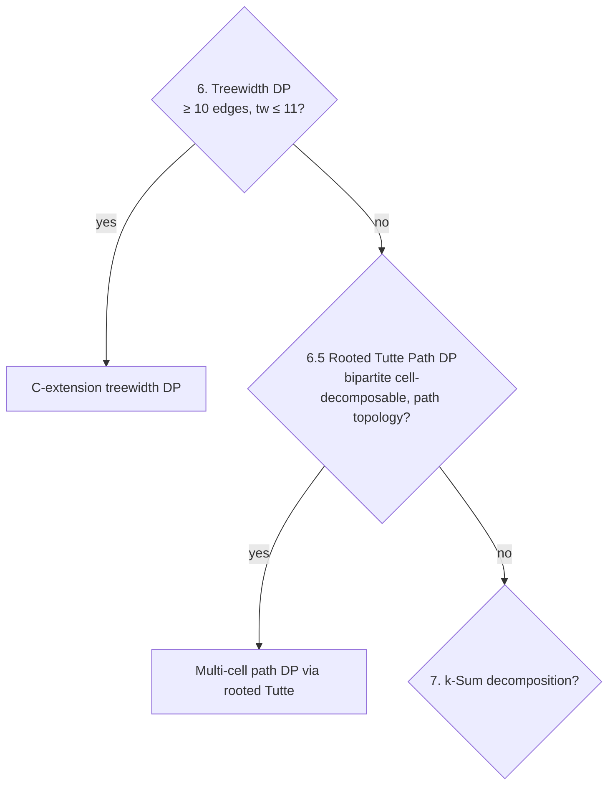

# Rooted Tutte Polynomial Path DP

Algebraic multi-cell composition for path-topology cell-decomposable graphs
via the **rooted Tutte polynomial** convolution. Validated April 23, 2026
on Cm1+K_{4,4}+Cm1 (Pm2 building block) through 4-cell paths.

> **Status (April 2026)**: research prototype in `tutte/scripts/algebraic_rooted_*.py`.
> Correct end-to-end for path topologies. Not yet integrated into the engine
> pipeline. Scaling to D-Wave Pm3 / Z(m,t) requires the orbit-compression
> optimization (Phase 17.E.9.5) and possibly Zephyr-specific recurrences.

## Motivation

D-Wave topologies (Chimera Cm_m, Pegasus Pm_m, Zephyr Z(m,t)) decompose
into repeating bipartite K_{4,4} cells joined by K_{a,b}-style junctions.
Standard `treewidth_dp` handles graphs up to treewidth ~11 — sufficient for
Cm2, Pm2, Z(1,2), but infeasible for Pm3 (treewidth 25+) and beyond.

The chord rule (Phase 13: k-matching closed form, Phase 17.A: K_{a,b} bipartite
junction polynomial) gives single-junction algebra but the multi-junction
extension hit a fundamental obstacle: cells joined at multi-super (k≥2 supers
each spanning both cells) form k-vertex-cut graphs whose Tutte polynomial
doesn't factor as `T(cell_left) × T(cell_right)`.

**The rooted Tutte polynomial framework solves this** by tracking a
boundary-partition-indexed table per cell, then composing via the
standard convolution formula for vertex-sums.

## Pipeline placement

Insert as **technique 6.5** between treewidth_dp (technique 6) and
k-sum decomposition (technique 7). Specifically:



When applicable: cell-decomposable graph where cells are bipartite (Cm1
K_{4,4}-like) and cell-topology forms a path. The DP composes cells via
vertex-sum convolutions of their rooted Tutte polynomials.

## Mathematical formulation

### Rooted Tutte polynomial

For graph G with marked boundary set S ⊆ V(G):

```
T_rooted(G, S)[P] = Σ over spanning subgraphs A of G of:
                    (x-1)^{r(E)-r(A)} · (y-1)^{|A|-r(A)}
                   where A's component-partition restricted to S equals P
```

The standard Tutte polynomial: `T(G) = Σ_P T_rooted(G, S)[P]`.

### Vertex-sum convolution (no shared edges)

For graphs G_1, G_2 vertex-summed at shared boundary S (no shared cell-edges
between identified vertices — applies to bipartite cells with same-side
identification):

```
T(G_1 ⊕_S G_2) = (x-1)^{-(|S|-1)} · Σ over (P_1, P_2 partitions of S) of:
                  T_rooted(G_1, S)[P_1] · T_rooted(G_2, S)[P_2] · ((x-1)(y-1))^{DELTA(P_1, P_2)}
```

where `DELTA(P_1, P_2) = nblocks(JOIN(P_1, P_2)) + |S| - nblocks(P_1) - nblocks(P_2)`.

The (x-1)^{-(|S|-1)} prefactor cancels via polynomial division — the accumulated
sum IS divisible.

### Partial vertex-sum (for chains)

When G_2 has additional boundary C (kept after the vertex-sum at S):

```
T_rooted(G_1 ⊕_S G_2, C)[P_C] = Σ over (P_1 of S, P_2 of S∪C consistent with P_C) of:
                                 T_rooted(G_1)[P_1] · T_rooted(G_2)[P_2] · ((x-1)(y-1))^{DELTA(P_1, P_2|_S)}
                                / (x-1)^{|S|-1}  [deferred to chain end]
```

## Multi-cell path DP

For G = cell_0 ⊕ J_0 ⊕ cell_1 ⊕ J_1 ⊕ ... ⊕ J_{n-1} ⊕ cell_n:

1. **Precompute** T_rooted of each cell (boundary = its anchor set)
   and each junction (boundary = A ∪ B sides).
2. **Chain compose** via partial_vertex_sum_convolution at each
   adjacent boundary (with fresh, disjoint labels per boundary
   position to avoid label collisions).
3. **Defer the (x-1)^{-(|S|-1)} normalization** through the chain;
   apply final division by (x-1)^{Σ(|S_i|-1)} at the end.

### Key implementation detail: boundary labels

For n cells and n-1 junctions, there are 2(n-1) boundary positions:
- pos 2j: cell_j's R = junction_j's A
- pos 2j+1: junction_j's B = cell_{j+1}'s L

Each position uses **disjoint integer labels** (e.g., `[10000*(i+1) + k]`).
Reusing labels between positions silently collapses adjacent boundaries
and corrupts the result.

## Validated results

| Graph | n | e | T(direct) | T(DP) | Match | DP wall |
|---|---:|---:|---:|---:|---|---:|
| Tiny K_2 3-cell path | 6 | 5 | x^5 | x^5 | ✓ | ~0s |
| K_{2,2} 3-cell path | 12 | 20 | 56t | 56t | ✓ | 0.05s |
| Cm1+K_{4,4}+Cm1 (2-cell) | 16 | 48 | 217t | 217t | ✓ | 21s |
| 3-cell Cm1 path | 24 | 80 | 597t | 597t | ✓ | 191s |
| 4-cell Cm1 path | 32 | 112 | 1169t | 1169t | ✓ | 899s |

## Current scaling and limits

DP wall-clock grows ~5× per cell added (current implementation). Bottleneck:
polynomial arithmetic over ~2100-entry partition dicts for Cm1 middle cells.

- 5-cell Cm1 path: estimated ~75 min
- Pm3-class (12+ cells): estimated days at current rate
- Z(12,4)-scale (576 cells): infeasible without further optimization

## Path forward

### Phase 17.E.9.5 — Orbit-level compression

For cells with full automorphism group (Cm1 = K_{4,4} with S_4 × S_4 × C_2,
order 384), partitions related by the automorphism produce identical T_rooted
values. Storing per-orbit (43 entries for K_{4,4}) instead of per-partition
(~2100 entries) gives ~50× state reduction.

The convolution must account for orbit-pair → orbit-list combinatorics
(JOIN of two orbits isn't a single orbit; specific partition pairs in same
orbits can produce JOINs in different orbits). This is the next implementation
step.

### Phase 17.E.9.6 — Bipartite-feasibility restriction

For partitions of cell anchors, only bipartite-feasible ones (each non-singleton
block contains both bipartition sides) are reachable. Already implicit in
non-zero T_rooted entries. Combined with orbit compression: ~100× total
state reduction.

### Phase 17.E.9.7 — Treewidth_dp integration for T_rooted

Brute-force T_rooted is feasible only up to ~16 edges. For larger compositions
(e.g., precomputing T_rooted of cell+junction ensembles), use the existing
treewidth_dp internals to extract the boundary-partition table.

### Long-term (research) — Zephyr-specific recurrences

For Z(m,t) graphs, derive recurrences:
- `T(Z(m,t))` in terms of `T(Z(m-1,t))` (column transfer matrix).
- `T(Z(m,t))` in terms of `T(Z(m,t-1))` (layer recursion).

This is analogous to known transfer-matrix methods for grid Tutte polynomials.
A clean recurrence would give true polynomial-in-(m,t) scaling, the only
realistic path to Z(12,4) and similar large targets.

## Files

| File | Purpose |
|---|---|
| `tutte/scripts/algebraic_rooted_tutte.py` | T_rooted brute-force + vertex-sum convolution |
| `tutte/scripts/algebraic_rooted_path_dp.py` | Multi-cell path DP composition |
| `tutte/data/rooted_tutte_validation.md` | Single-junction validation results |
| `tutte/data/rooted_path_dp_results.md` | Multi-cell path DP results |
| `tutte/docs/10_rooted_tutte_path_dp.md` | This document |

## References

- Brylawski, T. (1971). "A combinatorial model for series-parallel networks."
  Original 2-clique-sum Tutte formula.
- Bollobás, B. (1998). *Modern Graph Theory*. Chapter on graph polynomials.
- Welsh, D. (1976). *Matroid Theory*. Boundary-partition / rank-polynomial framework.
