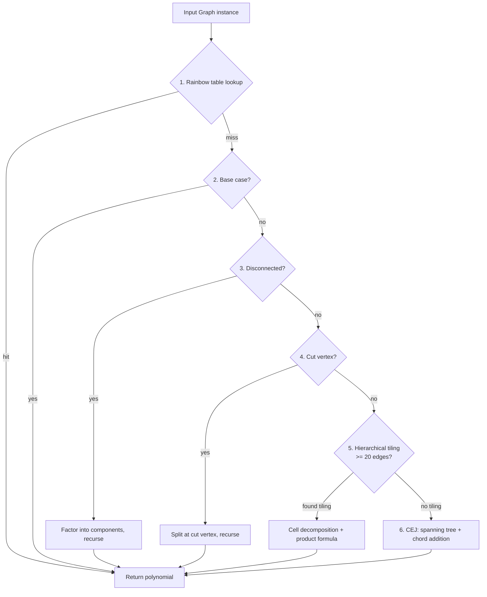

# Tutte Synthesis Engine — Documentation

Detailed documentation for each technique used by the tutte synthesis engine to compute Tutte polynomials.

## Motivation

| # | Document | Description |
|---|----------|-------------|
| 0 | [Tutte Polynomials as a Difficulty Mechanism](00_motivation.md) | Why Tutte polynomials are used in Quip Protocol's proof of work |

## Technique Index

| # | Technique | When Used | Complexity |
|---|-----------|-----------|------------|
| 1 | [Rainbow Table Lookup](01_rainbow_table_lookup.md) | First check — O(1) hash match | O(n² × d) — dominated by canonical key computation |
| 2 | [Base Cases](02_base_cases.md) | Empty graph or single edge | O(1) |
| 3 | [Disconnected Factorization](03_disconnected_factorization.md) | Graph has multiple connected components | O(n + m) + recursive synthesis per component |
| 4 | [Cut Vertex Factorization](04_cut_vertex_factorization.md) | Graph has an articulation point | O(n + m) + recursive synthesis per block |
| 5 | [Hierarchical Tiling](05_hierarchical_tiling.md) | Graphs >= 20 edges with repeating cell structure | O(inter_edges × synthesis_cost) — see sub-techniques |
| 6 | [Creation-Expansion-Join (CEJ)](06_creation_expansion_join.md) | Final fallback — spanning tree + chord addition | O(chords × synthesis_cost) |

## Pipeline Overview



## Sub-Techniques

These are not standalone pipeline steps — they are used inside techniques 5 and 6:

### Technique 5 (Hierarchical Tiling) Sub-Techniques

| # | Sub-Technique | Purpose | Complexity |
|---|---|---|---|
| 5.1 | [Find and Partition Cells](05_1_find_and_partition_cells.md) | Find cell from rainbow table, partition nodes into k groups | O(t + n × d²) typical, O(n!) VF2 fallback |
| 5.2 | [Theorem 6 Parallel Connection](05_2_theorem6_parallel_connection.md) | Bonin-de Mier formula for 2-cell decomposition (includes series-parallel fast path) | O(F² × synthesis_cost), F ≤ 2^e |
| 5.3 | [Edge-by-Edge Addition Fallback](05_3_edge_by_edge_addition.md) | Add inter-cell edges one at a time using bridge/chord formulas | O(bridges × terms + chords × synthesis_cost) |

### Technique 6 (CEJ) Sub-Techniques

| Sub-Technique | Purpose | Complexity |
|---|---|---|
| Spanning tree expansion | Builds BFS spanning tree, adds chords one by one | O(n + m) tree construction + O(chord × synthesis_cost) |
| Multigraph synthesis | Handles loops and parallel edges from node merging during chord addition | O(n + m) structural checks, O(n²) canonical key |

### Other

| Sub-Technique | Purpose |
|---|---|
| Algebraic decomposition | GCD-based polynomial factoring (separate engine, not part of main pipeline) |

## Engine Variants

- **SynthesisEngine** — Techniques 1-6 (primary engine, tiling-based)
- **HybridSynthesisEngine** — Combines algebraic + tiling approaches
- **AlgebraicSynthesisEngine** — Pure polynomial-level GCD decomposition (separate engine)

## Benchmarks

The benchmark suite (`tutte/benchmarks/benchmark.py`) measures wall-clock synthesis time across three engines, starting from an empty rainbow table. After each successful synthesis, the computed polynomial is added to the engine's rainbow table, so that subsequent graphs may use it as a tile or minor. Graphs are processed in ascending order of edge count to ensure that simpler graphs seed the table first.

### Engines Compared

| Engine | Description | Timeout |
|--------|-------------|---------|
| **CEJ** (`SynthesisEngine`) | Techniques 1–6 with a growing rainbow table | 60s (default) |
| **Hybrid** (`HybridSynthesisEngine`) | Algebraic + tiling with a growing rainbow table | 60s (default) |
| **NetworkX** (`nx.tutte_polynomial`) | Reference implementation via deletion-contraction (no table) | 30s (default) |

### Graph Set

The benchmark graph set is constructed from three sources, deduplicated by canonical key, and sorted by edge count:

| Source | Graphs | Description |
|--------|--------|-------------|
| Named graphs | 13 | K₃–K₇, C₅/C₁₀/C₁₅, W₅/W₇, Petersen, Grid 3×3/4×4 |
| Graph atlas | ~1000 | All connected graphs with ≥1 edge from `nx.graph_atlas` (indices 1–1252) |
| D-Wave topologies | Up to 49 | Chimera C₁–C₁₆, Pegasus P₁–P₁₆, Zephyr Z(1,1) (requires `dwave-networkx`) |

### Correctness Verification

Each synthesis result is verified against Kirchhoff's matrix-tree theorem: `T(1,1)` must equal the number of spanning trees. When both a synthesis engine and NetworkX produce a result for the same graph, the polynomials are cross-validated for exact equality.

### Frontier Skipping

To avoid spending the full timeout on graphs far beyond an engine's current capability, the benchmark tracks the maximum edge count each engine has solved (`cej_max_solved`, `hybrid_max_solved`, `nx_max_solved`). A graph is skipped without attempting synthesis if its edge count exceeds the engine's frontier by more than 30 edges (10 for NetworkX).

### Output

Results are written to `tutte/data/benchmark_results.json` with per-graph timings, status, and polynomial match flags. The console output includes:

- Per-graph table with node count, edge count, spanning tree count, and timing for each engine
- Per-edge-count summary with average timing across all graphs of the same size
- Final summary with success/failure counts and polynomial cross-validation status

### Usage

```bash
# Run benchmark from empty rainbow table
python -m tutte.benchmarks.benchmark

# Custom timeouts
python -m tutte.benchmarks.benchmark --timeout 300 --nx-timeout 300

# Compare two benchmark runs (e.g., across branches)
python -m tutte.benchmarks.benchmark --compare run_a.json run_b.json
```

The compare mode computes per-engine speedup ratios and geometric mean speedup across all graphs that both runs solved.
