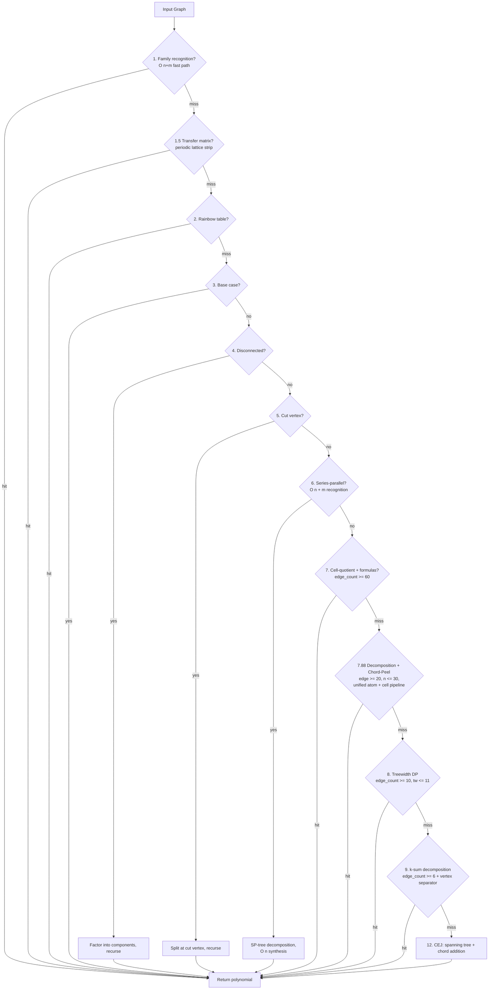

# Tutte Synthesis Engine — Documentation

Detailed documentation for each technique used by the synthesis engine
to compute Tutte polynomials. Each entry is self-contained: read it
without needing to read its predecessors.

## Motivation

| #   | Document                                                        | Description                                                     |
| --- | --------------------------------------------------------------- | --------------------------------------------------------------- |
| 0   | [Tutte Polynomials as a Difficulty Mechanism](00_motivation.md) | Why Tutte polynomials are used in Quip Protocol's proof of work |

## Pipeline overview


```mermaid
flowchart TD
    A[Input Graph] --> Z{1. Family recognition?\nO n+m fast path}
    Z -- hit --> R[Return polynomial]
    Z -- miss --> ZT{1.5 Transfer matrix?\nperiodic lattice strip}
    ZT -- hit --> R
    ZT -- miss --> B{2. Rainbow table?}
    B -- hit --> R
    B -- miss --> C{3. Base case?}
    C -- yes --> R
    C -- no --> D{4. Disconnected?}
    D -- yes --> E[Factor into components, recurse]
    E --> R
    D -- no --> F{5. Cut vertex?}
    F -- yes --> G[Split at cut vertex, recurse]
    G --> R
    F -- no --> SP{6. Series-parallel?\nO n + m recognition}
    SP -- yes --> SP1[SP-tree decomposition,\nO n synthesis]
    SP1 --> R
    SP -- no --> CQ{7. Cell-quotient + formulas?\nedge_count >= 60}
    CQ -- hit --> R
    CQ -- miss --> DCP{7.88 Decomposition + Chord-Peel\nedge >= 20, n <= 30,\nunified atom + cell pipeline}
    DCP -- hit --> R
    DCP -- miss --> TW{8. Treewidth DP\nedge_count >= 10, tw <= 11}
    TW -- hit --> R
    TW -- miss --> KS{9. k-sum decomposition\nedge_count >= 6 + vertex separator}
    KS -- hit --> R
    KS -- miss --> CEJ[12. CEJ: spanning tree + chord addition]
    CEJ --> R
```

> **Why family recognition runs first**: it costs `O(n + m)` and skips
> the canonical-key computation (which is `O(n² × d)`). For known
> parametric families — trees, cycles, wheels, fans, ladders, prisms,
> books, gears, Möbius ladders, grids — the polynomial is computed
> directly from a closed-form formula or constant-coefficient
> recurrence in `n`.

> **Why treewidth_dp runs after the cell-quotient paths**: closed-form
> formulas and cell-quotient DPs (when applicable) beat the
> general-purpose treewidth DP on cell-decomposable D-Wave-style
> graphs. When neither applies, the treewidth DP wins outright for
> `tw ≤ 11`. The chord-rule paths take over for graphs whose
> treewidth exceeds the cap.

## Technique index

The numbering reflects the engine cascade order in
`tutte/synthesis/engine.py::_synthesize_inner`. Step numbers may have
fractional sub-steps where the engine has multiple variants of the
same family of techniques (e.g., cell-quotient DPs).

### Pre-canonical-key fast paths

| #    | Technique                                                                           | When Used                                                                                                                | Complexity                                                            |
| ---- | ----------------------------------------------------------------------------------- | ------------------------------------------------------------------------------------------------------------------------ | --------------------------------------------------------------------- |
| 1    | [Family Recognition](01_family_recognition.md)                                      | Trees, cycles, wheels, fans, ladders, prisms, books, gears, Möbius ladders, grids                                        | **O(n + m)** — fastest path, runs before canonical-key                |
| 1.5  | [Transfer Matrix](01_1_transfer_matrix.md)                                          | Periodic lattice strips: grids (`m ≥ 3`), triangular, honeycomb, square-octagon, elongated-triangular                    | `O(V + E)` detection + `O(length × Catalan(width)²)` sweep            |

### Structural fast paths

| #    | Technique                                                      | When Used                                                       | Complexity                                              |
| ---- | -------------------------------------------------------------- | --------------------------------------------------------------- | ------------------------------------------------------- |
| 2    | [Rainbow Table Lookup](02_rainbow_table_lookup.md)             | Canonical-key match against pre-computed polynomials            | `O(n² × d)` — dominated by canonical-key computation    |
| 3    | [Base Cases](03_base_cases.md)                                 | Empty graph or single edge                                      | `O(1)`                                                  |
| 4    | [Disconnected Factorization](04_disconnected_factorization.md) | Graph has multiple connected components                         | `O(n + m)` + recursive synthesis per component          |
| 5    | [Cut Vertex Factorization](05_cut_vertex_factorization.md)     | Graph has an articulation point                                 | `O(n + m)` + recursive synthesis per block              |

### Cell-quotient DPs and closed-form formulas

| #    | Technique                                                            | When Used                                                                                                                                                   | Complexity                                       |
| ---- | -------------------------------------------------------------------- | ----------------------------------------------------------------------------------------------------------------------------------------------------------- | ------------------------------------------------ |
| 6.3  | [Rooted Tutte — Algebraic Framework](06_3_rooted_tutte_framework.md) | _(Theory reference)_ — math underneath the cell-quotient DPs                                                                                                | (theory)                                         |
| 6.4  | [Cell-Quotient Cycle DP](06_4_cell_quotient_cycle_dp.md)             | Cell-decomposable graphs whose cell-quotient is a simple cycle (Cm_2)                                                                                       | `O(n × Bell(W)² × poly²)` per junction step      |
| 6.5  | [Cell-Quotient Grid DP](06_5_cell_quotient_grid_dp.md)               | Cell-decomposable graphs with `(rows × cols)` grid quotient; the streamed `K_{a,b}` path is the engine's go-to for Cm_2-style grids                          | `O(rows × cols × Bell(W)² × poly²)`              |
| 6.6  | [Cell-Quotient Tree DP](06_6_cell_quotient_tree_dp.md)               | Cell-decomposable graphs with arbitrary tree quotient                                                                                                       | `O(n × Bell(W)² × poly²)`                        |
| 6.7  | [Chain & Cycle Recurrence Algebra](06_7_chain_recurrence_algebra.md) | Chain-of-cells families; explicit re-derivation of Noy-Ribò 2007 with order `r = n_orbits` and Faddeev-LeVerrier mod p                                       | `O(r)` modular muls per cell after one-time `M` extraction |
| 6.8  | [Modular Arithmetic Pathways](06_8_modular_arithmetic_pathways.md)   | Graphs whose coefficients overflow `int64` mid-DP; modular point-value evaluation + Lagrange interpolation + CRT                                            | per-point cost × grid × `n_primes`               |
| 6.9  | [Signed-Graph DP & σ-Equivariant Decomposition](06_9_signed_equivariant_dp.md) | Graphs with order-2 automorphism σ; computes `T_fix^σ` via Zaslavsky-frame DP on the σ-quotient                                              | depends on quotient treewidth                    |

### General-purpose DPs

| #    | Technique                                          | When Used                                                                                                  | Complexity                                                           |
| ---- | -------------------------------------------------- | ---------------------------------------------------------------------------------------------------------- | -------------------------------------------------------------------- |
| 6.1  | [Cotree DP](06_1_cotree_dp.md)                     | Cographs (`P_4`-free); also reached when treewidth DP can't fit (K_12+, large K_{a,b}, threshold graphs)   | `exp(O(n^{2/3}))` — subexponential                                   |
| 6.2  | [Almost-Cograph DP](06_2_almost_cograph_dp.md)     | Graphs that become cographs after removing ≤ 16 anomaly edges                                              | 1 cotree DP + `O(|A|)` recursive syntheses                           |
| 6    | [Treewidth DP](06_treewidth_dp.md)                 | Graphs ≥ 10 edges with treewidth ≤ 11; small-graph short-circuit at `tw ≤ 8` for `n ≤ 20`                  | `O(2^tw × n)` C extension                                            |

### Chord-rule fallbacks

| #    | Technique                                                | When Used                                                                  | Complexity                            |
| ---- | -------------------------------------------------------- | -------------------------------------------------------------------------- | ------------------------------------- |
| 7    | [k-Sum Decomposition](07_k_sum_decomposition.md)         | Graphs with `k`-vertex separators (`k = 2..7`)                              | **`1 + C(k, 2)` full syntheses**      |
| 7.88 | [Decomposition + Chord-Peel](08_5_decomposition_chord_peel.md) | Unified atom + cell decomposition discovery → closed-form formulas (`unified`, `kmatching`) → cost-gated chord-rule. Replaces legacy 7.88a/7.88/7.9/10. | **`O(chord_count)` full syntheses + Phase D recursive residue peel** |
| 8.1  | [Find and Partition Cells](08_1_find_and_partition_cells.md) | _(Theory reference)_ — how `try_hierarchical_partition` discovers candidates | `O(VF2-cost)` per candidate           |
| 8.2  | [Chord-Rule Formalization](08_2_chord_rule_formalization.md) | _(Theory reference)_ — mathematical justification for the chord rule        | (theory)                              |
| 8.3  | [k-Matching Formula](08_3_kmatching_formula.md)          | Cells joined by `M_k` perfect matching between vertex-transitive cells; closed form (Phase B sub-path of 7.88) | `O(k)` recursive syntheses (one per `k-j` term) |
| 8.4  | [Cross-Cell Chord-Peel](08_4_cross_cell_chord_peel.md)   | _(Merged into 7.88)_ — conceptual reference for inter-atom junction peel | **`O(junction_size)` syntheses** (e.g. Z(1,2) = 4) |
| 8.6  | [Unified Chord-Junction Theorem](08_6_unified_chord_junction.md) | Bivariate I-E closed form for chord-junction cell pairs; symmetric + asymmetric; persistent merger cache (255 K_{4,4} + 78 Z(1,1) entries). Generalises 8.3 and the chain framework (6.7). | **1 base synth + O(2^\|V_k\|) cache lookups** (warm), `2^\|V_k\|` syntheses (cold) |
| 8    | [Hierarchical Tiling](08_hierarchical_tiling.md)         | _(Merged into 7.88)_ — conceptual reference for boundary-quotient + chord recursion | **`O(chord_count)` full syntheses**   |
| 9    | [Creation-Expansion-Join](09_creation_expansion_join.md) | Final fallback — spanning tree + chord addition                            | `O(chords × synthesis_cost)`          |

## Hierarchical Tiling — how it works

For a graph with `k` disjoint cells `C_1, …, C_k` (each isomorphic to
a known minor) connected by some inter-cell edges:

**boundary quotient** (when no chords in the inter-cell graph):

```
T(target) = [∏_i T(C_i)] · T(B) / [∏_i T(B_i)]
```

where `B` is the induced subgraph on all boundary nodes (cell vertices
touched by inter-cell edges) plus all inter-cell edges plus intra-cell
edges among boundary nodes; `B_i` is each cell's boundary-induced
subgraph.

**chord recursion** (iterative chord rule, peels off cycle-creating
inter-cell edges):

```
T(target) = T(target − all chords) + Σ_i T((target − chord_1 − … − chord_{i-1}) / chord_i)
```

Each contraction leaf is synthesized as a multigraph (parallel edges
and loops are preserved).

**Cost**: `1 + chord_count` full syntheses. Linear in the cyclic
complexity of the inter-cell graph.

**Implementation**: `tutte/graphs/k_sum.py::boundary_quotient_tutte`.

## k-Sum Decomposition — how it works

For a graph with a `k`-vertex separator `S` (i.e., removing `S`
disconnects the graph):

```
PC = target + missing K_k clique edges       (parallel completion)
T(target) = T(PC) − Σ_i T((PC − e_1 − … − e_{i-1}) / e_i)
```

This is the iterative chord rule applied to the `K_k` clique edges.
**Cost**: `1 + C(k, 2)` full syntheses. For `k = 2`: 2; for `k = 3`:
4; for `k = 4`: 7.

When the separator already contains the full `K_k` clique (no edges
missing), the engine peels the existing clique edges instead — same
cost.

**Implementation**: `tutte/graphs/k_sum.py::clique_chord_k_sum`.

## Treewidth DP fallback

Used when neither cell-quotient DPs nor closed-form formulas apply.
Builds a tree decomposition of width ≤ `max_width` (default 11) and
runs a bag-by-bag dynamic program in C (via cffi).

The C path is gated to `5 ≤ tw ≤ 10` where head-to-head benchmarks
show it beats the pure-Python wrapper. For graphs with coefficients
exceeding `int64`, the modular-CRT path activates at `m > 62`.

## Supporting theory

| Document                                                          | Topic                                                                                                                                                                                          |
| ----------------------------------------------------------------- | ---------------------------------------------------------------------------------------------------------------------------------------------------------------------------------------------- |
| [Chord-Rule Formalization](08_2_chord_rule_formalization.md)       | Mathematical formalization (boundary quotient + chord recursion) generalising the classical 2-sum identity to incomplete-graph boundaries; empirical validation.                              |
| [Rooted Tutte Framework](06_3_rooted_tutte_framework.md)           | Boundary-partition-indexed Tutte polynomial; vertex-sum convolution algebra; closing formulas. Underpins the entire `tutte/roots/` package.                                                    |
| [Chain Recurrence](06_7_chain_recurrence_algebra.md)               | Linear recurrence in `n` for chain-of-cells families; constructive re-derivation of Noy-Ribò (2007); Faddeev-LeVerrier mod p extraction.                                                       |
| [Modular Arithmetic Pathways](06_8_modular_arithmetic_pathways.md) | Point-value evaluation + Lagrange interpolation + CRT for graphs whose coefficients overflow `int64`.                                                                                          |
| [Signed-Graph DP / σ-Equivariant Decomposition](06_9_signed_equivariant_dp.md) | `T(G) = T_fix^σ + T_free^σ` decomposition for graphs with an order-2 automorphism σ; quotient-side signed-graph DP via Zaslavsky's frame matroid; four open `T_free^σ` directions.        |

## Package READMEs

The synthesis engine is split across several subpackages; each has its
own README with module-level details:

- [`tutte/synthesis/`](../synthesis/README.md) — `SynthesisEngine`,
  `HybridSynthesisEngine`, and the shared `BaseMultigraphSynthesizer`.
- [`tutte/graphs/`](../graphs/README.md) — series-parallel, treewidth
  DP, k-sum chord rule, signed/σ-equivariant DPs.
- [`tutte/roots/`](../roots/README.md) — cell-quotient cycle / grid /
  tree DPs, chain recurrence, modular point-value pathways.
- [`tutte/lookup/`](../lookup/README.md) — rainbow table, canonical
  keys, binary serialisation.
- [`tutte/transfer_matrix/`](../transfer_matrix/README.md) — periodic
  lattice strips via Fortuin-Kasteleyn transfer matrix.
- [`tutte/data/`](../data/README.md) — pre-computed lookup tables.
- [`tutte/tests/`](../tests/README.md) — parametrised test suite.
- [`tutte/benchmarks/`](../benchmarks/README.md) — standalone benchmark
  sweep (CEJ + Hybrid + NetworkX).

## Engine variants

- **`SynthesisEngine`** — primary cascade (steps 1–11 above).
- **`HybridSynthesisEngine`** — structural-first variant; delegates to
  `SynthesisEngine` for the structural decomposition step.
- **`AlgebraicSynthesisEngine`** — polynomial-level GCD decomposition,
  used by the visualizer for explanatory output.

## Benchmarks

The benchmark suite (`tutte/benchmarks/benchmark.py`) measures
wall-clock synthesis time across three engines, starting from an
empty rainbow table. After each successful synthesis, the computed
polynomial is added to the engine's rainbow table so subsequent
graphs may use it as a tile or minor. Graphs are processed in
ascending order of edge count.

### Engines compared

| Engine                               | Description                                   | Default Timeout |
| ------------------------------------ | --------------------------------------------- | --------------- |
| **CEJ** (`SynthesisEngine`)          | Steps 1–11 with growing rainbow table         | 60s             |
| **Hybrid** (`HybridSynthesisEngine`) | Algebraic + tiling with growing rainbow table | 60s             |
| **NetworkX** (`nx.tutte_polynomial`) | Reference deletion-contraction (no table)     | 30s             |

### Graph set

Built from three sources, deduplicated by canonical key, sorted by
edge count: named graphs (K_3–K_7, cycles, wheels, Petersen, small
grids), `nx.graph_atlas(1..1252)`, and D-Wave topologies (Chimera Cm_1
… Cm_16, Pegasus Pm_1 … Pm_16, Zephyr Z(1, 1)).

### Verification

Every result is checked against Kirchhoff's matrix-tree theorem:
`T(1, 1)` must equal the number of spanning trees. When both a
synthesis engine and NetworkX produce a polynomial for the same graph,
they are cross-validated for exact equality.

### Usage

```bash
python -m tutte.benchmarks.benchmark                          # default
python -m tutte.benchmarks.benchmark --timeout 300            # extend timeout
python -m tutte.benchmarks.benchmark --compare a.json b.json  # diff two runs
```
