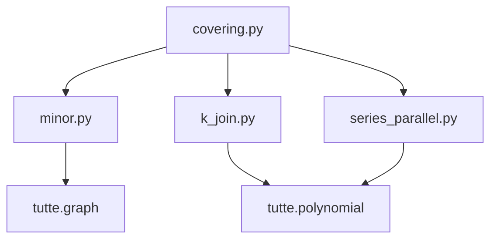

# tutte.graphs

Graph algorithms for Tutte polynomial computation: series-parallel recognition, subgraph covering, minor detection, and k-join composition.

## Modules

| Module | Description |
|--------|-------------|
| `series_parallel.py` | O(n+m) SP recognition, O(n) Tutte synthesis via decomposition tree |
| `covering.py` | VF2 subgraph isomorphism, disjoint covers, hierarchical tiling |
| `minor.py` | Graph minor detection (general VF2 + specialized O(n) tree minor) |
| `k_join.py` | k-sum polynomial composition (0-sum through k-sum) and fringe division |

## Module Dependencies

## Key Algorithms

**Series-Parallel Fast Path** — `is_series_parallel()` recognizes treewidth-2 graphs in O(n+m) via edge reduction. `compute_sp_tutte()` then evaluates the Tutte polynomial in O(n) from the decomposition tree, avoiding exponential deletion-contraction.

**Disjoint Covering** — `find_subgraph_isomorphisms()` uses VF2 to embed rainbow table entries into a target graph. `find_edge_mapping()` partitions the graph into non-overlapping tiles whose polynomials combine via k-join formulas.

**Minor Detection** — `is_graph_minor()` checks if H is a minor of G by searching for an H-model (vertex-disjoint connected subgraphs). Includes a specialized O(n) algorithm for tree minors.

**k-Join Composition** — Combines tile polynomials using clique-sum formulas:
- 0-sum (disjoint): `T(G₁ ∪ G₂) = T(G₁) × T(G₂)`
- 1-sum (cut vertex): `T(G₁ ·₁ G₂) = T(G₁) × T(G₂)`
- 2-sum (shared edge): `T(G₁ ⊕₂ G₂) = T(G₁) × T(G₂) / T(K₂)`
