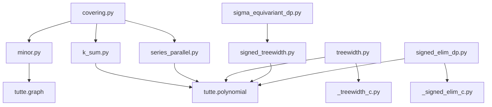

# tutte.graphs

Graph algorithms backing the synthesis engine: series-parallel
recognition, subgraph covering and hierarchical tiling, treewidth DP
(with a C extension), the chord-rule k-sum, and signed / σ-equivariant
DPs that support research paths.

## Modules

| Module                    | Description                                                                                                                                                                  |
| ------------------------- | ---------------------------------------------------------------------------------------------------------------------------------------------------------------------------- |
| `series_parallel.py`      | `O(n + m)` SP recognition (`is_series_parallel`); `O(n)` Tutte synthesis via SP-tree decomposition.                                                                          |
| `covering.py`             | VF2 subgraph isomorphism, disjoint covers, hierarchical/heterogeneous cell partitioners, k-matching and bipartite-junction topology detection, `apply_kmatching_formula` closed form. |
| `minor.py`                | Graph minor detection (general VF2 + specialised `O(n)` tree-minor path).                                                                                                    |
| `k_sum.py`                | Chord-rule k-sum (`clique_chord_k_sum`) and boundary quotient (`boundary_quotient_tutte`) — the production path for graphs with vertex separators or hierarchical structure. |
| `treewidth.py`            | Python tree-decomposition + bag DP wrapper. Dispatches to the C extension when the graph fits.                                                                              |
| `_treewidth_c.py`         | cffi C extension: bag DP in int64 with `unsigned long long[]` overflow-aware batch reduction, and a modular-CRT path for `m > 62`. C path gated to `5 ≤ tw ≤ 10`.            |
| `signed_treewidth.py`     | Signed-graph (Zaslavsky frame-matroid) variant of the treewidth DP; backs σ-equivariant evaluations.                                                                         |
| `signed_elim_dp.py`       | Vertex-elimination DP for signed/twisted Tutte on a quotient graph; supports modular point evaluation for full-polynomial recovery via interpolation.                       |
| `_signed_elim_c.py`       | cffi C extension for the signed-elim inner loop.                                                                                                                            |
| `sigma_equivariant_dp.py` | σ-equivariant unsigned Tutte DP on a 2-fold cover; consumed by the Burnside table-of-marks recovery framework.                                                              |
| `atom_detection.py`       | Named-family atom finders (K_n cliques, K_{a,b} complete bipartite) and inter-atom junction analysis. Used by `_try_cross_cell_chord_peel` (engine step 7.88) to peel the smallest connected bipartite junction between disjoint dense atoms. See [docs/08_4](../docs/08_4_cross_cell_chord_peel.md). |

## Module dependencies

```mermaid
graph TD
    C[covering.py] --> M[minor.py]
    C --> KS[k_sum.py]
    C --> SP[series_parallel.py]
    KS --> P[tutte.polynomial]
    SP --> P
    M --> G[tutte.graph]
    TW[treewidth.py] --> TWC[_treewidth_c.py]
    TW --> P
    STW[signed_treewidth.py] --> P
    SED[signed_elim_dp.py] --> SEC[_signed_elim_c.py]
    SED --> P
    SEQ[sigma_equivariant_dp.py] --> STW
```

## Key algorithms

**Series-parallel fast path** — `is_series_parallel` recognises
treewidth-2 graphs in `O(n + m)` via edge reduction; `compute_sp_tutte`
evaluates the Tutte polynomial in `O(n)` from the decomposition tree.

**Hierarchical cell covering** — `find_cell_candidates` and
`try_hierarchical_partition` partition a graph into `N` isomorphic
cells joined by inter-cell edges, returning the partition plus
`InterCellInfo`. `try_heterogeneous_partition` accepts mixed cells
(e.g., Z(1,3) = Z(1,2) + Z(1,1)). Results feed the cell-quotient DPs
in [`tutte/roots/`](../roots/README.md) and the chord-rule paths here.

**k-matching topology** — `detect_kmatching_topology` recognises when
every inter-cell junction is a `k`-edge perfect matching;
`apply_kmatching_formula` evaluates the closed form
`T(G_1 + M_k + G_2) = (x + k − 1) T(G_1) T(G_2) +
Σ_j C(k, j) T(G_1 ⊕_j G_2)` for vertex-transitive cells.
`detect_bipartite_junction_topology` is the generalisation that
accepts non-matching bipartite junctions.

**Chord-rule k-sum** — `clique_chord_k_sum` decomposes the graph at a
`k`-vertex separator by adding back the missing `K_k` clique edges and
peeling them off via the iterative chord rule. Cost is `1 + C(k, 2)`
recursive syntheses; see
[`tutte/docs/07_k_sum_decomposition.md`](../docs/07_k_sum_decomposition.md).

**Boundary quotient** — `boundary_quotient_tutte` handles
hierarchically-tiled graphs via
`T(G) = (∏ T(cells)) · T(B) / (∏ T(B_i))` when the inter-cell graph is
a tree, falling through to chord recursion otherwise. See
[`tutte/docs/08_hierarchical_tiling.md`](../docs/08_hierarchical_tiling.md)
and
[`tutte/docs/08_2_chord_rule_formalization.md`](../docs/08_2_chord_rule_formalization.md).

**Treewidth DP** — `compute_treewidth_tutte_if_applicable` builds a
tree decomposition (mindegree heuristic with time budget) and runs a
bag-by-bag DP in C. The C path is gated to `5 ≤ tw ≤ 10`; the modular-
CRT path activates at `m > 62` to avoid `int64` overflow on larger
graphs.

**Signed / σ-equivariant** — `signed_treewidth.py` and
`signed_elim_dp.py` compute Tutte polynomials of signed graphs (edges
with ± labels, Zaslavsky's frame matroid). `sigma_equivariant_dp.py`
runs the unsigned DP on a 2-fold cover for the Burnside table-of-marks
recovery framework. Background:
[`tutte/docs/06_9_signed_equivariant_dp.md`](../docs/06_9_signed_equivariant_dp.md)
and the matching section of
[`tutte/research/engine_workflow_primer.md`](../research/engine_workflow_primer.md).

## Related docs

- [`tutte/docs/01_family_recognition.md`](../docs/01_family_recognition.md) — closed-form fast path that runs before this package
- [`tutte/docs/06_treewidth_dp.md`](../docs/06_treewidth_dp.md) — treewidth DP details
- [`tutte/docs/07_k_sum_decomposition.md`](../docs/07_k_sum_decomposition.md) — k-sum chord rule
- [`tutte/docs/08_hierarchical_tiling.md`](../docs/08_hierarchical_tiling.md) — hierarchical tiling
- [`tutte/docs/08_1_find_and_partition_cells.md`](../docs/08_1_find_and_partition_cells.md) — cell candidate detection and partitioning
- [`tutte/docs/08_2_chord_rule_formalization.md`](../docs/08_2_chord_rule_formalization.md) — chord-rule mathematical justification
- [`tutte/docs/08_3_kmatching_formula.md`](../docs/08_3_kmatching_formula.md) — k-matching closed-form derivation
