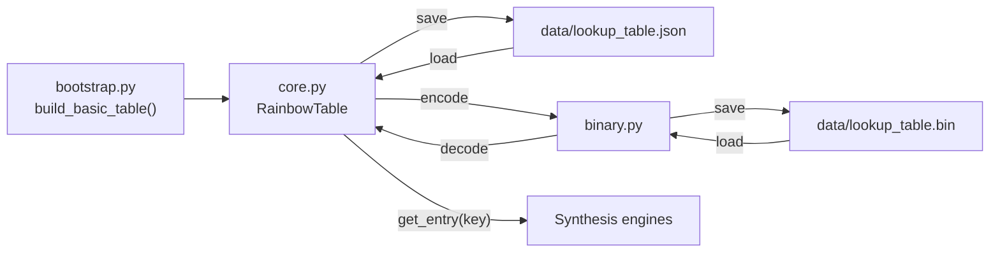

# tutte.lookup

Pre-computed Tutte polynomial lookup table. Provides O(1) polynomial retrieval by canonical graph key, minor indexing, and binary serialization.

## Modules

| Module         | Description                                                                  |
| -------------- | ---------------------------------------------------------------------------- |
| `core.py`      | `RainbowTable`, `MinorEntry`, `GCDMinorIndex`, `load_default_table()`        |
| `binary.py`    | v2 binary format encoder/decoder for compact on-disk storage                 |
| `bootstrap.py` | `build_basic_table()` seeds known polynomials, `sympy_to_tutte()` conversion |

## Data Flow



## Usage

```python
from tutte.lookup import load_default_table

table = load_default_table()  # tries binary first, falls back to JSON
entry = table.get_entry("Petersen")
print(entry.polynomial.num_spanning_trees())  # 2000
```

## Binary Format (v2)

The `.bin` format stores the table compactly with header, entries, and optional minor relationship data:

- **Header**: magic `RTBL`, version 2, flags, entry count
- **Entries**: canonical key + serialized Tutte polynomial coefficients
- **Minor relationships**: graph-to-minor mappings for structural decomposition
