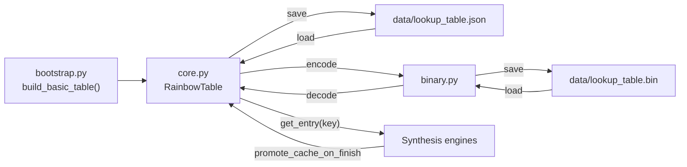

# tutte.lookup

Pre-computed Tutte polynomial lookup tables. Provides O(1) polynomial
retrieval by canonical graph key, minor indexing, and binary
serialization.

Keys are the WL-based canonical form computed by `Graph.canonical_key()`
/ `MultiGraph.canonical_key()` (see
[`tutte/docs/02_rainbow_table_lookup.md`](../docs/02_rainbow_table_lookup.md)).
Isomorphic graphs always resolve to the same key, so cache hits work
across arbitrary vertex relabelings.

## Modules

| Module         | Description                                                                                                              |
| -------------- | ------------------------------------------------------------------------------------------------------------------------ |
| `core.py`      | `RainbowTable`, `MinorEntry`, `GCDMinorIndex`, `load_default_table()`, `load_default_multigraph_table()` and save helpers |
| `binary.py`    | v2 binary format encoder/decoder for compact on-disk storage (plus v1 backward-compat read path)                          |
| `bootstrap.py` | `build_basic_table()` seeds known polynomials from `networkx`; `sympy_to_tutte()` converts NX's symbolic form             |

The package also re-exports `is_graph_minor` from `tutte.graphs.minor`
for back-compat.

## Data files

The default tables live in [`tutte/data/`](../data/README.md):

| File                                    | Purpose                                                                                  |
| --------------------------------------- | ---------------------------------------------------------------------------------------- |
| `lookup_table.bin` / `.json`            | Simple-graph rainbow table (canonical key → polynomial + minor relationships)             |
| `multigraph_lookup_table.bin` / `.json` | Multigraph cache populated by `SynthesisEngine` during chord-rule contractions            |
| `rooted_lookup_table.bin` / `.json`     | Cached `T_rooted(cell, boundary)` entries keyed by canonical labels (loaded by the engine at construction) |

## Data flow


```mermaid
graph LR
    B["bootstrap.py<br/>build_basic_table()"] --> C["core.py<br/>RainbowTable"]
    C --> |save| D["data/lookup_table.json"]
    C --> |encode| E["binary.py"]
    E --> |save| F["data/lookup_table.bin"]
    F --> |load| E
    E --> |decode| C
    D --> |load| C
    C --> |"get_entry(key)"| S[Synthesis engines]
    S --> |"promote_cache_on_finish"| C
```

The synthesis engine fills the rainbow table during cold-cache runs
and promotes successfully synthesized sub-problems back to disk on
finish (see `SynthesisEngine._flush_cache_to_table` in
[`tutte/synthesis/engine.py`](../synthesis/engine.py)).

## Usage

```python
from tutte.lookup import load_default_table

table = load_default_table()  # tries binary first, falls back to JSON
entry = table.get_entry("Petersen")
print(entry.polynomial.num_spanning_trees())  # 2000
```

## Binary format (v2)

The `.bin` format stores the table compactly:

- **Header**: magic `RTBL`, version 2, flags, entry count
- **Entries**: canonical key + serialized Tutte polynomial coefficients
  (varuint-encoded)
- **Minor relationships**: graph-to-minor mappings used by structural
  decomposition

`encode_rainbow_table_binary` / `decode_rainbow_table_binary` are the
underlying codecs; `save_binary_rainbow_table` /
`load_binary_rainbow_table` are the file wrappers. The v1 decoder is
preserved for reading older tables.

## Related docs

- [`tutte/docs/02_rainbow_table_lookup.md`](../docs/02_rainbow_table_lookup.md)
  — canonical-key generation, lookup semantics, table maintenance
- [`tutte/data/README.md`](../data/README.md) — file inventory and
  provenance
- [`tutte/synthesis/README.md`](../synthesis/README.md) — how the
  engine consumes the rainbow table
