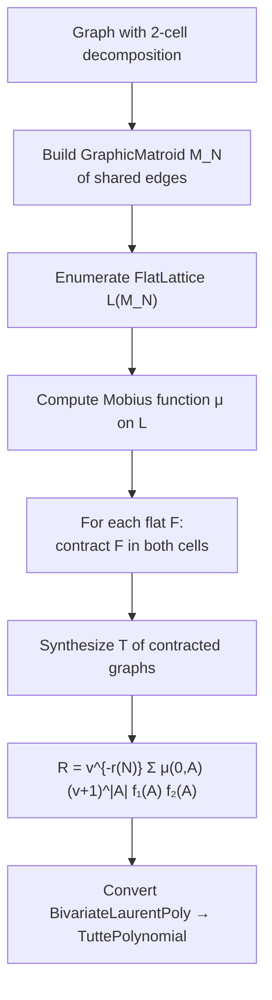

# tutte.matroids

Matroid infrastructure for computing Tutte polynomials via the Bonin-de Mier Theorem 6 (parallel connection formula) and Theorem 10 (k-sum formula). An alternative to edge-by-edge chord addition for graphs decomposable into cells sharing edges.

## Modules

| Module                   | Description                                                                    |
| ------------------------ | ------------------------------------------------------------------------------ |
| `core.py`                | `GraphicMatroid`, `FlatLattice`, flat/cyclic-flat enumeration, Mobius function |
| `parallel_connection.py` | Theorem 6 formula, `BivariateLaurentPoly`, contraction precomputation          |

## Theorem 6 Pipeline

## Key Types

- **`GraphicMatroid`** — Cycle matroid where ground set = edges, rank = |V| - components. Supports rank queries and closure operations.
- **`FlatLattice`** — Lattice of flats with Hasse diagram and batch Mobius function computation.
- **`BivariateLaurentPoly`** — Polynomial in u=x-1, v=y-1 basis supporting negative v-exponents, needed for the Theorem 6 formula.
