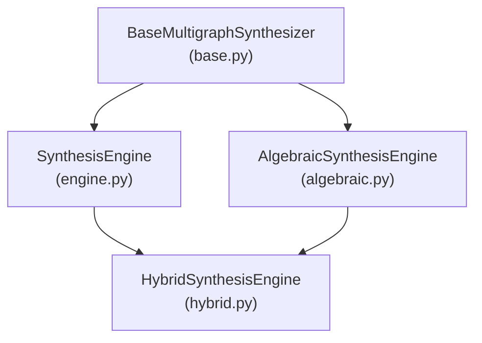
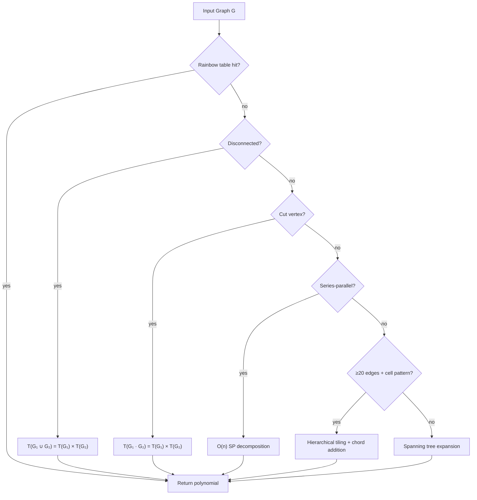

# tutte.synthesis

Synthesis engines for computing Tutte polynomials by decomposing graphs into known components.

## Modules

| Module | Description |
|--------|-------------|
| `base.py` | `UnionFind`, `BaseMultigraphSynthesizer`, `SynthesisResult` — shared infrastructure |
| `engine.py` | `SynthesisEngine` — main CEJ (Creation-Expansion-Join) algorithm |
| `algebraic.py` | `AlgebraicSynthesisEngine` — GCD/factorization-based decomposition |
| `hybrid.py` | `HybridSynthesisEngine` — combines algebraic + tiling for best coverage |

## Engine Hierarchy



## Algorithm Selection (CEJ Engine)



## Usage

```python
from tutte.lookup import load_default_table
from tutte.synthesis import SynthesisEngine, HybridSynthesisEngine

table = load_default_table()

# CEJ engine
result = SynthesisEngine(table).synthesize(graph)

# Hybrid engine (recommended — faster for structured graphs)
result = HybridSynthesisEngine(table).synthesize(graph)
```
