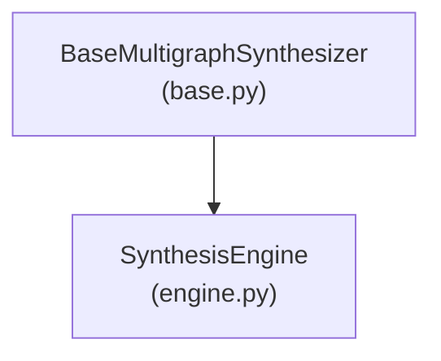

# tutte.synthesis

Synthesis engine for computing Tutte polynomials. A single engine,
`SynthesisEngine`, runs a cascade of structural and algebraic fast
paths; the first to succeed wins.

## Modules

| Module        | Description                                                                                                                       |
| ------------- | --------------------------------------------------------------------------------------------------------------------------------- |
| `base.py`     | `UnionFind`, `BaseMultigraphSynthesizer`, `SynthesisResult` — shared multigraph-synthesis infrastructure                          |
| `engine.py`   | `SynthesisEngine` — the cascade: family recognition, lookup, cell-quotient grid / chain recurrence, treewidth DP, chord rule, CEJ |
| `parallel.py` | `parallel_synthesize_pair` — multiprocess helper for synthesizing two graphs in parallel                                          |

## Engine cascade

`SynthesisEngine._synthesize_inner` (`engine.py`) tries techniques in
order; the first to succeed wins. The cascade as it stands today:

1. **Family recognition** — `recognize_family(graph)` returns a
   closed-form polynomial for trees, cycles, wheels, ladders, prisms,
   books, gears, Möbius ladders, grids, etc. Runs before canonical-key
   so structured inputs never pay the WL refinement cost.
2. **Transfer matrix** — `compute_tutte_via_transfer_matrix(graph)`
   handles periodic lattice strips (grids `m ≥ 3`, triangular,
   honeycomb, square-octagon, elongated-triangular).
3. **Rainbow table lookup** — keyed by `Graph.canonical_key()`. The
   top-level call can skip this with `skip_target_lookup=True` (used by
   the visualizer to show the decomposition path for a graph that
   would otherwise be a direct hit).
4. **Base cases** — empty graph (`T = 1`), single edge (`T = x`).
5. **Disconnected factorization** — `T(G_1 ∪ G_2) = T(G_1) · T(G_2)`.
6. **Cut-vertex factorization** — `T(G_1 · G_2) = T(G_1) · T(G_2)`
   at every articulation point.
7. **Series-parallel** — `compute_sp_tutte_if_applicable(graph)` in
   `tutte/graphs/series_parallel.py`. `O(n + m)` recognition plus
   `O(n)` SP-tree synthesis.
8. **Cell-quotient and closed-form paths** (gated by edge count):
   - **Chain recurrence** — `compute_chain_full_poly_from_spec` for
     cell-decomposable graphs whose cell-quotient is a chain (e.g.
     Chimera chains). Uses `build_bipartite_junction_spec` →
     `CellTreeSpec` (`roots/cell_quotient_bipartite_junction.py`,
     `roots/cell_quotient_tree.py`).
   - `compute_cell_quotient_grid_dp_streamed` — 2D-grid cell-quotient
     for `K_{a,b}`-style cells with disjoint per-direction anchors
     (Cm_2-style).
   - `_try_formula_shortcircuit` — unified formula (cell-pairs share a
     single vertex-pair connection) and k-matching formula (matchings
     between vertex-transitive cells).
   - `compute_tutte_cotree_dp` — subexponential `exp(O(n^{2/3}))` for
     cographs.
   - `compute_tutte_almost_cograph` — cotree DP plus chord rule on up
     to 16 anomaly edges. Reached before treewidth DP (the small-graph
     treewidth short-circuit was removed, so cograph-ish graphs route
     here directly).
9. **Treewidth DP** — `compute_treewidth_tutte_if_applicable` for
   `edge_count ≥ 10` and `tw ≤ 11`. C extension gated to
   `5 ≤ tw ≤ 10`; Python fallback above.
10. **k-sum decomposition** — `_try_ksum_decomposition` for
    `edge_count ≥ 6`. Searches `k = 2..7` vertex separators (with
    `kappa`-aware bounds when `nx.node_connectivity` succeeds),
    applies the chord rule.
11. **Hierarchical tiling** — `_try_hierarchical` for `edge_count ≥
    20`. Cost-aware dispatch between homogeneous and heterogeneous
    cell partitions, picking the partition with fewer chord edges.
    Falls through to `boundary_quotient_tutte` when the product
    formula fails.
12. **Creation-expansion-join (CEJ)** — `_synthesize_connected` and
    `_synthesize_from_k2` are the final fallback: spanning tree plus
    iterative chord addition.

The full per-stage doc index is in
[`tutte/docs/README.md`](../docs/README.md).

## Engine hierarchy


```mermaid
graph TD
    B["BaseMultigraphSynthesizer<br/>(base.py)"] --> E["SynthesisEngine<br/>(engine.py)"]
```

`SynthesisEngine` extends `BaseMultigraphSynthesizer`, which holds the
shared multigraph cache and chord-rule machinery.

## Usage

```python
from tutte.lookup import load_default_table
from tutte.synthesis import SynthesisEngine

table = load_default_table()
result = SynthesisEngine(table).synthesize(graph)
```

The engine auto-loads the rooted-Tutte lookup table from `tutte/data/`
at construction time (best-effort; the engine works without it).

## Engine flags

| Flag                      | Default | Effect                                                                                                                |
| ------------------------- | ------- | --------------------------------------------------------------------------------------------------------------------- |
| `verbose`                 | `False` | Print per-stage progress                                                                                              |
| `auto_promote`            | `False` | Promote every synthesized simple graph to the rainbow table                                                           |
| `promote_cache_on_finish` | `False` | At the end of each top-level `synthesize()`, flush cache entries to the persistent lookup tables                      |
| `k_max`                   | `12`    | Max `k` for the k-sum vertex-separator search (clamped to 20)                                                          |
| `chord_smart_order`       | `True`  | Sort chord edges by descending `|N(u) ∩ N(v)|` so parallel-edge / loop fast paths fire sooner                         |
| `chord_sigma_order`       | `True`  | Reorder chords so σ-orbits are contiguous, maximising canonical-key cache hits on isomorphic intermediate contractions |
| `skip_target_lookup`      | `False` | Top-level call skips the rainbow-table lookup (sub-problems may still hit it) — used by the visualizer                 |

## Related docs

- [`tutte/docs/README.md`](../docs/README.md) — per-technique doc index
  with pipeline flowchart
- [`tutte/docs/08_2_chord_rule_formalization.md`](../docs/08_2_chord_rule_formalization.md)
  — the chord rule that backs k-sum and hierarchical tiling
- [`tutte/docs/06_8_modular_arithmetic_pathways.md`](../docs/06_8_modular_arithmetic_pathways.md)
  — modular point-value pathways used in the cell-quotient grid DP
- [`tutte/docs/06_7_chain_recurrence_algebra.md`](../docs/06_7_chain_recurrence_algebra.md)
  — chain recurrence framework for cell-decomposable chain families
- [`tutte/research/engine_workflow_primer.md`](../research/engine_workflow_primer.md)
  — vocabulary-first walkthrough of the pipeline
