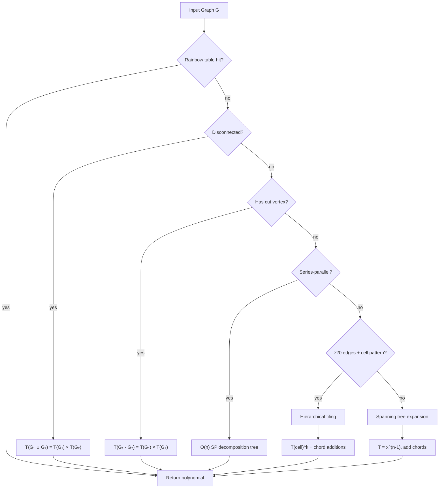
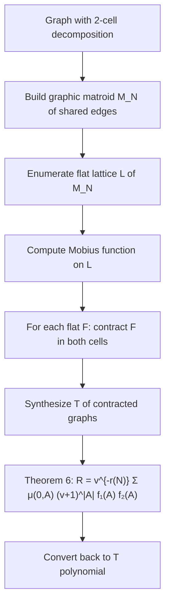

# Tutte Polynomial Synthesis Library

Tools for computing Tutte polynomials of graphs.

## Modules

| File                     | Description                                                            |
| ------------------------ | ---------------------------------------------------------------------- |
| `graph.py`               | `Graph` and `MultiGraph` classes, graph builders, WL canonical hashing |
| `polynomial.py`          | `TuttePolynomial` class with bitstring encoding                        |
| `synthesis.py`           | Main Create-Expand-Join synthesis engine (`SynthesisEngine`)           |
| `rainbow_table.py`       | `RainbowTable` for pre-computed polynomials                            |
| `covering.py`            | Subgraph isomorphism (VF2), disjoint covers, hierarchical tiling       |
| `series_parallel.py`     | O(n+m) SP recognition, O(n) Tutte synthesis                            |
| `validation.py`          | Kirchhoff verification, NetworkX cross-checks                          |
| `matroid.py`             | Graphic matroid, flat lattice, Mobius function                         |
| `parallel_connection.py` | Bonin-de Mier Theorem 6, bivariate Laurent polynomials                 |
| `k_join.py`              | K-join operations and polynomial division                              |
| `factorization.py`       | Polynomial GCD and factorization                                       |
| `algebraic_synthesis.py` | Algebraic synthesis (GCD/factorization approach)                       |
| `hybrid_synthesis.py`    | Hybrid engine combining algebraic + tiling                             |

## Synthesis Workflows

### CEJ Engine (Creation-Expansion-Join)

The primary synthesis engine in `synthesis.py`. Computes Tutte polynomials by decomposing graphs into known components.



### Matroid / Parallel Connection (Theorem 6)

An alternative approach for graphs decomposable into two cells sharing edges. Uses the Bonin-de Mier formula for parallel connections of graphic matroids.



## Key Formulas

| Operation         | Formula                                    | When                            |
| ----------------- | ------------------------------------------ | ------------------------------- |
| Bridge (cut edge) | `T(G+e) = x × T(G)`                        | e connects different components |
| Chord             | `T(G+e) = T(G) + T(G/{u,v})`               | e connects same component       |
| Cut vertex        | `T(G₁ · G₂) = T(G₁) × T(G₂)`               | graphs share single vertex      |
| Disjoint union    | `T(G₁ ∪ G₂) = T(G₁) × T(G₂)`               | no shared vertices              |
| Loop              | `T(G) = y × T(G-e)`                        | e is a self-loop                |
| Parallel edges    | `T(k parallel) = x + y + y² + ⋯ + y^(k-1)` | k edges between same pair       |

## Graph Families

| Family         | Builder                             | Notes                       |
| -------------- | ----------------------------------- | --------------------------- |
| Complete K_n   | `complete_graph(n)`                 | Up to K_8 in rainbow table  |
| Cycle C_n      | `cycle_graph(n)`                    | Up to C_24                  |
| Path P_n       | `path_graph(n)`                     | Up to P_24                  |
| Wheel W_n      | `wheel_graph(n)`                    | Up to W_11                  |
| Grid m×n       | `grid_graph(m, n)`                  | Up to 5×3                   |
| Petersen       | `petersen_graph()`                  | 10 nodes, 15 edges          |
| D-Wave Chimera | `dwave_networkx.chimera_graph(m)`   | Requires dwave-networkx     |
| D-Wave Zephyr  | `dwave_networkx.zephyr_graph(m, t)` | Z(1,1) = 12 nodes, 22 edges |
| D-Wave Pegasus | `dwave_networkx.pegasus_graph(m)`   | Requires dwave-networkx     |

## Known Limitations

- **Z(1,2)+ synthesis broken**: Graphs above Z(1,1) (22 edges) time out due to 31+ chord additions on 45+ edge intermediate graphs where merged nodes lack cut vertices, falling through to expensive VF2 minor search.
- **Exponential worst case**: Deletion-contraction is O(2^m). Practical for ≤25 edges without structural shortcuts.
- **Matroid approach**: Currently implemented for 2-cell decompositions only. Useful for dense graphs where CEJ chord addition is too slow.

## Rainbow Table

Pre-computed Tutte polynomials for graph minors in `tutte_rainbow_table.json` (also binary format in `.bin`).

```python
from tutte_test.rainbow_table import load_default_table

table = load_default_table()
entry = table.get_entry("Petersen")
print(f"Spanning trees: {entry.polynomial.num_spanning_trees()}")  # 2000
```

## Running Tests

```bash
# Full test suite
python -m pytest tutte_test/test_tutte.py -v

# Skip slow tests (graph atlas exhaustive)
python -m pytest tutte_test/test_tutte.py -v -m "not slow"

# Update rainbow table with newly computed polynomials
python -m pytest tutte_test/test_tutte.py -v --update-rainbow-table

# Run with benchmarks
python -m pytest tutte_test/test_tutte.py -v --benchmark
```

## Running Benchmarks

```bash
# Standalone benchmark
python -m tutte_test.benchmark_tutte

# Compare two benchmark runs (e.g., across branches)
python -m tutte_test.benchmark_tutte --compare results_tutte.json results_tutte2.json
```

## Performance vs NetworkX

Speedup of Hybrid engine over NetworkX `nx.tutte_polynomial()` (deletion-contraction),
measured from empty rainbow tables across 1000+ graphs:

| Edges | Graphs | Hybrid avg | NX avg    | Speedup     |
|-------|--------|------------|-----------|-------------|
| 1-5   | ~200   | 0.1-0.5ms  | 0.5-5ms   | ~5-10x      |
| 6-10  | ~500   | 0.3-2ms    | 5-100ms   | ~20-50x     |
| 11-15 | ~250   | 1-5ms      | 100ms-5s  | ~100-500x   |
| 16-19 | ~50    | 2-5ms      | 1-30s     | ~500-5000x  |
| 20+   | ~10    | 3-10ms     | TIMEOUT   | -           |

Key graph timings (Hybrid engine, empty table):

- **Petersen** (15 edges): ~1ms Hybrid, ~800ms NX
- **Chimera C1** (16 edges): ~3ms Hybrid, ~1.5s NX
- **Zephyr Z(1,1)** (22 edges): ~5ms Hybrid, NX timeout

### Optimizations

| Optimization              | Impact                                         | Mechanism                                                  |
| ------------------------- | ---------------------------------------------- | ---------------------------------------------------------- |
| Series-parallel fast path | O(n) vs O(2^n) for SP graphs                   | SP decomposition tree avoids deletion-contraction          |
| WL canonical hashing      | 2x speedup on Z(1,1), 3.4x fewer cache entries | Isomorphism-invariant keys eliminate redundant computation |
| `skip_minor_search`       | Avoids VF2 on intermediate graphs              | Skips expensive subgraph isomorphism during chord addition |

## Usage

```python
from tutte_test.graph import complete_graph, petersen_graph
from tutte_test.synthesis import SynthesisEngine
from tutte_test.rainbow_table import load_default_table

table = load_default_table()
engine = SynthesisEngine(table)

# Compute Tutte polynomial
result = engine.synthesize(petersen_graph())
print(f"T(Petersen; 1,1) = {result.polynomial.num_spanning_trees()}")  # 2000
```

## References

- Tutte, W.T. (1954). "A contribution to the theory of chromatic polynomials"
- Bonin, J. & de Mier, A. (2008). "The lattice of cyclic flats of a matroid"
